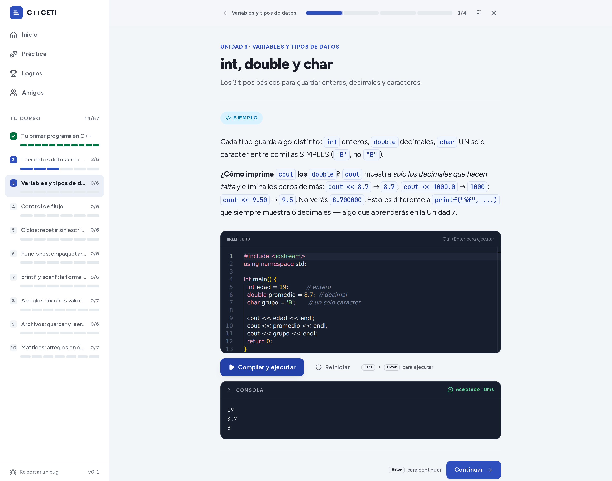
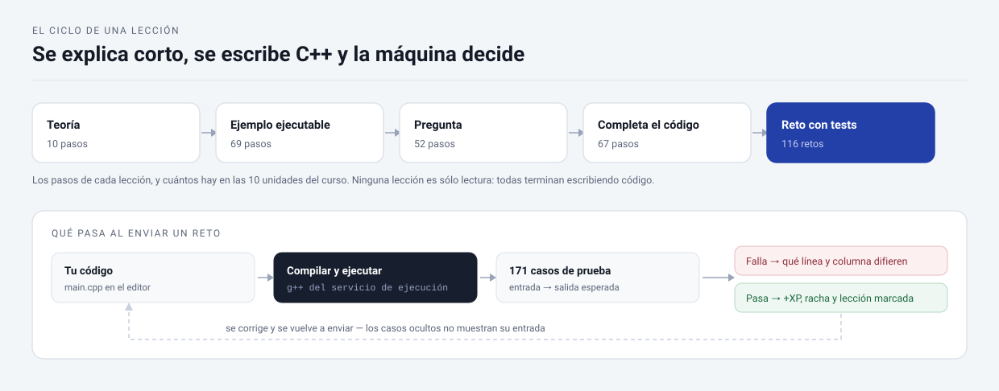
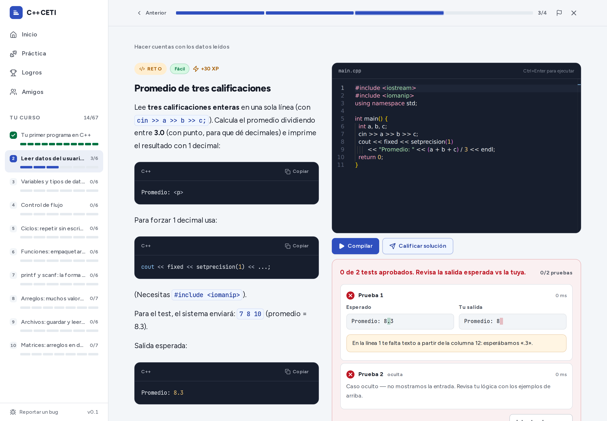
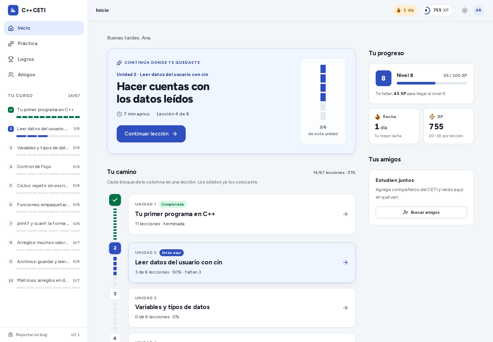

# C++ CETI

Plataforma para aprender **C++ escribiendo C++**, pensada para estudiantes del
**CETI Guadalajara**. Lecciones cortas, un editor con compilador de verdad y retos que se
califican contra casos de prueba. Todo en español y dentro del navegador: sin instalar
compiladores, sin configurar un IDE.



**90 % práctica, 10 % teoría.** El texto explica lo justo y en seguida hay que escribir
código. Ninguna lección termina en lectura.

## Por qué existe

- En el CETI, muchos maestros explican C++ copiando código al pizarrón sin desmenuzar la
  lógica.
- Mimo, Sololearn y Codecademy no enseñan C++.
- Reprobar programación casi nunca es flojera: es **falta de un recurso** donde practicar
  con retroalimentación inmediata.

Esta plataforma es ese recurso. **No es un producto oficial del CETI**: es una iniciativa
independiente.

---

## El ciclo de una lección



Cada lección encadena pasos de cinco tipos y siempre desemboca en código propio. El reto
final no se autoevalúa: se compila y se ejecuta contra casos de entrada/salida, incluidos
casos ocultos, y el resultado decide si la lección se marca como terminada.



Un intento real con el error clásico de la división entera (`/ 3` en vez de `/ 3.0`). El
feedback no dice «incorrecto»: muestra la salida esperada contra la tuya, señala la línea
y la columna donde se separan, y guarda un caso oculto para que la solución no se ajuste
al ejemplo. Las pistas se revelan una por una.

---

## Qué hay construido

| | |
| --- | --- |
| Unidades | 10, del primer `cout` a las matrices |
| Lecciones | 67 |
| Pasos de lección | 314 — teoría, ejemplos ejecutables, preguntas, completar código y retos |
| Retos calificados | 116, con 171 casos de prueba (algunos ocultos) |
| Ejercicios de práctica | 80 más, fuera del camino de lecciones, con sus 225 casos |
| Idioma | Español de México, en todo el contenido y la interfaz |

El curso está escrito como curso: el temario avanza de `cout` a `cin`, tipos, control de
flujo, ciclos, funciones, `printf`/`scanf`, arreglos, archivos y matrices, y cada unidad
apoya en la anterior. No es un playground con ejercicios sueltos.



El avance se mide en lecciones colocadas, no en tiempo de pantalla: cada bloque de la
columna es una lección, y el rail muestra en qué unidad vas. Alrededor hay XP, niveles,
racha, logros y amigos del CETI para comparar avance.

---

## Cómo funciona por dentro

| Capa | Tecnología |
| --- | --- |
| Frontend | Next.js 16 (App Router) · React 19 · TypeScript |
| UI | Tailwind 4 · shadcn/ui · Radix · Lucide |
| Editor | Monaco (el de VS Code), con autocompletado de C++ propio |
| Datos | PostgreSQL + Prisma |
| Auth | Better Auth (correo/contraseña + Google) |
| Ejecución de C++ | Adapter: **Wandbox** (default), Piston o Judge0 — público o self-hosted |
| Hosting | Vercel (app) y el servicio de ejecución aparte |

Tres decisiones que explican el resto:

- **El executor es un adapter.** `getCodeExecutor()` elige proveedor según
  `CODE_EXECUTOR_PROVIDER`; cambiar de Wandbox a un Judge0 propio es una variable de
  entorno, no un refactor. La app no sabe quién compila.
- **El contenido vive en TypeScript tipado** (`prisma/content/*.ts`), no en un CMS: da
  autocompletado y errores en compilación. El seed hace `upsert`, así que recargar el
  curso no borra el progreso de nadie.
- **Una sola vía para el progreso.** `completeStep` y `submitExercise` son Server Actions
  y son el único lugar donde se suma XP, se actualiza la racha y se marca una lección.

→ [Arquitectura y decisiones](docs/arquitectura.md) ·
[Configuración y variables](docs/configuracion.md) ·
[Cómo escribir contenido nuevo](docs/contenido.md) ·
[Despliegue paso a paso](DEPLOYMENT.md)

---

## Correrlo en local

Necesitas Node 20+ y una base PostgreSQL (Supabase gratis, Docker o una local).

```bash
npm install
cp .env.example .env.local     # completa DATABASE_URL y BETTER_AUTH_SECRET
npm run db:push                # crea el schema
npm run db:seed                # carga las 10 unidades y sus 67 lecciones
npm run dev                    # http://localhost:3000
```

El ejecutor por defecto es la API pública de Wandbox: no pide llave ni tarjeta, así que
los retos se compilan desde el primer arranque. Si prefieres Piston o un Judge0 propio,
cámbialo con `CODE_EXECUTOR_PROVIDER` — ver [docs/configuracion.md](docs/configuracion.md).

```bash
npm run lint       # ESLint
npm run typecheck  # TypeScript sin emitir
npm test           # Vitest: progreso y XP, salida del executor, rate limit y contenido
```

---

## Hecho en Guadalajara

Proyecto independiente, sin relación oficial con el CETI. Si detectas un error en una
lección o en un reto, la app tiene un botón para reportarlo y el repo tiene
[issues](https://github.com/CesarManzoCode/cpp-ceti/issues) abiertas.
