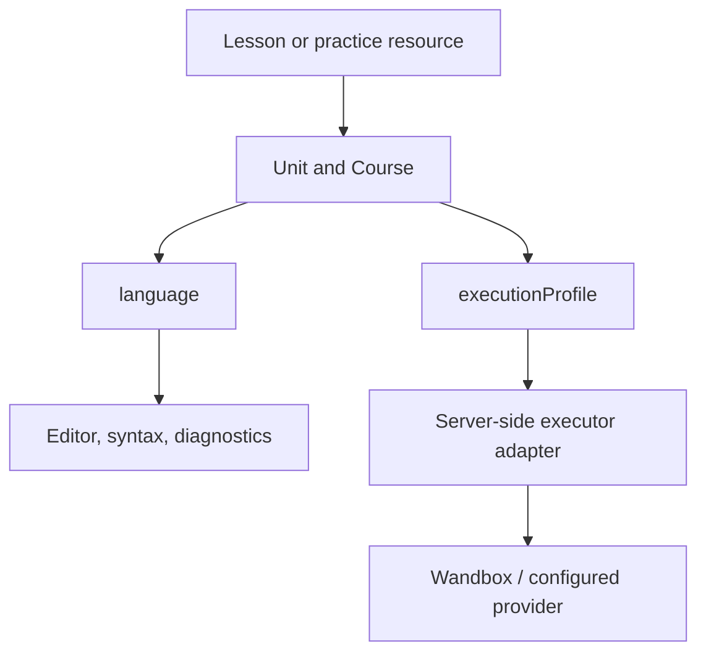

# CETI C# / POO I and multilanguage platform handoff

## Evidence map

| Topic | Classroom evidence | Official program | Inference | Confidence | Decision |
| --- | --- | --- | --- | --- | --- |
| OOP paradigm and contrast with structured programming | Notes define OOP and organize characteristics/behaviors | Unit 1: principles, analysis, abstraction, classes and objects | Use a short bridge from prior structured programming | High | Open with object modeling, not C# syntax history |
| Abstraction | Notes model `Persona`, `Animal`, `Edificio`, `Celular`, `Planta` | Unit 1 explicitly requires abstraction and UML representation | CETI-context examples reduce cognitive load | High | Students choose relevant state/behavior before coding |
| Class, object, instance | Explicit definitions and multiple `Animal` instances | Unit 1 explicitly requires own/library classes and instances | Use temporary public fields only to expose the model, then refactor | High | Teach class -> instances -> state/behavior immediately |
| Attributes and methods | Repeated class lists and actions | Units 1-2 explicitly require attributes, methods, purpose-specific methods | C# fields/properties need a just-in-time distinction | High | Fields first for recognition, properties for final design |
| `public`, `private`, `protected` | Notes map `+`, `-`, `#` and describe access | Units 1-2 require encapsulation, visibility, member access | C# defaults and assembly-level modifiers are not needed | High | Deep coverage of these three only; defer the rest |
| Getters and setters | Explicit handwritten getter/setter methods and UML operations | Encapsulation/access control supports them, although not named separately | C# properties are the idiomatic equivalent | High | Show explicit methods first, then backing-field properties; no unexplained auto-property shortcut |
| Constructors | Not visible in supplied pages | Unit 1 default constructor; Unit 2 constructors and overloads | `this` is required to write clear C# constructors | High | Teach default/custom constructors and `this`; no primary constructors |
| Method/constructor overloading | Not visible in supplied pages | Unit 2 explicitly requires method overloads | Keep examples small so overload is not confused with override | High | Dedicated lesson before inheritance |
| UML class diagrams | Explicit class box, attributes, methods, `+ - #` | Central to Units 1-2 and integrator | Text/static diagrams are sufficient; no graphical editor required | High | Repeated UML -> C# and C# -> UML translation |
| Dependency and association | Notes define both with examples | Unit 2 explicitly names dependency and association | Constructor/parameter examples make lifetime visible | High | Contrast by persistence of the reference |
| Aggregation and composition | Notes define both and show diamond symbols; student reports confusion | Not named in POO I table, but compatible with class relationships | The classroom confusion warrants extra guided discrimination | Medium-high | Include, label classroom-confirmed, avoid pretending C# enforces lifetime |
| Generalization/inheritance | Notes show “is a” and inheritance arrow | Unit 2 requires generalization, inheritance, subclasses | Use `base`, `protected`, `virtual`, `override` just in time | High | Model `is-a`, then code it; test bad inheritance choices |
| Polymorphism | Listed among POO principles in notes | Course descriptor explicitly names polymorphism | Fixed arrays can demonstrate it without POO II collections | High | Use base-class references and a fixed array; no generics |
| Abstract classes | Not visible in supplied pages | Unit 2 explicitly requires abstract classes | Abstract members are necessary to make the concept operational | High | One focused lesson and an integrator use |
| GUI/forms/controls | Not visible in supplied pages yet | Unit 3 and final product require desktop GUI, forms, controls | C# course choice makes Windows Forms the smallest classroom-compatible mapping | High for curriculum, medium for exact framework | Teach WinForms as a local Visual Studio lab; never claim browser execution |
| Events | Notes list “event” as an OOP principle; no implementation shown | Unit 3 requires events in forms | Button click is the clearest event example | High | Teach event flow and handler responsibility, locally |
| Validation and exceptions | Not visible in supplied pages | Unit 3 explicitly requires both | Domain validation should be testable separately from GUI | High | Test pure/domain logic in browser; wire it to GUI locally |
| Containers, panels, process/data flow | Not visible in supplied pages | Unit 3 explicitly requires them | Layout containers and UI-to-domain flow need conceptual treatment | High | Mockup/matching + local lab; no browser desktop simulation |
| References, packaging, publication | Not visible in supplied pages | Unit 3 explicitly requires internal/external references and packaging/publication | Exact classroom publisher may vary | Medium-high | Teach project references conceptually and a minimal Visual Studio publish checklist |
| C# as implementation language | Supplied notes actually use C++ syntax | Official program says “a high-level language”, not C# | Product decision is C#; syntax/API claims must not be attributed to classroom evidence | High about product decision | Mark C# as the chosen vehicle, not as a fact proved by the photos |
| Lists, dictionaries, dynamic structures, generics | Not in supplied pages | Explicitly POO II Unit 1 / descriptors | None needed for POO I | High | Exclude; use fixed arrays only when several objects are needed |
| Sorting/searching, concurrency, XML, sockets/networking | Not in supplied pages | Explicitly reserved for POO II | None | High | Exclude completely from this course |
| Interfaces as the C# `interface` type | Not shown; “interfaces” in POO I means GUI | Not listed as a language feature in POO I | Could confuse GUI “interfaces” with interface types | Medium-high | Defer the `interface` keyword; use abstract classes only |

> Target repository: `CesarManzoCode/cpp-ceti`, branch `main`.
> Repository snapshot inspected: `2e367962b3236eec20d9e266cffd73e1669554f8` (2026-08-31).
> This is an implementation contract. The repository remains the source of truth for mechanical details if `main` moves after this snapshot.

## Objective and non-negotiable scope

Transform the existing C++-only product into a course-centered **plataforma CETI** that supports the existing C++ course and a new complete course, **Programación Orientada a Objetos I - C#**. Preserve all existing C++ content, progress, attempts, completions, revisions, feedback, and analytics. Add only the multilingual machinery required for C++ and C#, with a small registry that can accept a third language later.

This handoff contains the curriculum, final lesson copy, exercises, runtime decision, architecture changes, migration constraints, implementation order, and acceptance criteria. Do not redesign unrelated areas. Do not implement POO II, a browser desktop emulator, a graphical UML editor, a new analytics system, or a generic framework for arbitrary languages.

## Sources and evidence policy

Evidence hierarchy used here:

1. **Level A - current classroom evidence.** Two supplied student reports with photographs of third-semester notes: `3.-Introduccion (Actividad 3)` (6 pages) and `4.-UML (Actividad 4)` (7 pages). Every photographed page was visually inspected, not only OCR text.
2. **Level B - official CETI curriculum.** CETI 2025 programs for [Programación Orientada a Objetos I](https://direccionacademica.ceti.mx/docs/Planes%20y%20Programas%20de%20Estudio/Tecnologos/Tecnologo%20en%20Desarrollo%20de%20Software/2025/Programas/3/Programaci%C3%B3n%20Orientada%20a%20Objetos%20I_.pdf) and [Programación Orientada a Objetos II](https://direccionacademica.ceti.mx/docs/Planes%20y%20Programas%20de%20Estudio/Tecnologos/Tecnologo%20en%20Desarrollo%20de%20Software/2025/Programas/4/Programaci%C3%B3n%20orientada%20a%20objetos%20II_.pdf). POO I is 72 semester hours (4 weekly, 2 theory + 2 practice).
3. **Level C - bounded inference.** C#-specific bridge material and pedagogy needed to implement the confirmed concepts. Microsoft documentation was used for language semantics, properties, inheritance, Windows Forms, and publishing.
4. **Product evidence.** The repository snapshot above, particularly `prisma/content/`, the Prisma schema and seeds, editor, executor adapters, lesson/practice actions, routes, and analytics contract.

### Classroom evidence details that must shape the pedagogy

- The photographed sequence is roughly: OOP/class/object/abstraction -> several everyday class models -> visibility/getters/setters -> UML class box -> class relations.
- The notes are written in C++-like syntax. Treat them as evidence of **concepts and sequencing**, never as evidence of C# syntax.
- The student explicitly reports understanding the opening class/object work and becoming confused when UML relationships were introduced. Therefore relationship lessons require contrast cases, counterexamples, matching, and repeated UML/code translation; one definitions page is not enough.
- Familiar examples used in class include animal, building, phone, plant, student/subject, house/rooms, printer/document, car/driver/motor/tool. Reuse the familiarity selectively but do not copy incorrect lifetime claims without explanation.

## Academic boundary and runtime decision

### What POO I includes

POO foundations; abstraction; classes/objects; fields, methods and constructors; encapsulation/visibility; UML class diagrams; dependency, association and generalization; classroom-confirmed aggregation/composition; inheritance, subclasses, abstract classes and basic polymorphism; method/constructor overloads; GUI concepts, forms, controls, events, validations, exceptions, containers/panels, data flow, project references, packaging/publication; and a small-business desktop integrator.

### What belongs to POO II and is forbidden here

Dynamic data structures, dictionaries, general-purpose collections, generic objects/types, sorting/search algorithms as a subject, concurrent processes/threads, XML transfer, sockets, networking, and any attempt to pre-teach the later patterns/frameworks course. Fixed arrays inherited from structured programming are allowed only to demonstrate polymorphism.

### C#/.NET profile

Use two explicitly separated environments:

| Environment | Decision | Why |
| --- | --- | --- |
| Browser lessons/challenges | C# syntax compatible with Mono 6.12; Wandbox compiler `mono-6.12.0.199`; file `prog.cs`/`Main.cs` | Live API test on 2026-08-31 compiled and ran C# successfully. It is already available through the default provider; no new service is needed. |
| Local GUI labs | Visual Studio, template **Windows Forms App (.NET)**; target the installed supported LTS (`.NET 10` preferred, `.NET 8` acceptable for the current classroom image) | WinForms is Windows desktop-only and its visual designer is part of the intended workflow. The course code uses a conservative subset that compiles on both targets. |

Language style rules:

- Use `using System;`, an explicit `class Program`, and `static void Main()` in browser programs.
- Use explicit types, ordinary block bodies, `Console.ReadLine`, `int.Parse`/`double.Parse`, string interpolation, classes, properties, constructors, `virtual`/`override`, and `abstract`.
- Do not use top-level statements, file-scoped namespaces, records, primary constructors, nullable reference annotations, `init`, `required`, LINQ, pattern-heavy syntax, async, or new C# 14/15 features. They obscure POO I and are not supported uniformly by the browser compiler.
- Explain the classroom-style explicit `GetX`/`SetX` methods, then teach C# properties as the final idiom. Do not silently replace one with the other.
- Browser challenges are single-file console programs. GUI snippets are `runnable: false` and clearly labeled “Práctica local en Visual Studio”.

Provider facts verified for this handoff:

- [Wandbox compiler inventory](https://wandbox.org/api/list.json) lists `mono-6.12.0.199`, `dotnetcore-8.0.402`, and C++ compilers. A live `.NET 8` hello-world request failed inside Wandbox with a file-size-limit error, while Mono 6.12 succeeded. Do not select the broken profile merely because it is listed.
- [Piston runtime inventory](https://emkc.org/api/v2/piston/runtimes) lists `csharp.net 5.0.201` and `csharp 6.12.0`, but the public execute endpoint returned HTTP 401. Keep Piston support for self-hosted/whitelisted deployments; it is not the zero-config default.
- [Judge0 CE language inventory](https://ce.judge0.com/languages/) exposes C++ and C# Mono, but language IDs are instance-specific. Resolve/verify IDs per deployment; do not hardcode one universal ID.
- Microsoft documents [C# language/runtime version coupling](https://learn.microsoft.com/en-us/dotnet/csharp/language-reference/language-versioning), [properties](https://learn.microsoft.com/en-us/dotnet/csharp/programming-guide/classes-and-structs/using-properties), [OOP concepts](https://learn.microsoft.com/en-us/dotnet/csharp/fundamentals/tutorials/oop), [WinForms](https://learn.microsoft.com/en-us/dotnet/desktop/winforms/overview/), and [.NET publishing](https://learn.microsoft.com/en-us/dotnet/core/deploying/).

## Course-level contract

```ts
export const cursoCsharpPoo1: CourseDefinition = {
  slug: "csharp-poo-1",
  title: "Programación Orientada a Objetos I",
  description:
    "Modela problemas con UML e implementa clases, relaciones, herencia y aplicaciones de escritorio en C#.",
  subjectName: "Programación Orientada a Objetos I",
  academicContext: "Tecnólogo en Desarrollo de Software · 3.er semestre · CETI",
  language: "csharp",
  executionProfile: "csharp-mono-6.12",
  units: [/* units below, in this exact order */],
};
```

The existing course keeps its slug and all nested slugs. Add metadata without changing identity:

```ts
cursoCpp.subjectName = "Programación estructurada / fundamentos de programación";
cursoCpp.academicContext = "Primeros semestres · CETI";
cursoCpp.language = "cpp";
cursoCpp.executionProfile = "cpp17-wandbox";
```

## Complete course map

| # | Unit slug | Title | Objective | Prior knowledge | New concepts | Typical errors | Lessons | Observable result |
| --- | --- | --- | --- | --- | --- | --- | --- | --- |
| 1 | `csharp-poo-01-modelar` | De problemas a objetos | Translate a familiar situation into classes and executable C# objects | Variables, functions, conditions, console I/O | abstraction, class, object, instance, fields, methods, C# program shell | treating class as object; mixing state and behavior; forgetting `new`; making every noun a class | 4 | Implements two instances whose state changes independently |
| 2 | `csharp-poo-02-encapsular` | Encapsulation and constructors | Protect invariants and create valid objects | Unit 1 | `private/public/protected`, explicit accessors, properties, constructors, `this`, overload | public mutable state; setter without validation; constructor/method confusion; overload vs override | 4 | Refactors a public-field model into a validated class |
| 3 | `csharp-poo-03-uml` | UML as a code contract | Read, draw textually, and implement class diagrams | Units 1-2 | compartments, visibility symbols, signatures, UML -> C#, C# -> UML | swapping `+/-/#`; omitting types/returns; diagram/code mismatch | 4 | Implements a diagram and audits code against it |
| 4 | `csharp-poo-04-relaciones` | Relationships between classes | Select and implement dependency, association, aggregation, composition, and generalization | UML/classes | lifetime/ownership reasoning, fields vs parameters, diamonds/arrows | choosing by vocabulary; calling every relation composition; assuming C# deletes objects automatically | 4 | Justifies and codes the relationship in a multi-class model |
| 5 | `csharp-poo-05-herencia` | Inheritance and polymorphism | Build valid `is-a` hierarchies and vary behavior through a base type | Relations, `protected` | base/derived, `base`, virtual/override, polymorphism, abstract class | inheritance for code reuse only; hiding instead of overriding; instantiating abstract class | 4 | Executes different overrides through `Empleado[]`/base references |
| 6 | `csharp-poo-06-diseno-robusto` | Responsibilities, validation and exceptions | Keep business rules in domain classes and make failures explicit | Units 1-5 | instance vs static responsibility, exceptions, separation of UI/domain, multi-class design | validation only in UI; empty catch; god class; returning magic strings | 3 | Produces a testable domain layer for a small business case |
| 7 | `csharp-poo-07-gui` | Windows Forms, events and data flow | Connect a WinForms UI to the tested domain model | Unit 6 | form/control/event, handlers, panels/containers, validation feedback, references | business logic in click handler; browser execution assumption; control names as domain model | 4 | Completes a local form that creates/updates domain objects |
| 8 | `csharp-poo-08-integrador` | Small-business integrator | Deliver the official product: requirements, UML, code, GUI, report, publication | All prior units | traceability, acceptance scenarios, packaging/publish, technical report | building UI before model; diagram drift; no evidence; machine-only publish | 3 | Produces a coherent, testable and publishable mini-system |

Total: **30 lessons**, **23 embedded code challenges** plus guided design/local transfer tasks, and **32 independent practice exercises**. The platform is support material for a 72-hour semester; it is not supposed to manufacture 72 hours of passive screen time.

## Content notation used below

- Every `correctIndex` is zero-based, matching the current TypeScript types.
- `testCases` normalize trailing whitespace exactly as the current executor does.
- Unless marked otherwise, code examples and solutions are complete single-file C# programs compatible with the browser profile.
- A local GUI activity has no fake executor tests. It uses supported steps with `runnable: false`, a concrete checklist, and an observable local result.
- XP calibration used here: lesson 25-100, embedded challenge 15-48, practice 18-46. Difficulty is relative to the unit and rises with autonomy.

---

## UNIT `csharp-poo-01-modelar`

slug: `csharp-poo-01-modelar`  
title: `De problemas a objetos`  
description: `Abstrae objetos cotidianos y conviértelos en clases, instancias, estado y comportamiento en C#.`  
icon: `🧱`  
published: `true`

### LESSON `pensar-en-objetos`

slug: `pensar-en-objetos`  
title: `Pensar en objetos, no en una lista de instrucciones`  
description: `Separa qué sabe cada objeto de lo que puede hacer.`  
estimatedMinutes: `9`  
xpReward: `30`  
objective: `Identify relevant objects, state, and behavior in a concrete problem.`  
prerequisites: `Variables and functions.`

#### STEP 1 - theory

markdown:

> # De instrucciones a colaboradores
>
> En programación estructurada sueles preguntar: **¿qué pasos debe ejecutar el programa?** En POO agregas otra pregunta: **¿quién debería conocer cada dato y realizar cada acción?**
>
> Para un préstamo de herramientas del taller podrías identificar:
>
> - `Herramienta`: conoce nombre y existencias; puede prestar y devolver.
> - `Alumno`: conoce nombre y registro; puede solicitar una herramienta.
> - `Prestamo`: conoce quién recibió qué y si ya devolvió.
>
> Una **clase** es el modelo. Un **objeto** es una instancia concreta creada desde ese modelo. Sus datos forman el **estado** y sus acciones son **métodos**.
>
> Abstraer no es anotar todo lo que existe. Es conservar sólo lo necesario para resolver el problema. El color favorito del alumno no ayuda a controlar préstamos; su registro sí.

#### STEP 2 - matching

prompt: `Empareja cada elemento con su papel en un sistema de préstamo.`

pairs:

- `Herramienta` -> `Clase posible: representa un tipo de objeto`
- `taladroBosch` -> `Objeto concreto o instancia`
- `Existencias` -> `Estado que el objeto debe recordar`
- `Prestar()` -> `Comportamiento que puede cambiar el estado`

explanation: `La clase define; la instancia existe durante la ejecución; los atributos describen; los métodos actúan.`

#### STEP 3 - code_example

code:

```csharp
using System;

class Herramienta
{
    public string Nombre;
    public int Existencias;

    public void Mostrar()
    {
        Console.WriteLine($"{Nombre}: {Existencias}");
    }
}

class Program
{
    static void Main()
    {
        Herramienta taladro = new Herramienta();
        taladro.Nombre = "Taladro";
        taladro.Existencias = 3;
        taladro.Mostrar();
    }
}
```

explanation: `Herramienta es el modelo; taladro es el objeto. Los campos son públicos sólo para ver primero la mecánica. En la unidad siguiente protegeremos el estado.`  
runnable: `true`  
expectedOutput: `Taladro: 3`

#### STEP 4 - quiz

question: `En el código anterior, ¿cuál elemento es una instancia?`  
options:

1. `class Herramienta`
2. `public int Existencias`
3. `taladro`
4. `Mostrar()`

correctIndex: `2`  
feedbackPerOption:

1. `Eso es la clase: el modelo compartido por posibles objetos.`
2. `Eso es parte del estado definido por la clase.`
3. `Correcto: la variable referencia al objeto creado con new.`
4. `Eso es un método de la clase.`

explanation: `new Herramienta() crea el objeto; taladro guarda la referencia a esa instancia.`

#### STEP 5 - code_challenge

prompt:

> ## Ficha de herramienta
>
> Define una clase `FichaHerramienta` con campos públicos `Nombre` (`string`) y `Cantidad` (`int`), y un método `Mostrar()` que escriba exactamente `Nombre: Cantidad pieza(s)`. Lee nombre y cantidad, crea un objeto y llama al método. No imprimas prompts.

starterCode:

```csharp
using System;

// Define la clase aquí

class Program
{
    static void Main()
    {
        string nombre = Console.ReadLine();
        int cantidad = int.Parse(Console.ReadLine());
        // Crea, asigna y muestra el objeto
    }
}
```

solutionCode:

```csharp
using System;

class FichaHerramienta
{
    public string Nombre;
    public int Cantidad;

    public void Mostrar()
    {
        Console.WriteLine($"{Nombre}: {Cantidad} pieza(s)");
    }
}

class Program
{
    static void Main()
    {
        string nombre = Console.ReadLine();
        int cantidad = int.Parse(Console.ReadLine());
        FichaHerramienta ficha = new FichaHerramienta();
        ficha.Nombre = nombre;
        ficha.Cantidad = cantidad;
        ficha.Mostrar();
    }
}
```

hints:

1. `La clase va fuera de Program y contiene dos campos más un método.`
2. `Crea con FichaHerramienta ficha = new FichaHerramienta();.`
3. `Mostrar usa interpolación: $"{Nombre}: {Cantidad} pieza(s)".`

difficulty: `easy`  
xpReward: `20`

testCases:

- stdin: `Martillo\n8\n`
  expectedStdout: `Martillo: 8 pieza(s)\n`
  visible: `true`
  description: `Caso visible`
- stdin: `Broca 1/4\n27\n`
  expectedStdout: `Broca 1/4: 27 pieza(s)\n`
  visible: `false`
  description: `Nombre con espacio`
- stdin: `Nivel\n0\n`
  expectedStdout: `Nivel: 0 pieza(s)\n`
  visible: `false`
  description: `Cantidad cero`

### LESSON `clase-objeto-instancia`

slug: `clase-objeto-instancia`  
title: `Una clase, muchos objetos`  
description: `Crea instancias independientes a partir del mismo modelo.`  
estimatedMinutes: `10`  
xpReward: `35`  
objective: `Explain and demonstrate independent object state.`  
prerequisites: `pensar-en-objetos`

#### STEP 1 - theory

markdown:

> # El molde no guarda los datos de cada objeto
>
> `class Locker` describe qué tendrá cualquier locker. Cada `new Locker()` crea una instancia separada. Cambiar `lockerA.Numero` no cambia `lockerB.Numero`.
>
> Una variable de clase (`Locker lockerA`) guarda una **referencia** al objeto. Si dos variables apuntaran al mismo objeto, verían el mismo estado; hoy crearemos dos objetos distintos.

#### STEP 2 - code_example

code:

```csharp
using System;

class Locker
{
    public int Numero;
    public string Responsable;

    public void Mostrar()
    {
        Console.WriteLine($"Locker {Numero}: {Responsable}");
    }
}

class Program
{
    static void Main()
    {
        Locker a = new Locker();
        a.Numero = 12;
        a.Responsable = "Ana";

        Locker b = new Locker();
        b.Numero = 13;
        b.Responsable = "Luis";

        a.Mostrar();
        b.Mostrar();
    }
}
```

explanation: `a y b nacen de la misma clase, pero cada new crea estado independiente.`  
runnable: `true`  
expectedOutput: `Locker 12: Ana\nLocker 13: Luis`

#### STEP 3 - fill_blank

prompt: `Completa el tipo y la construcción de dos objetos diferentes.`

template:

```csharp
{{0}} primero = {{1}} Libro();
{{2}} segundo = {{3}} Libro();
```

blanks:

- answer: `Libro`
  hint: `El tipo de la variable es la clase.`
- answer: `new`
  hint: `La palabra que crea una instancia.`
- answer: `Libro`
  hint: `El segundo objeto usa el mismo tipo.`
- answer: `new`
  hint: `También necesita su propia construcción.`

explanation: `Hay dos expresiones new, por lo tanto hay dos objetos.`

#### STEP 4 - quiz

question: `Si ejecutas b = a; y luego cambias b.Numero, ¿qué ocurre?`  
options:

1. `Sólo cambia b porque las variables siempre copian objetos completos.`
2. `a y b observan el cambio porque apuntan al mismo objeto.`
3. `Se crea automáticamente un tercer objeto.`
4. `No compila porque no se pueden asignar objetos.`

correctIndex: `1`  
explanation: `Las clases son tipos por referencia. b = a copia la referencia, no clona el objeto.`

#### STEP 5 - code_challenge

prompt: `Define Libro con campos Titulo y Paginas y método Resumen(). Lee datos para dos libros, crea dos instancias y muestra cada una como Titulo (N paginas).`  
starterCode:

```csharp
using System;

class Libro
{
    // Campos y método
}

class Program
{
    static void Main()
    {
        string titulo1 = Console.ReadLine();
        int paginas1 = int.Parse(Console.ReadLine());
        string titulo2 = Console.ReadLine();
        int paginas2 = int.Parse(Console.ReadLine());
        // Dos objetos distintos
    }
}
```

solutionCode:

```csharp
using System;

class Libro
{
    public string Titulo;
    public int Paginas;

    public void Resumen()
    {
        Console.WriteLine($"{Titulo} ({Paginas} paginas)");
    }
}

class Program
{
    static void Main()
    {
        string titulo1 = Console.ReadLine();
        int paginas1 = int.Parse(Console.ReadLine());
        string titulo2 = Console.ReadLine();
        int paginas2 = int.Parse(Console.ReadLine());
        Libro primero = new Libro();
        primero.Titulo = titulo1;
        primero.Paginas = paginas1;
        Libro segundo = new Libro();
        segundo.Titulo = titulo2;
        segundo.Paginas = paginas2;
        primero.Resumen();
        segundo.Resumen();
    }
}
```

hints: [`Cada objeto necesita su propio new.`, `Asigna los datos al objeto correspondiente.`, `Llama Resumen una vez por objeto.`]  
difficulty: `easy`  
xpReward: `22`

testCases:

- { stdin: `POO\n120\nUML\n80\n`, expectedStdout: `POO (120 paginas)\nUML (80 paginas)\n`, visible: `true`, description: `Dos libros` }
- { stdin: `Manual CETI\n1\nC Sharp\n450\n`, expectedStdout: `Manual CETI (1 paginas)\nC Sharp (450 paginas)\n`, visible: `false`, description: `Títulos con espacios` }

### LESSON `estado-y-comportamiento`

slug: `estado-y-comportamiento`  
title: `Los métodos cambian el estado`  
description: `Haz que el objeto realice la operación en lugar de modificar sus datos desde fuera.`  
estimatedMinutes: `11`  
xpReward: `35`  
objective: `Place state-changing behavior in the class that owns the state.`  
prerequisites: `clase-objeto-instancia`

#### STEP 1 - code_example

code:

```csharp
using System;

class TarjetaComedor
{
    public int Saldo;

    public void Recargar(int cantidad)
    {
        Saldo = Saldo + cantidad;
    }

    public void Consumir(int cantidad)
    {
        Saldo = Saldo - cantidad;
    }
}

class Program
{
    static void Main()
    {
        TarjetaComedor tarjeta = new TarjetaComedor();
        tarjeta.Saldo = 100;
        tarjeta.Recargar(40);
        tarjeta.Consumir(25);
        Console.WriteLine(tarjeta.Saldo);
    }
}
```

explanation: `Recargar y Consumir viven junto al saldo porque esa clase es responsable de cambiarlo. La validación llegará con encapsulamiento.`  
runnable: `true`  
expectedOutput: `115`

#### STEP 2 - quiz

question: `¿Cuál diseño expresa mejor la responsabilidad del objeto?`  
options:

1. `Desde Program: tarjeta.Saldo = tarjeta.Saldo - costo;`
2. `Dentro de TarjetaComedor: tarjeta.Consumir(costo);`
3. `Una variable global saldo para todas las tarjetas.`
4. `Imprimir el saldo sin almacenarlo.`

correctIndex: `1`  
explanation: `El método representa la operación del dominio y centraliza la regla que después podremos validar.`

#### STEP 3 - code_completion

prompt: `Ordena el cuerpo de un método que incrementa el contador y luego muestra el nuevo valor.`  
lines:

1. `public void RegistrarEntrada()`
2. `{`
3. `    Entradas = Entradas + 1;`
4. `    Console.WriteLine(Entradas);`
5. `}`

explanation: `Primero cambia el estado; después muestra el estado ya actualizado.`

#### STEP 4 - code_challenge

prompt: `Crea Marcador con campo público Puntos, método Sumar(int) y método Restar(int). Lee saldo inicial, puntos a sumar y puntos a restar; ejecuta ambos métodos e imprime Puntos: N.`  
starterCode:

```csharp
using System;

class Marcador
{
    public int Puntos;
    // Métodos
}

class Program
{
    static void Main()
    {
        int inicial = int.Parse(Console.ReadLine());
        int suma = int.Parse(Console.ReadLine());
        int resta = int.Parse(Console.ReadLine());
        // Usa un Marcador
    }
}
```

solutionCode:

```csharp
using System;

class Marcador
{
    public int Puntos;
    public void Sumar(int cantidad) { Puntos = Puntos + cantidad; }
    public void Restar(int cantidad) { Puntos = Puntos - cantidad; }
}

class Program
{
    static void Main()
    {
        int inicial = int.Parse(Console.ReadLine());
        int suma = int.Parse(Console.ReadLine());
        int resta = int.Parse(Console.ReadLine());
        Marcador marcador = new Marcador();
        marcador.Puntos = inicial;
        marcador.Sumar(suma);
        marcador.Restar(resta);
        Console.WriteLine($"Puntos: {marcador.Puntos}");
    }
}
```

hints: [`Los métodos reciben cantidad.`, `Ambos modifican Puntos.`, `La salida ocurre después de las dos llamadas.`]  
difficulty: `easy`  
xpReward: `22`

testCases:

- { stdin: `10\n7\n3\n`, expectedStdout: `Puntos: 14\n`, visible: `true`, description: `Cambio doble` }
- { stdin: `0\n100\n40\n`, expectedStdout: `Puntos: 60\n`, visible: `false`, description: `Parte de cero` }
- { stdin: `50\n0\n50\n`, expectedStdout: `Puntos: 0\n`, visible: `false`, description: `Llega a cero` }

### LESSON `abstraccion-con-criterio`

slug: `abstraccion-con-criterio`  
title: `Abstraer es decidir qué importa`  
description: `Evita clases infladas y modela sólo lo que exige el problema.`  
estimatedMinutes: `10`  
xpReward: `40`  
objective: `Select relevant attributes and methods from requirements.`  
prerequisites: `estado-y-comportamiento`

#### STEP 1 - theory

markdown:

> # Un modelo tiene propósito
>
> Para asignar equipos de laboratorio, de una laptop importan `NumeroInventario`, `RamGb` y `Disponible`. Su fondo de pantalla no afecta la operación. Otro sistema, como soporte técnico, quizá sí necesite número de serie y fecha de mantenimiento.
>
> La pregunta correcta no es “¿qué datos podría tener una laptop?”, sino “¿qué datos y acciones necesita **este sistema**?”. Una clase con veinte campos irrelevantes no es más completa: es más difícil de entender y mantener.

#### STEP 2 - matching

prompt: `Para un sistema que presta equipo, separa lo relevante de lo decorativo.`  
pairs:

- `NumeroInventario` -> `Identifica el equipo prestado`
- `Disponible` -> `Permite decidir si se puede prestar`
- `Prestar()` -> `Cambia el estado operativo`
- `ColorFavoritoDelAlumno` -> `No pertenece al modelo de Equipo`

explanation: `La abstracción depende del problema y de las operaciones requeridas.`

#### STEP 3 - quiz

question: `El requerimiento dice: “registrar préstamos y evitar prestar un equipo ocupado”. ¿Qué miembro sobra en Equipo?`  
options: [`Disponible`, `Prestar()`, `NumeroInventario`, `MarcaDeLaMochilaDelAlumno`]  
correctIndex: `3`  
explanation: `Ese dato no ayuda a identificar, prestar ni validar disponibilidad del equipo.`

#### STEP 4 - code_challenge

prompt: `Modela SensorAula con Nombre y Lectura, más Actualizar(double) y Mostrar(). Lee dos sensores; actualiza sólo el primero con una tercera lectura; imprime ambos como Nombre = lectura con un decimal. Deben seguir siendo objetos independientes.`  
starterCode:

```csharp
using System;

class SensorAula
{
    // Estado y comportamiento relevante
}

class Program
{
    static void Main()
    {
        string n1 = Console.ReadLine();
        double l1 = double.Parse(Console.ReadLine());
        string n2 = Console.ReadLine();
        double l2 = double.Parse(Console.ReadLine());
        double nueva = double.Parse(Console.ReadLine());
        // Dos sensores; actualiza sólo el primero
    }
}
```

solutionCode:

```csharp
using System;

class SensorAula
{
    public string Nombre;
    public double Lectura;
    public void Actualizar(double nueva) { Lectura = nueva; }
    public void Mostrar() { Console.WriteLine($"{Nombre} = {Lectura:F1}"); }
}

class Program
{
    static void Main()
    {
        string n1 = Console.ReadLine();
        double l1 = double.Parse(Console.ReadLine());
        string n2 = Console.ReadLine();
        double l2 = double.Parse(Console.ReadLine());
        double nueva = double.Parse(Console.ReadLine());
        SensorAula primero = new SensorAula();
        primero.Nombre = n1;
        primero.Lectura = l1;
        SensorAula segundo = new SensorAula();
        segundo.Nombre = n2;
        segundo.Lectura = l2;
        primero.Actualizar(nueva);
        primero.Mostrar();
        segundo.Mostrar();
    }
}
```

hints: [`No necesitas más de dos campos.`, `Actualizar sólo asigna Lectura.`, `F1 imprime un decimal.`]  
difficulty: `medium`  
xpReward: `28`

testCases:

- { stdin: `Temperatura\n22.0\nHumedad\n48.5\n23.2\n`, expectedStdout: `Temperatura = 23.2\nHumedad = 48.5\n`, visible: `true`, description: `Independencia` }
- { stdin: `A\n0\nB\n-2.5\n10\n`, expectedStdout: `A = 10.0\nB = -2.5\n`, visible: `false`, description: `Decimales y negativos` }

---

## UNIT `csharp-poo-02-encapsular`

slug: `csharp-poo-02-encapsular`  
title: `Encapsulamiento y constructores`  
description: `Protege el estado y garantiza que cada objeto nazca y permanezca válido.`  
icon: `🔒`  
published: `true`

### LESSON `visibilidad`

slug: `visibilidad`  
title: `public, private y protected`  
description: `Decide quién puede ver o modificar cada miembro.`  
estimatedMinutes: `11`  
xpReward: `40`  
objective: `Apply visibility according to responsibility, not convenience.`  
prerequisites: `Unit 1`

#### STEP 1 - theory

markdown:

> # Encapsular es controlar el acceso
>
> - `public`: cualquier código con acceso al objeto puede usar el miembro. En UML: `+`.
> - `private`: sólo la propia clase puede usarlo. En UML: `-`.
> - `protected`: la clase y sus clases derivadas pueden usarlo. En UML: `#`.
>
> El estado que sostiene una regla debe ser `private`. Si `saldo` es público, cualquier línea puede volverlo negativo sin pasar por `Retirar`. Haz públicas las operaciones que el resto del programa necesita, no todos los datos.
>
> `protected` se reconoce ahora, pero se usará con sentido al estudiar herencia. No lo elijas como un `private` “menos estricto”.

#### STEP 2 - code_example

code:

```csharp
using System;

class CuentaCopias
{
    private int saldo;

    public void Recargar(int hojas)
    {
        if (hojas > 0) saldo = saldo + hojas;
    }

    public bool Imprimir()
    {
        if (saldo == 0) return false;
        saldo = saldo - 1;
        return true;
    }

    public int ConsultarSaldo()
    {
        return saldo;
    }
}

class Program
{
    static void Main()
    {
        CuentaCopias cuenta = new CuentaCopias();
        cuenta.Recargar(2);
        cuenta.Imprimir();
        Console.WriteLine(cuenta.ConsultarSaldo());
    }
}
```

explanation: `Program no puede escribir saldo directamente. Sólo las operaciones de CuentaCopias pueden preservar la regla.`  
runnable: `true`  
expectedOutput: `1`

#### STEP 3 - quiz

question: `¿Qué miembro debería ser private en una clase Inventario?`  
options: [`RegistrarEntrada(int)`, `ConsultarExistencias()`, `existencias`, `MostrarResumen()`]  
correctIndex: `2`  
explanation: `El dato interno sostiene reglas; el exterior interactúa mediante operaciones públicas.`

#### STEP 4 - fill_blank

prompt: `Haz privado el dato y pública la operación que lo consulta.`  
template:

```csharp
{{0}} int existencias;
{{1}} int Consultar() { return existencias; }
```

blanks:

- { answer: `private`, hint: `Sólo la clase debe modificar el campo.` }
- { answer: `public`, hint: `El resto del programa sí necesita consultar.` }

explanation: `El campo queda oculto; el método es el contrato público.`

#### STEP 5 - code_challenge

prompt: `Implementa Inventario con existencias private, Agregar(int), Retirar(int) que devuelva bool y Consultar(). Agregar ignora cantidades <= 0. Retirar sólo tiene éxito si cantidad > 0 y hay suficientes piezas. Lee inicial, retiro y entrada; inicializa agregando, intenta retirar, agrega la entrada e imprime OK/NO y Final: N.`  
starterCode:

```csharp
using System;

class Inventario
{
    private int existencias;
    // Métodos públicos
}

class Program
{
    static void Main()
    {
        int inicial = int.Parse(Console.ReadLine());
        int retiro = int.Parse(Console.ReadLine());
        int entrada = int.Parse(Console.ReadLine());
        // Ejecuta el caso
    }
}
```

solutionCode:

```csharp
using System;

class Inventario
{
    private int existencias;
    public void Agregar(int cantidad) { if (cantidad > 0) existencias += cantidad; }
    public bool Retirar(int cantidad)
    {
        if (cantidad <= 0 || cantidad > existencias) return false;
        existencias -= cantidad;
        return true;
    }
    public int Consultar() { return existencias; }
}

class Program
{
    static void Main()
    {
        int inicial = int.Parse(Console.ReadLine());
        int retiro = int.Parse(Console.ReadLine());
        int entrada = int.Parse(Console.ReadLine());
        Inventario inventario = new Inventario();
        inventario.Agregar(inicial);
        bool ok = inventario.Retirar(retiro);
        inventario.Agregar(entrada);
        Console.WriteLine(ok ? "OK" : "NO");
        Console.WriteLine($"Final: {inventario.Consultar()}");
    }
}
```

hints: [`No expongas existencias.`, `Retirar valida antes de restar.`, `El operador condicional puede imprimir OK o NO.`]  
difficulty: `medium`  
xpReward: `30`

testCases:

- { stdin: `10\n4\n3\n`, expectedStdout: `OK\nFinal: 9\n`, visible: `true`, description: `Retiro válido` }
- { stdin: `5\n8\n2\n`, expectedStdout: `NO\nFinal: 7\n`, visible: `false`, description: `No permite negativo` }
- { stdin: `4\n0\n-3\n`, expectedStdout: `NO\nFinal: 4\n`, visible: `false`, description: `Cantidades inválidas` }

### LESSON `getters-setters-propiedades`

slug: `getters-setters-propiedades`  
title: `Getters, setters y propiedades de C#`  
description: `Conecta el estilo visto en clase con la forma idiomática de C#.`  
estimatedMinutes: `12`  
xpReward: `45`  
objective: `Implement controlled read/write access and explain C# properties.`  
prerequisites: `visibilidad`

#### STEP 1 - theory

markdown:

> # Dos escrituras, una misma intención
>
> Un getter explícito devuelve un campo privado y un setter recibe el valor nuevo:
>
> ```csharp
> public string GetNombre() { return nombre; }
> public void SetNombre(string nuevo) { nombre = nuevo; }
> ```
>
> C# ofrece **propiedades**, que conservan ese control con una sintaxis de uso parecida a un campo:
>
> ```csharp
> public string Nombre
> {
>     get { return nombre; }
>     set { if (value != "") nombre = value; }
> }
> ```
>
> `value` es el dato que intentan asignar. Desde fuera se escribe `alumno.Nombre = "Ana"`, pero se ejecuta el bloque `set`. Una auto-propiedad (`public string Nombre { get; set; }`) es útil cuando no hay regla; no protege por arte de magia una validación que nunca escribiste.

#### STEP 2 - code_example

code:

```csharp
using System;

class Alumno
{
    private double promedio;

    public double Promedio
    {
        get { return promedio; }
        set
        {
            if (value >= 0 && value <= 10) promedio = value;
        }
    }
}

class Program
{
    static void Main()
    {
        Alumno alumno = new Alumno();
        alumno.Promedio = 8.7;
        alumno.Promedio = 15;
        Console.WriteLine(alumno.Promedio.ToString("F1"));
    }
}
```

explanation: `La segunda asignación pasa por set, no cumple la regla y no reemplaza 8.7.`  
runnable: `true`  
expectedOutput: `8.7`

#### STEP 3 - matching

prompt: `Empareja sintaxis y efecto.`  
pairs:

- `get` -> `Se ejecuta al leer la propiedad`
- `set` -> `Se ejecuta al asignar la propiedad`
- `value` -> `Valor nuevo recibido por el setter`
- `{ get; private set; }` -> `Se lee desde fuera; sólo la clase asigna`

explanation: `Una propiedad es una interfaz controlada sobre el estado.`

#### STEP 4 - fill_blank

prompt: `Completa una propiedad que permite leer Stock desde fuera pero sólo modificarlo dentro de la clase.`  
template: `public int Stock { {{0}}; {{1}} set; }`  
blanks:

- { answer: `get`, hint: `Accessor de lectura.` }
- { answer: `private`, hint: `Restringe la escritura.` }

explanation: `Program puede consultar Stock, pero no asignarlo directamente.`

#### STEP 5 - code_challenge

prompt: `Crea Calificacion con campo private valor y propiedad Valor. El setter acepta sólo 0..10; si el dato es inválido conserva el anterior. Lee dos intentos de asignación e imprime el valor final con un decimal.`  
starterCode:

```csharp
using System;

class Calificacion
{
    private double valor;
    // Propiedad Valor
}

class Program
{
    static void Main()
    {
        double a = double.Parse(Console.ReadLine());
        double b = double.Parse(Console.ReadLine());
        Calificacion c = new Calificacion();
        c.Valor = a;
        c.Valor = b;
        Console.WriteLine(c.Valor.ToString("F1"));
    }
}
```

solutionCode:

```csharp
using System;

class Calificacion
{
    private double valor;
    public double Valor
    {
        get { return valor; }
        set { if (value >= 0 && value <= 10) valor = value; }
    }
}

class Program
{
    static void Main()
    {
        double a = double.Parse(Console.ReadLine());
        double b = double.Parse(Console.ReadLine());
        Calificacion c = new Calificacion();
        c.Valor = a;
        c.Valor = b;
        Console.WriteLine(c.Valor.ToString("F1"));
    }
}
```

hints: [`La propiedad y el campo no deben llamarse igual.`, `value debe estar entre 0 y 10.`, `Una entrada inválida no asigna nada.`]  
difficulty: `medium`  
xpReward: `30`

testCases:

- { stdin: `8.5\n12\n`, expectedStdout: `8.5\n`, visible: `true`, description: `Conserva válido` }
- { stdin: `-1\n9\n`, expectedStdout: `9.0\n`, visible: `false`, description: `Segundo válido` }
- { stdin: `10\n0\n`, expectedStdout: `0.0\n`, visible: `false`, description: `Límites inclusivos` }

### LESSON `constructores`

slug: `constructores`  
title: `Constructores: objetos válidos desde el inicio`  
description: `Inicializa el estado obligatorio al crear la instancia.`  
estimatedMinutes: `12`  
xpReward: `45`  
objective: `Use constructors and this to establish valid initial state.`  
prerequisites: `getters-setters-propiedades`

#### STEP 1 - theory

markdown:

> # El constructor no es un método cualquiera
>
> Tiene el mismo nombre que la clase, no declara tipo de retorno y se ejecuta con `new`. Si un producto no tiene sentido sin código y precio, esos datos pertenecen al constructor.
>
> `this.codigo` señala el campo del objeto actual; `codigo` señala el parámetro. La distinción evita nombres artificiales.
>
> Si declaras cualquier constructor con parámetros, C# ya no crea automáticamente el constructor vacío. `new Producto()` sólo compilará si también defines `public Producto() { ... }`.

#### STEP 2 - code_example

code:

```csharp
using System;

class Producto
{
    public string Codigo { get; private set; }
    public double Precio { get; private set; }

    public Producto(string codigo, double precio)
    {
        Codigo = codigo;
        if (precio >= 0) Precio = precio;
    }
}

class Program
{
    static void Main()
    {
        Producto p = new Producto("T-15", 39.5);
        Console.WriteLine($"{p.Codigo}: ${p.Precio:F2}");
    }
}
```

explanation: `El objeto recibe sus datos obligatorios en la misma expresión que lo crea.`  
runnable: `true`  
expectedOutput: `T-15: $39.50`

#### STEP 3 - quiz

question: `¿Cuál firma es un constructor válido de la clase Pedido?`  
options: [`public void Pedido()`, `public Pedido(int folio)`, `private int Pedido`, `public int Pedido()`]  
correctIndex: `1`  
explanation: `No tiene tipo de retorno y su nombre coincide exactamente con la clase.`

#### STEP 4 - code_completion

prompt: `Ordena el constructor que asigna ambos parámetros al objeto actual.`  
lines: [`public Equipo(string serie, int ram)`, `{`, `    this.serie = serie;`, `    this.ram = ram;`, `}`]  
explanation: `this distingue los campos de los parámetros homónimos.`

#### STEP 5 - code_challenge

prompt: `Implementa Pedido con propiedades Folio y Total de escritura privada. El constructor recibe ambos; Total negativo se convierte en 0. Lee datos, crea el objeto e imprime Pedido F: $T con dos decimales.`  
starterCode:

```csharp
using System;

class Pedido
{
    // Propiedades y constructor
}

class Program
{
    static void Main()
    {
        int folio = int.Parse(Console.ReadLine());
        double total = double.Parse(Console.ReadLine());
        Pedido pedido = new Pedido(folio, total);
        Console.WriteLine($"Pedido {pedido.Folio}: ${pedido.Total:F2}");
    }
}
```

solutionCode:

```csharp
using System;

class Pedido
{
    public int Folio { get; private set; }
    public double Total { get; private set; }
    public Pedido(int folio, double total)
    {
        Folio = folio;
        Total = total >= 0 ? total : 0;
    }
}

class Program
{
    static void Main()
    {
        int folio = int.Parse(Console.ReadLine());
        double total = double.Parse(Console.ReadLine());
        Pedido pedido = new Pedido(folio, total);
        Console.WriteLine($"Pedido {pedido.Folio}: ${pedido.Total:F2}");
    }
}
```

hints: [`Las propiedades llevan private set.`, `El constructor tiene el nombre Pedido.`, `Usa total >= 0 ? total : 0.`]  
difficulty: `medium`  
xpReward: `30`

testCases:

- { stdin: `104\n250.5\n`, expectedStdout: `Pedido 104: $250.50\n`, visible: `true`, description: `Total válido` }
- { stdin: `7\n-10\n`, expectedStdout: `Pedido 7: $0.00\n`, visible: `false`, description: `Corrige negativo` }
- { stdin: `0\n0\n`, expectedStdout: `Pedido 0: $0.00\n`, visible: `false`, description: `Ceros` }

### LESSON `sobrecarga`

slug: `sobrecarga`  
title: `Sobrecarga: mismo nombre, distintas entradas`  
description: `Distingue sobrecarga de duplicación y de override.`  
estimatedMinutes: `10`  
xpReward: `45`  
objective: `Implement method and constructor overloads with distinct signatures.`  
prerequisites: `constructores`

#### STEP 1 - theory

markdown:

> # La firma decide qué versión se llama
>
> Hay **sobrecarga** cuando una clase contiene métodos con el mismo nombre pero diferente cantidad o tipo de parámetros. El tipo de retorno por sí solo no distingue una firma.
>
> ```csharp
> public double Calcular(double subtotal) { ... }
> public double Calcular(double subtotal, double descuento) { ... }
> ```
>
> Esto no es `override`. Sobrecarga se resuelve por los argumentos de la llamada y puede ocurrir sin herencia. `override` reemplaza comportamiento heredado y llegará después.

#### STEP 2 - code_example

code:

```csharp
using System;

class Etiqueta
{
    public void Imprimir(string texto)
    {
        Console.WriteLine(texto);
    }

    public void Imprimir(string texto, int copias)
    {
        for (int i = 0; i < copias; i++) Console.WriteLine(texto);
    }
}

class Program
{
    static void Main()
    {
        Etiqueta e = new Etiqueta();
        e.Imprimir("A");
        e.Imprimir("B", 2);
    }
}
```

explanation: `El compilador elige por la lista de argumentos: una cadena o una cadena más un entero.`  
runnable: `true`  
expectedOutput: `A\nB\nB`

#### STEP 3 - quiz

question: `¿Cuál par NO es una sobrecarga válida?`  
options:

1. `Calcular(int) y Calcular(double)`
2. `Calcular(int) y Calcular(int, int)`
3. `int Calcular(int) y double Calcular(int)`
4. `Pedido() y Pedido(int)`

correctIndex: `2`  
explanation: `Sólo cambia el retorno; los parámetros son idénticos, así que las firmas colisionan.`

#### STEP 4 - matching

pairs:

- `Mismo nombre, parámetros distintos` -> `Sobrecarga`
- `Misma firma heredada, nueva implementación` -> `Override (se verá con herencia)`
- `Pedido()` y `Pedido(int folio)` -> `Constructores sobrecargados`
- `Cambiar sólo el tipo de retorno` -> `Error: firma duplicada`

explanation: `La sobrecarga ofrece variantes legítimas de una misma operación.`

#### STEP 5 - code_challenge

prompt: `Crea CalculadoraEnvio con Calcular(double peso), que cobra peso*12, y la sobrecarga Calcular(double peso, bool express), que cobra peso*12 más 50 sólo si express es true. Lee peso y 0/1; imprime Normal y Elegido con dos decimales.`  
starterCode:

```csharp
using System;

class CalculadoraEnvio
{
    // Dos métodos Calcular
}

class Program
{
    static void Main()
    {
        double peso = double.Parse(Console.ReadLine());
        bool express = Console.ReadLine() == "1";
        CalculadoraEnvio c = new CalculadoraEnvio();
        Console.WriteLine($"Normal: {c.Calcular(peso):F2}");
        Console.WriteLine($"Elegido: {c.Calcular(peso, express):F2}");
    }
}
```

solutionCode:

```csharp
using System;

class CalculadoraEnvio
{
    public double Calcular(double peso) { return peso * 12; }
    public double Calcular(double peso, bool express)
    {
        return Calcular(peso) + (express ? 50 : 0);
    }
}

class Program
{
    static void Main()
    {
        double peso = double.Parse(Console.ReadLine());
        bool express = Console.ReadLine() == "1";
        CalculadoraEnvio c = new CalculadoraEnvio();
        Console.WriteLine($"Normal: {c.Calcular(peso):F2}");
        Console.WriteLine($"Elegido: {c.Calcular(peso, express):F2}");
    }
}
```

hints: [`Las dos firmas difieren por el segundo parámetro.`, `La segunda versión puede reutilizar Calcular(peso).`, `Express suma 50.`]  
difficulty: `medium`  
xpReward: `32`

testCases:

- { stdin: `2.5\n1\n`, expectedStdout: `Normal: 30.00\nElegido: 80.00\n`, visible: `true`, description: `Express` }
- { stdin: `10\n0\n`, expectedStdout: `Normal: 120.00\nElegido: 120.00\n`, visible: `false`, description: `Normal` }
- { stdin: `0\n1\n`, expectedStdout: `Normal: 0.00\nElegido: 50.00\n`, visible: `false`, description: `Peso cero` }

---

## UNIT `csharp-poo-03-uml`

slug: `csharp-poo-03-uml`  
title: `UML como contrato de código`  
description: `Lee y produce diagramas de clase que coincidan con una implementación real.`  
icon: `📐`  
published: `true`

### LESSON `anatomia-diagrama-clase`

slug: `anatomia-diagrama-clase`  
title: `La anatomía de una clase en UML`  
description: `Interpreta nombre, atributos, operaciones, tipos y visibilidad.`  
estimatedMinutes: `11`  
xpReward: `40`  
objective: `Read every part of a UML class box.`  
prerequisites: `Units 1-2`

#### STEP 1 - theory

markdown:

> # Tres compartimentos
>
> ```text
> Producto
> -----------------------------
> -codigo: string
> -precio: double
> -----------------------------
> +Producto(codigo: string, precio: double)
> +CambiarPrecio(nuevo: double): bool
> +ObtenerPrecio(): double
> ```
>
> 1. Arriba: nombre de clase.
> 2. Centro: atributos como `visibilidad nombre: tipo`.
> 3. Abajo: operaciones como `visibilidad nombre(parámetros): retorno`.
>
> Símbolos: `+ public`, `- private`, `# protected`. `void` significa que la operación no devuelve un valor. Un constructor no necesita retorno en código; en el diagrama puede mostrarse con el nombre de la clase.

#### STEP 2 - matching

pairs:

- `-saldo: int` -> `Campo private saldo de tipo int`
- `+Recargar(cantidad: int): void` -> `Método público con un parámetro`
- `#codigo: string` -> `Miembro protected`
- `+Consultar(): int` -> `Método público que devuelve int`

explanation: `Lee cada línea de izquierda a derecha: visibilidad, nombre, tipo o firma.`

#### STEP 3 - quiz

question: `¿Qué representa +Retirar(cantidad: int): bool?`  
options:

1. `Un campo público bool llamado Retirar`
2. `Un método privado sin parámetros`
3. `Un método público que recibe int y devuelve bool`
4. `Un constructor protected`

correctIndex: `2`  
explanation: `Los paréntesis indican operación; + es public; el tipo después de : es el retorno.`

#### STEP 4 - fill_blank

prompt: `Traduce el miembro UML -existencias: int a C#.`  
template: `{{0}} {{1}} existencias;`  
blanks:

- { answer: `private`, hint: `El símbolo -.` }
- { answer: `int`, hint: `El tipo aparece después de : en UML.` }

explanation: `UML coloca nombre antes del tipo; C# coloca tipo antes del nombre.`

#### STEP 5 - code_challenge

prompt: `Implementa exactamente este contrato: Contador, -valor:int, +Contador(inicial:int), +Incrementar():void, +Obtener():int. Lee inicial y número de incrementos, crea el objeto, incrementa con un for e imprime Obtener().`  
starterCode:

```csharp
using System;

// Implementa Contador según UML

class Program
{
    static void Main()
    {
        int inicial = int.Parse(Console.ReadLine());
        int veces = int.Parse(Console.ReadLine());
        // Usa Contador
    }
}
```

solutionCode:

```csharp
using System;

class Contador
{
    private int valor;
    public Contador(int inicial) { valor = inicial; }
    public void Incrementar() { valor++; }
    public int Obtener() { return valor; }
}

class Program
{
    static void Main()
    {
        int inicial = int.Parse(Console.ReadLine());
        int veces = int.Parse(Console.ReadLine());
        Contador contador = new Contador(inicial);
        for (int i = 0; i < veces; i++) contador.Incrementar();
        Console.WriteLine(contador.Obtener());
    }
}
```

hints: [`Cada línea UML se convierte en un miembro.`, `valor no se toca desde Program.`, `El for llama Incrementar veces veces.`]  
difficulty: `easy`  
xpReward: `25`

testCases:

- { stdin: `5\n3\n`, expectedStdout: `8\n`, visible: `true`, description: `Contrato básico` }
- { stdin: `-2\n2\n`, expectedStdout: `0\n`, visible: `false`, description: `Inicial negativo` }
- { stdin: `9\n0\n`, expectedStdout: `9\n`, visible: `false`, description: `Sin incrementos` }

### LESSON `uml-a-csharp`

slug: `uml-a-csharp`  
title: `Del diagrama al código`  
description: `Implementa sin perder visibilidad, tipos ni firmas.`  
estimatedMinutes: `13`  
xpReward: `50`  
objective: `Translate a complete UML class into compiling C#.`  
prerequisites: `anatomia-diagrama-clase`

#### STEP 1 - theory

markdown:

> # Traducción mecánica, decisiones explícitas
>
> Recorre el diagrama en este orden:
>
> 1. Crea la clase.
> 2. Declara atributos con la visibilidad exacta.
> 3. Implementa constructor y establece invariantes.
> 4. Implementa cada operación con parámetros y retorno exactos.
> 5. Compila un caso mínimo y compara nuevamente diagrama contra código.
>
> No “mejores” silenciosamente el contrato durante la traducción. Si el diagrama necesita cambiar, actualiza ambos artefactos y explica por qué.

#### STEP 2 - code_example

code:

```csharp
using System;

// UML:
// Bateria
// -nivel: int
// +Bateria(inicial: int)
// +Cargar(cantidad: int): void
// +Nivel(): int
class Bateria
{
    private int nivel;

    public Bateria(int inicial)
    {
        nivel = inicial >= 0 ? inicial : 0;
    }

    public void Cargar(int cantidad)
    {
        if (cantidad > 0) nivel += cantidad;
    }

    public int Nivel() { return nivel; }
}

class Program
{
    static void Main()
    {
        Bateria b = new Bateria(20);
        b.Cargar(15);
        Console.WriteLine(b.Nivel());
    }
}
```

explanation: `El comentario permite revisar la correspondencia uno a uno. La validación concreta una regla del modelo sin cambiar la firma.`  
runnable: `true`  
expectedOutput: `35`

#### STEP 3 - quiz

question: `El UML exige -codigo:string y +Codigo():string. ¿Qué implementación rompe el contrato?`  
options: [`private string codigo;`, `public string Codigo() { return codigo; }`, `public string codigo;`, `class Producto { ... }`]  
correctIndex: `2`  
explanation: `El diagrama exige el atributo privado. Hacerlo público elimina el control de acceso.`

#### STEP 4 - code_completion

prompt: `Ordena la implementación de un método UML +Cambiar(nuevo:int):bool.`  
lines: [`public bool Cambiar(int nuevo)`, `{`, `    if (nuevo < 0) return false;`, `    valor = nuevo;`, `    return true;`, `}`]  
explanation: `La firma, retorno y regla deben coincidir con el contrato.`

#### STEP 5 - code_challenge

prompt: `Implementa UML: Tanque, -litros:double, -capacidad:double, +Tanque(capacidad:double), +Agregar(cantidad:double):bool, +Litros():double. Agregar sólo acepta cantidad > 0 y no rebasa capacidad. Lee capacidad y dos cargas; imprime OK/NO por cada una y Final: N.N.`  
starterCode:

```csharp
using System;

class Tanque
{
    // Implementa el diagrama
}

class Program
{
    static void Main()
    {
        double capacidad = double.Parse(Console.ReadLine());
        double a = double.Parse(Console.ReadLine());
        double b = double.Parse(Console.ReadLine());
        Tanque tanque = new Tanque(capacidad);
        Console.WriteLine(tanque.Agregar(a) ? "OK" : "NO");
        Console.WriteLine(tanque.Agregar(b) ? "OK" : "NO");
        Console.WriteLine($"Final: {tanque.Litros():F1}");
    }
}
```

solutionCode:

```csharp
using System;

class Tanque
{
    private double litros;
    private double capacidad;
    public Tanque(double capacidad) { this.capacidad = capacidad > 0 ? capacidad : 0; }
    public bool Agregar(double cantidad)
    {
        if (cantidad <= 0 || litros + cantidad > capacidad) return false;
        litros += cantidad;
        return true;
    }
    public double Litros() { return litros; }
}

class Program
{
    static void Main()
    {
        double capacidad = double.Parse(Console.ReadLine());
        double a = double.Parse(Console.ReadLine());
        double b = double.Parse(Console.ReadLine());
        Tanque tanque = new Tanque(capacidad);
        Console.WriteLine(tanque.Agregar(a) ? "OK" : "NO");
        Console.WriteLine(tanque.Agregar(b) ? "OK" : "NO");
        Console.WriteLine($"Final: {tanque.Litros():F1}");
    }
}
```

hints: [`Dos campos private.`, `Valida litros + cantidad antes de asignar.`, `Un intento fallido no cambia litros.`]  
difficulty: `medium`  
xpReward: `32`

testCases:

- { stdin: `10\n4\n7\n`, expectedStdout: `OK\nNO\nFinal: 4.0\n`, visible: `true`, description: `Evita rebase` }
- { stdin: `5\n2.5\n2.5\n`, expectedStdout: `OK\nOK\nFinal: 5.0\n`, visible: `false`, description: `Llena exacto` }
- { stdin: `8\n-1\n3\n`, expectedStdout: `NO\nOK\nFinal: 3.0\n`, visible: `false`, description: `Rechaza negativo` }

### LESSON `csharp-a-uml`

slug: `csharp-a-uml`  
title: `Del código al diagrama`  
description: `Reconstruye el contrato visible de una clase existente.`  
estimatedMinutes: `11`  
xpReward: `45`  
objective: `Derive a consistent textual UML representation from C#.`  
prerequisites: `uml-a-csharp`

#### STEP 1 - theory

markdown:

> # El diagrama no copia el cuerpo de los métodos
>
> Para pasar C# a UML registra estructura: clase, atributos relevantes, propiedades/operaciones, visibilidad, parámetros y retornos. No copies `if`, ciclos ni `Console.WriteLine`; pertenecen a la implementación.
>
> Una propiedad puede representarse como atributo público con `{get}`/`{get,set}` o como operaciones getter/setter, pero elige una convención y úsala de forma consistente en todo el proyecto.

#### STEP 2 - code_example

code:

```csharp
class Puerta
{
    private bool abierta;
    public void Abrir() { abierta = true; }
    public void Cerrar() { abierta = false; }
    public bool EstaAbierta() { return abierta; }
}
```

explanation:

> UML resultante:
>
> ```text
> Puerta
> -----------------
> -abierta: bool
> -----------------
> +Abrir(): void
> +Cerrar(): void
> +EstaAbierta(): bool
> ```

runnable: `false`

#### STEP 3 - matching

pairs:

- `private double total;` -> `-total: double`
- `public bool Pagar(double monto)` -> `+Pagar(monto: double): bool`
- `protected string codigo;` -> `#codigo: string`
- `public Pedido(int folio)` -> `+Pedido(folio: int)`

explanation: `C# y UML ordenan nombre/tipo de manera distinta, pero expresan el mismo contrato.`

#### STEP 4 - quiz

question: `¿Qué detalle NO debe copiarse al diagrama de clase?`  
options: [`Tipo de retorno`, `Visibilidad`, `El ciclo for dentro del método`, `Parámetros`]  
correctIndex: `2`  
explanation: `El diagrama de clase muestra estructura, no el algoritmo interno completo.`

#### STEP 5 - code_challenge

prompt: `El programa contiene una clase Semaforo. Completa sólo Main para demostrar su contrato: lee color inicial, crea el objeto, llama Cambiar una vez con el segundo color e imprime ColorActual(). No modifiques la clase.`  
starterCode:

```csharp
using System;

class Semaforo
{
    private string color;
    public Semaforo(string inicial) { color = inicial; }
    public void Cambiar(string nuevo) { color = nuevo; }
    public string ColorActual() { return color; }
}

class Program
{
    static void Main()
    {
        string inicial = Console.ReadLine();
        string nuevo = Console.ReadLine();
        // Usa únicamente el contrato público visible en UML
    }
}
```

solutionCode:

```csharp
using System;

class Semaforo
{
    private string color;
    public Semaforo(string inicial) { color = inicial; }
    public void Cambiar(string nuevo) { color = nuevo; }
    public string ColorActual() { return color; }
}

class Program
{
    static void Main()
    {
        string inicial = Console.ReadLine();
        string nuevo = Console.ReadLine();
        Semaforo semaforo = new Semaforo(inicial);
        semaforo.Cambiar(nuevo);
        Console.WriteLine(semaforo.ColorActual());
    }
}
```

hints: [`El constructor recibe el color inicial.`, `color es private: usa Cambiar y ColorActual.`, `No agregues acceso directo al campo.`]  
difficulty: `easy`  
xpReward: `24`

testCases:

- { stdin: `Rojo\nVerde\n`, expectedStdout: `Verde\n`, visible: `true`, description: `Usa contrato` }
- { stdin: `Amarillo\nRojo\n`, expectedStdout: `Rojo\n`, visible: `false`, description: `No hardcode` }

### LESSON `modelar-requerimientos`

slug: `modelar-requerimientos`  
title: `De requerimientos a un modelo verificable`  
description: `Extrae responsabilidades antes de dibujar o programar.`  
estimatedMinutes: `14`  
xpReward: `55`  
objective: `Produce a minimal class contract from prose requirements.`  
prerequisites: `csharp-a-uml`

#### STEP 1 - theory

markdown:

> # Subraya verbos, datos y reglas
>
> Requerimiento: “La papelería registra artículos. Cada artículo tiene clave, descripción, precio y existencias. No puede vender más piezas de las disponibles. Una venta exitosa reduce existencias y devuelve el importe”.
>
> - Datos del objeto: clave, descripción, precio, existencias.
> - Operación: `Vender(cantidad)`.
> - Regla: cantidad positiva y no mayor a existencias.
> - Resultado necesario: éxito e importe. Para POO I podemos separar `PuedeVender` y `Vender`, o devolver un número con convenio documentado. Aquí usaremos `bool Vender(int)` y `double Importe(int)` para mantener contratos simples.
>
> No crees `Papeleria`, `Sistema`, `Usuario`, `Pantalla` y `BaseDeDatos` sólo porque aparecen o se imaginan. Empieza por las responsabilidades que el caso realmente exige.

#### STEP 2 - matching

pairs:

- `“tiene clave y precio”` -> `Atributos`
- `“vende piezas”` -> `Método`
- `“no más de las disponibles”` -> `Invariante/validación`
- `“mostrar botón Vender”` -> `Responsabilidad de GUI, no de Articulo`

explanation: `Separar dominio de interfaz desde el modelo evita una clase que haga todo.`

#### STEP 3 - quiz

question: `¿Qué decisión demuestra mejor abstracción para este requerimiento?`  
options: [`Agregar 20 datos “por si acaso”`, `Modelar sólo datos y operaciones usados por venta`, `Poner todo en Main`, `Hacer públicos todos los campos`]  
correctIndex: `1`  
explanation: `El modelo mínimo cubre las reglas observables sin inventar alcance.`

#### STEP 4 - code_challenge

prompt: `Implementa Articulo con Codigo de sólo lectura externa, Precio y Existencias privados, constructor, Vender(int):bool y ConsultarExistencias():int. El constructor convierte precio/existencias negativos a 0. Lee artículo y dos ventas; por cada venta imprime OK/NO; al final Stock: N.`  
starterCode:

```csharp
using System;

class Articulo
{
    // Modelo derivado del requerimiento
}

class Program
{
    static void Main()
    {
        string codigo = Console.ReadLine();
        double precio = double.Parse(Console.ReadLine());
        int stock = int.Parse(Console.ReadLine());
        int v1 = int.Parse(Console.ReadLine());
        int v2 = int.Parse(Console.ReadLine());
        Articulo a = new Articulo(codigo, precio, stock);
        Console.WriteLine(a.Vender(v1) ? "OK" : "NO");
        Console.WriteLine(a.Vender(v2) ? "OK" : "NO");
        Console.WriteLine($"Stock: {a.ConsultarExistencias()}");
    }
}
```

solutionCode:

```csharp
using System;

class Articulo
{
    public string Codigo { get; private set; }
    private double precio;
    private int existencias;
    public Articulo(string codigo, double precio, int existencias)
    {
        Codigo = codigo;
        this.precio = precio >= 0 ? precio : 0;
        this.existencias = existencias >= 0 ? existencias : 0;
    }
    public bool Vender(int cantidad)
    {
        if (cantidad <= 0 || cantidad > existencias) return false;
        existencias -= cantidad;
        return true;
    }
    public int ConsultarExistencias() { return existencias; }
}

class Program
{
    static void Main()
    {
        string codigo = Console.ReadLine();
        double precio = double.Parse(Console.ReadLine());
        int stock = int.Parse(Console.ReadLine());
        int v1 = int.Parse(Console.ReadLine());
        int v2 = int.Parse(Console.ReadLine());
        Articulo a = new Articulo(codigo, precio, stock);
        Console.WriteLine(a.Vender(v1) ? "OK" : "NO");
        Console.WriteLine(a.Vender(v2) ? "OK" : "NO");
        Console.WriteLine($"Stock: {a.ConsultarExistencias()}");
    }
}
```

hints: [`Convierte las reglas del texto en condiciones.`, `Una venta fallida no cambia existencias.`, `No necesitas clases inventadas para pasar los tests.`]  
difficulty: `hard`  
xpReward: `38`

testCases:

- { stdin: `A1\n20\n10\n3\n8\n`, expectedStdout: `OK\nNO\nStock: 7\n`, visible: `true`, description: `Regla central` }
- { stdin: `X\n-5\n-2\n1\n0\n`, expectedStdout: `NO\nNO\nStock: 0\n`, visible: `false`, description: `Constructor y cantidades inválidas` }
- { stdin: `B\n1.5\n5\n2\n3\n`, expectedStdout: `OK\nOK\nStock: 0\n`, visible: `false`, description: `Agota exacto` }

---

## UNIT `csharp-poo-04-relaciones`

slug: `csharp-poo-04-relaciones`  
title: `Relaciones entre clases`  
description: `Distingue dependencia, asociación, agregación, composición y generalización con evidencia de vida y propiedad.`  
icon: `🔗`  
published: `true`

### LESSON `dependencia-vs-asociacion`

slug: `dependencia-vs-asociacion`  
title: `Dependencia o asociación: ¿guarda la referencia?`  
description: `Usa la duración de la relación para decidir.`  
estimatedMinutes: `13`  
xpReward: `50`  
objective: `Distinguish temporary use from persistent knowledge.`  
prerequisites: `Unit 3`

#### STEP 1 - theory

markdown:

> # La prueba de la referencia
>
> **Dependencia:** una clase usa otra temporalmente, normalmente como parámetro o variable local. No necesita recordarla después de la operación. UML: flecha discontinua de quien usa hacia lo usado.
>
> **Asociación:** un objeto conoce a otro durante parte relevante de su vida; guarda una referencia en un campo/propiedad. UML: línea continua.
>
> `Impresora.Imprimir(Documento d)` puede ser dependencia si sólo usa `d` durante la llamada. `Alumno` asociado a `Grupo` guarda el grupo porque debe consultarlo después.

#### STEP 2 - code_example

code:

```csharp
using System;

class Documento
{
    public string Texto { get; private set; }
    public Documento(string texto) { Texto = texto; }
}

class Impresora
{
    public void Imprimir(Documento documento)
    {
        Console.WriteLine(documento.Texto);
    }
}

class Program
{
    static void Main()
    {
        Documento d = new Documento("Reporte");
        Impresora i = new Impresora();
        i.Imprimir(d);
    }
}
```

explanation: `Impresora recibe Documento sólo durante Imprimir y no lo guarda: dependencia.`  
runnable: `true`  
expectedOutput: `Reporte`

#### STEP 3 - matching

pairs:

- `Método recibe Servicio y lo usa una vez` -> `Dependencia`
- `Alumno guarda Grupo como campo` -> `Asociación`
- `Flecha discontinua` -> `Notación común de dependencia`
- `Línea continua` -> `Notación común de asociación`

explanation: `No decidas por los nombres; decide por cómo vive la referencia.`

#### STEP 4 - quiz

question: `Auto recibe Mecanico sólo en Revisar(Mecanico m) y no lo guarda. ¿Qué relación es?`  
options: [`Composición`, `Dependencia`, `Herencia`, `Agregación`]  
correctIndex: `1`  
explanation: `El uso es temporal y ocurre dentro de una operación.`

#### STEP 5 - code_challenge

prompt: `Modela Notificador con Enviar(Mensaje mensaje), sin guardar el mensaje. Mensaje conserva Texto. Lee dos textos, crea un solo Notificador y dos Mensajes, y envíalos como Enviado: texto. La relación debe ser dependencia.`  
starterCode:

```csharp
using System;

class Mensaje { /* ... */ }
class Notificador { /* ... */ }

class Program
{
    static void Main()
    {
        string a = Console.ReadLine();
        string b = Console.ReadLine();
        // Usa la dependencia
    }
}
```

solutionCode:

```csharp
using System;

class Mensaje
{
    public string Texto { get; private set; }
    public Mensaje(string texto) { Texto = texto; }
}

class Notificador
{
    public void Enviar(Mensaje mensaje)
    {
        Console.WriteLine($"Enviado: {mensaje.Texto}");
    }
}

class Program
{
    static void Main()
    {
        string a = Console.ReadLine();
        string b = Console.ReadLine();
        Notificador n = new Notificador();
        n.Enviar(new Mensaje(a));
        n.Enviar(new Mensaje(b));
    }
}
```

hints: [`Notificador no necesita un campo Mensaje.`, `Mensaje llega como parámetro.`, `Usa dos objetos Mensaje.`]  
difficulty: `easy`  
xpReward: `25`

testCases:

- { stdin: `Clase inicia\nClase termina\n`, expectedStdout: `Enviado: Clase inicia\nEnviado: Clase termina\n`, visible: `true`, description: `Dos dependencias temporales` }
- { stdin: `A\nB con espacio\n`, expectedStdout: `Enviado: A\nEnviado: B con espacio\n`, visible: `false`, description: `Texto variable` }

### LESSON `asociacion`

slug: `asociacion`  
title: `Asociación: objetos que se conocen`  
description: `Guarda una referencia y navega la relación.`  
estimatedMinutes: `12`  
xpReward: `50`  
objective: `Implement a persistent reference between independent objects.`  
prerequisites: `dependencia-vs-asociacion`

#### STEP 1 - theory

markdown:

> # Conocer no significa poseer
>
> Un `Alumno` puede guardar una referencia a `Grupo`. Ambos pueden existir independientemente: el grupo no fue creado dentro del alumno y cambiar de grupo no destruye ninguno. Esa es una asociación.
>
> La dirección importa. Si sólo `Alumno` guarda `Grupo`, puede navegar `alumno.Grupo.Clave`; el grupo no conoce automáticamente a todos sus alumnos.

#### STEP 2 - code_example

code:

```csharp
using System;

class Grupo
{
    public string Clave { get; private set; }
    public Grupo(string clave) { Clave = clave; }
}

class Alumno
{
    public string Nombre { get; private set; }
    private Grupo grupo;
    public Alumno(string nombre, Grupo grupo)
    {
        Nombre = nombre;
        this.grupo = grupo;
    }
    public void Mostrar() { Console.WriteLine($"{Nombre} - {grupo.Clave}"); }
}

class Program
{
    static void Main()
    {
        Grupo grupo = new Grupo("3P");
        Alumno alumno = new Alumno("Ana", grupo);
        alumno.Mostrar();
    }
}
```

explanation: `Grupo nace fuera y se inyecta al Alumno, que conserva la referencia.`  
runnable: `true`  
expectedOutput: `Ana - 3P`

#### STEP 3 - quiz

question: `¿Qué línea convierte el uso de Grupo en una asociación persistente?`  
options: [`new Grupo("3P")`, `private Grupo grupo;`, `Console.WriteLine`, `class Program`]  
correctIndex: `1`  
explanation: `El campo hace que Alumno recuerde al Grupo después del constructor.`

#### STEP 4 - fill_blank

prompt: `Completa el campo y la asignación de una asociación.`  
template:

```csharp
private {{0}} responsable;
public Equipo(Persona responsable) { {{1}}.responsable = responsable; }
```

blanks:

- { answer: `Persona`, hint: `Tipo del objeto asociado.` }
- { answer: `this`, hint: `El objeto actual.` }

explanation: `El campo conserva la referencia recibida.`

#### STEP 5 - code_challenge

prompt: `Crea Responsable con Nombre y Equipo con Codigo y una asociación private a Responsable recibida por constructor. Mostrar imprime Codigo -> Nombre. Lee un responsable y dos códigos; ambos equipos deben asociarse al mismo objeto Responsable.`  
starterCode:

```csharp
using System;

class Responsable { /* ... */ }
class Equipo { /* ... */ }

class Program
{
    static void Main()
    {
        string nombre = Console.ReadLine();
        string c1 = Console.ReadLine();
        string c2 = Console.ReadLine();
        // Un responsable, dos equipos
    }
}
```

solutionCode:

```csharp
using System;

class Responsable
{
    public string Nombre { get; private set; }
    public Responsable(string nombre) { Nombre = nombre; }
}

class Equipo
{
    public string Codigo { get; private set; }
    private Responsable responsable;
    public Equipo(string codigo, Responsable responsable)
    {
        Codigo = codigo;
        this.responsable = responsable;
    }
    public void Mostrar() { Console.WriteLine($"{Codigo} -> {responsable.Nombre}"); }
}

class Program
{
    static void Main()
    {
        string nombre = Console.ReadLine();
        string c1 = Console.ReadLine();
        string c2 = Console.ReadLine();
        Responsable r = new Responsable(nombre);
        Equipo a = new Equipo(c1, r);
        Equipo b = new Equipo(c2, r);
        a.Mostrar();
        b.Mostrar();
    }
}
```

hints: [`Responsable se crea una sola vez.`, `Equipo guarda la referencia.`, `Pasa r a ambos constructores.`]  
difficulty: `medium`  
xpReward: `30`

testCases:

- { stdin: `Franco\nPC-01\nPC-02\n`, expectedStdout: `PC-01 -> Franco\nPC-02 -> Franco\n`, visible: `true`, description: `Referencia compartida` }
- { stdin: `Ana Maria\nA\nB\n`, expectedStdout: `A -> Ana Maria\nB -> Ana Maria\n`, visible: `false`, description: `Nombre con espacio` }

### LESSON `agregacion-composicion`

slug: `agregacion-composicion`  
title: `Agregación y composición: la vida de las partes`  
description: `Usa propiedad y ciclo de vida, no sólo el dibujo del rombo.`  
estimatedMinutes: `15`  
xpReward: `55`  
objective: `Differentiate whole-part relationships without false memory-management claims.`  
prerequisites: `asociacion`

#### STEP 1 - theory

markdown:

> # El rombo habla del modelo, no del recolector de basura
>
> **Agregación** (rombo blanco): relación todo-parte débil. La parte puede existir y ser compartida fuera del todo. Ejemplo: un `EquipoProyecto` recibe integrantes que ya existían.
>
> **Composición** (rombo negro): el todo es responsable de crear/poseer conceptualmente la parte y la parte no tiene sentido independiente en ese modelo. Ejemplo: un `Pedido` crea sus `DatosEnvio` internos.
>
> C# usa recolección de basura. Un rombo negro **no garantiza** que la memoria se destruya en un instante ni prohíbe físicamente otra referencia. Expresa una decisión de diseño y ciclo de vida conceptual.

#### STEP 2 - code_example

code:

```csharp
using System;

class Motor
{
    public string Serie { get; private set; }
    public Motor(string serie) { Serie = serie; }
}

class Auto
{
    private Motor motor;
    public Auto(string serieMotor)
    {
        motor = new Motor(serieMotor); // composición en este modelo
    }
    public void Mostrar() { Console.WriteLine(motor.Serie); }
}

class Program
{
    static void Main()
    {
        Auto auto = new Auto("M-9");
        auto.Mostrar();
    }
}
```

explanation: `Auto crea su Motor internamente y no acepta uno compartido. Eso materializa la composición conceptual del ejemplo.`  
runnable: `true`  
expectedOutput: `M-9`

#### STEP 3 - matching

pairs:

- `El todo recibe una parte ya creada y compartible` -> `Agregación`
- `El todo crea la parte y controla su ciclo conceptual` -> `Composición`
- `Rombo blanco` -> `Agregación`
- `Rombo negro` -> `Composición`

explanation: `Primero justifica la vida de la parte; después elige el símbolo.`

#### STEP 4 - quiz

question: `Curso recibe un Profesor creado por otro módulo; el Profesor puede impartir otros cursos. ¿Qué relación describe mejor el caso?`  
options: [`Composición`, `Agregación`, `Herencia`, `Dependencia únicamente`]  
correctIndex: `1`  
explanation: `Profesor existe independientemente y puede compartirse; Curso lo agrega a su contexto.`

#### STEP 5 - code_challenge

prompt: `Implementa composición: Credencial crea internamente un CodigoQr a partir de un texto. CodigoQr tiene Valor; Credencial tiene Titular y un CodigoQr private. Mostrar imprime Titular:Valor. Program sólo puede crear Credencial, no debe pasar un CodigoQr.`  
starterCode:

```csharp
using System;

class CodigoQr { /* ... */ }
class Credencial { /* ... */ }

class Program
{
    static void Main()
    {
        string titular = Console.ReadLine();
        string valor = Console.ReadLine();
        Credencial c = new Credencial(titular, valor);
        c.Mostrar();
    }
}
```

solutionCode:

```csharp
using System;

class CodigoQr
{
    public string Valor { get; private set; }
    public CodigoQr(string valor) { Valor = valor; }
}

class Credencial
{
    public string Titular { get; private set; }
    private CodigoQr codigo;
    public Credencial(string titular, string valorQr)
    {
        Titular = titular;
        codigo = new CodigoQr(valorQr);
    }
    public void Mostrar() { Console.WriteLine($"{Titular}:{codigo.Valor}"); }
}

class Program
{
    static void Main()
    {
        string titular = Console.ReadLine();
        string valor = Console.ReadLine();
        Credencial c = new Credencial(titular, valor);
        c.Mostrar();
    }
}
```

hints: [`Credencial guarda un CodigoQr private.`, `El new CodigoQr ocurre dentro del constructor de Credencial.`, `Program pasa datos, no una parte ya creada.`]  
difficulty: `medium`  
xpReward: `32`

testCases:

- { stdin: `Cesar\nQR-123\n`, expectedStdout: `Cesar:QR-123\n`, visible: `true`, description: `Composición` }
- { stdin: `Ana Lopez\nX Y\n`, expectedStdout: `Ana Lopez:X Y\n`, visible: `false`, description: `Datos variables` }

### LESSON `elegir-relacion`

slug: `elegir-relacion`  
title: `Elegir la relación y defenderla`  
description: `Combina UML y código sin escoger por intuición superficial.`  
estimatedMinutes: `16`  
xpReward: `60`  
objective: `Select and justify a relation from requirements and implementation evidence.`  
prerequisites: `All prior Unit 4 lessons`

#### STEP 1 - theory

markdown:

> # Cuatro preguntas de diagnóstico
>
> 1. ¿A es realmente un tipo de B? Si sí, candidata a generalización/herencia.
> 2. ¿A sólo usa B durante una llamada? Dependencia.
> 3. ¿A necesita recordar B? Asociación.
> 4. Si es todo-parte, ¿B existe/puede compartirse fuera de A? Sí: agregación. No, A crea y gobierna la parte: composición.
>
> Las relaciones no son etiquetas decorativas. Deben coincidir con campos, parámetros, constructores y reglas de ciclo de vida del código.

#### STEP 2 - matching

prompt: `Clasifica por evidencia, no por sustantivos.`  
pairs:

- `Reporte usa Formateador sólo en Generar(Formateador f)` -> `Dependencia`
- `Alumno guarda Grupo` -> `Asociación`
- `EquipoProyecto recibe Persona ya creada` -> `Agregación`
- `Pedido crea LineaDireccion interna no compartible` -> `Composición`

explanation: `La implementación propuesta aporta la evidencia decisiva.`

#### STEP 3 - quiz

question: `¿Cuál afirmación es incorrecta?`  
options:

1. `Una dependencia suele aparecer como parámetro.`
2. `Una asociación suele almacenarse como referencia.`
3. `Toda clase con un campo de otro tipo es automáticamente composición.`
4. `La composición expresa ciclo de vida conceptual fuerte.`

correctIndex: `2`  
explanation: `Un campo sólo demuestra que se recuerda la referencia; la propiedad/ciclo de vida decide asociación, agregación o composición.`

#### STEP 4 - code_challenge

prompt: `Modela una OrdenServicio que se asocia con un Cliente existente y compone un Diagnostico creado internamente desde texto. Cliente tiene Nombre; Diagnostico tiene Detalle; OrdenServicio recibe folio, Cliente y detalle. Mostrar imprime Folio | Cliente | Detalle. Lee un cliente y dos órdenes; ambas comparten el mismo Cliente, cada orden crea su Diagnostico.`  
starterCode:

```csharp
using System;

class Cliente { /* ... */ }
class Diagnostico { /* ... */ }
class OrdenServicio { /* ... */ }

class Program
{
    static void Main()
    {
        string cliente = Console.ReadLine();
        string f1 = Console.ReadLine();
        string d1 = Console.ReadLine();
        string f2 = Console.ReadLine();
        string d2 = Console.ReadLine();
        // Un Cliente, dos OrdenServicio
    }
}
```

solutionCode:

```csharp
using System;

class Cliente
{
    public string Nombre { get; private set; }
    public Cliente(string nombre) { Nombre = nombre; }
}

class Diagnostico
{
    public string Detalle { get; private set; }
    public Diagnostico(string detalle) { Detalle = detalle; }
}

class OrdenServicio
{
    public string Folio { get; private set; }
    private Cliente cliente;
    private Diagnostico diagnostico;
    public OrdenServicio(string folio, Cliente cliente, string detalle)
    {
        Folio = folio;
        this.cliente = cliente;
        diagnostico = new Diagnostico(detalle);
    }
    public void Mostrar()
    {
        Console.WriteLine($"{Folio} | {cliente.Nombre} | {diagnostico.Detalle}");
    }
}

class Program
{
    static void Main()
    {
        string cliente = Console.ReadLine();
        string f1 = Console.ReadLine();
        string d1 = Console.ReadLine();
        string f2 = Console.ReadLine();
        string d2 = Console.ReadLine();
        Cliente c = new Cliente(cliente);
        OrdenServicio a = new OrdenServicio(f1, c, d1);
        OrdenServicio b = new OrdenServicio(f2, c, d2);
        a.Mostrar();
        b.Mostrar();
    }
}
```

hints: [`Cliente se crea fuera y se comparte.`, `Diagnostico se crea dentro de cada orden.`, `Los campos revelan ambas relaciones.`]  
difficulty: `hard`  
xpReward: `40`

testCases:

- { stdin: `Ferrol\nOS-1\nMotor detenido\nOS-2\nCable suelto\n`, expectedStdout: `OS-1 | Ferrol | Motor detenido\nOS-2 | Ferrol | Cable suelto\n`, visible: `true`, description: `Asociación + composición` }
- { stdin: `Cliente X\nA\nUno\nB\nDos\n`, expectedStdout: `A | Cliente X | Uno\nB | Cliente X | Dos\n`, visible: `false`, description: `Datos variables` }

## UNIT `csharp-poo-05-herencia`

slug: `csharp-poo-05-herencia`  
title: `Herencia y polimorfismo`  
description: `Modela generalizaciones válidas, reutiliza comportamiento y usa despacho dinámico sin confundir herencia con composición.`  
icon: `🌳`  
published: `true`

### LESSON `generalizacion-herencia`

slug: `generalizacion-herencia`  
title: `Generalización: una relación es-un`  
description: `Decide cuándo una subclase realmente puede sustituir a su base.`  
estimatedMinutes: `14`  
xpReward: `45`  
objective: `Implement a valid is-a relationship with C# inheritance.`  
prerequisites: `elegir-relacion`

#### STEP 1 - theory

markdown:

```markdown
# Heredar exige una promesa

`class Becario : Empleado` significa que **todo Becario es un Empleado**. La subclase recibe los miembros accesibles de la base y puede añadir especialización. No uses herencia sólo para ahorrar líneas: `Motor : Automovil` es falso; un automóvil *tiene un* motor.

Prueba de sustitución: si una operación espera `Empleado`, ¿aceptar un `Becario` conserva el sentido? Si sí, la generalización puede ser adecuada.
```

#### STEP 2 - code_example

code:

```csharp
using System;

class Empleado
{
    public string Nombre { get; private set; }
    public Empleado(string nombre) { Nombre = nombre; }
    public void Identificarse() { Console.WriteLine("Empleado: " + Nombre); }
}

class Becario : Empleado
{
    public string Escuela { get; private set; }
    public Becario(string nombre, string escuela) : base(nombre) { Escuela = escuela; }
}

class Program
{
    static void Main()
    {
        Becario b = new Becario("Ana", "CETI");
        b.Identificarse();
        Console.WriteLine(b.Escuela);
    }
}
```

explanation: `Becario hereda Identificarse y satisface el contrato de Empleado; Escuela es su especialización.`  
runnable: `true`  
expectedOutput: `Empleado: Ana\nCETI`

#### STEP 3 - matching

pairs:

- { left: `Becario / Empleado`, right: `Herencia: es-un` }
- { left: `Automóvil / Motor`, right: `Composición: tiene-un inseparable` }
- { left: `Curso / Docente`, right: `Asociación: conoce-a` }

explanation: `El vocabulario del dominio decide la relación; la reutilización es una consecuencia, no el criterio.`

#### STEP 4 - code_challenge

prompt: `Crea Persona con Nombre y método Presentar(). Crea Alumno : Persona con Registro. Lee nombre y registro; imprime "Persona: N" y "Registro: R".`  
starterCode:

```csharp
using System;
class Persona { /* completa */ }
class Alumno : Persona { /* completa */ }
class Program { static void Main() { /* lee, crea y muestra */ } }
```

solutionCode:

```csharp
using System;
class Persona
{
    public string Nombre { get; private set; }
    public Persona(string nombre) { Nombre = nombre; }
    public void Presentar() { Console.WriteLine("Persona: " + Nombre); }
}
class Alumno : Persona
{
    public string Registro { get; private set; }
    public Alumno(string nombre, string registro) : base(nombre) { Registro = registro; }
}
class Program
{
    static void Main()
    {
        Alumno a = new Alumno(Console.ReadLine(), Console.ReadLine());
        a.Presentar();
        Console.WriteLine("Registro: " + a.Registro);
    }
}
```

hints: [`Usa : Persona.`, `Invoca base(nombre) en el constructor.`, `El método heredado se llama sobre Alumno.`]  
difficulty: `medium`  
xpReward: `28`

testCases:

- { stdin: `Luz\n22101\n`, expectedStdout: `Persona: Luz\nRegistro: 22101\n`, visible: `true`, description: `Herencia básica` }
- { stdin: `José Luis\nA-7\n`, expectedStdout: `Persona: José Luis\nRegistro: A-7\n`, visible: `false`, description: `Texto variable` }

### LESSON `base-protected`

slug: `base-protected`  
title: `Construcción de la base y acceso protegido`  
description: `Inicializa primero la parte heredada y limita protected a extensiones justificadas.`  
estimatedMinutes: `14`  
xpReward: `45`  
objective: `Chain constructors with base and explain protected access.`  
prerequisites: `generalizacion-herencia`

#### STEP 1 - theory

markdown:

```markdown
# Primero existe la base

El constructor derivado delega con `: base(...)`. Así la base protege sus invariantes. `protected` permite acceso en la propia clase y sus derivadas, pero no desde `Program`. Prefiere `private` y propiedades cuando una subclase no necesita manipular el dato directamente.
```

#### STEP 2 - code_example

code:

```csharp
using System;
class Cuenta
{
    protected decimal saldo;
    public Cuenta(decimal saldoInicial) { saldo = saldoInicial; }
    public decimal ConsultarSaldo() { return saldo; }
}
class CuentaAhorro : Cuenta
{
    public CuentaAhorro(decimal saldoInicial) : base(saldoInicial) { }
    public void AbonarInteres(decimal tasa) { saldo += saldo * tasa; }
}
class Program
{
    static void Main()
    {
        CuentaAhorro c = new CuentaAhorro(100m);
        c.AbonarInteres(0.10m);
        Console.WriteLine(c.ConsultarSaldo().ToString("0.00"));
    }
}
```

explanation: `La base inicializa saldo; la derivada puede usar el miembro protected, pero el consumidor sólo ve operaciones públicas.`  
runnable: `true`  
expectedOutput: `110.00`

#### STEP 3 - fill_blank

prompt: `Completa la llamada al constructor base y el miembro protegido.`  
template:

```csharp
class Vehiculo
{
    protected string serie;
    public Vehiculo(string serie) { this.serie = serie; }
}
class Camion : Vehiculo
{
    public Camion(string serie) : {{0}}(serie) { }
    public string VerSerie() { return {{1}}; }
}
```

blanks:

- { answer: `base`, hint: `Delega al constructor padre.` }
- { answer: `serie`, hint: `Es accesible por ser protected.` }

explanation: `base construye la parte Vehiculo antes de completar Camion.`

#### STEP 4 - quiz

question: `¿Qué afirmación es correcta?`  
options: [`protected equivale a public.`, `Program puede escribir cualquier miembro protected.`, `Una clase derivada puede acceder a un miembro protected heredado.`, `base crea un objeto separado.`]  
correctIndex: `2`  
explanation: `protected abre el miembro a la jerarquía, no a cualquier consumidor.`

### LESSON `virtual-override-polimorfismo`

slug: `virtual-override-polimorfismo`  
title: `Polimorfismo con virtual y override`  
description: `Invoca la implementación correcta a través de una referencia base.`  
estimatedMinutes: `17`  
xpReward: `60`  
objective: `Use virtual/override and base references for runtime polymorphism.`  
prerequisites: `base-protected`

#### STEP 1 - theory

markdown:

```markdown
# Un mensaje, varias respuestas

La base declara un punto de extensión `virtual`; la subclase lo redefine con `override`. Una variable de tipo base puede referirse a cualquier subtipo y C# elige la implementación según el objeto real. En POO I se practica con un arreglo de tamaño fijo; las colecciones genéricas corresponden a POO II.
```

#### STEP 2 - code_example

code:

```csharp
using System;
class Empleado
{
    public virtual decimal Pago() { return 1000m; }
}
class Vendedor : Empleado
{
    public override decimal Pago() { return 1300m; }
}
class Program
{
    static void Main()
    {
        Empleado[] equipo = new Empleado[2];
        equipo[0] = new Empleado();
        equipo[1] = new Vendedor();
        for (int i = 0; i < equipo.Length; i++)
            Console.WriteLine(equipo[i].Pago().ToString("0.00"));
    }
}
```

explanation: `La segunda referencia tiene tipo declarado Empleado, pero el objeto Vendedor decide la respuesta.`  
runnable: `true`  
expectedOutput: `1000.00\n1300.00`

#### STEP 3 - quiz

question: `¿Qué habilita el despacho polimórfico del ejemplo?`  
options: [`Que Pago sea static.`, `La combinación virtual en la base y override en la derivada.`, `Que el arreglo tenga dos posiciones.`, `El método Main.`]  
correctIndex: `1`  
explanation: `virtual/override forman el contrato de redefinición.`

#### STEP 4 - code_challenge

prompt: `Define Notificacion con virtual Enviar(), y Correo y Sms que hagan override. Lee destinatarios, guarda ambos objetos en Notificacion[2] e imprime "Correo a X" y "SMS a Y" mediante un ciclo.`  
starterCode:

```csharp
using System;
class Notificacion { public virtual void Enviar() { } }
class Correo : Notificacion { /* completa */ }
class Sms : Notificacion { /* completa */ }
class Program { static void Main() { /* arreglo y ciclo */ } }
```

solutionCode:

```csharp
using System;
class Notificacion { public virtual void Enviar() { } }
class Correo : Notificacion
{
    private string destino;
    public Correo(string destino) { this.destino = destino; }
    public override void Enviar() { Console.WriteLine("Correo a " + destino); }
}
class Sms : Notificacion
{
    private string destino;
    public Sms(string destino) { this.destino = destino; }
    public override void Enviar() { Console.WriteLine("SMS a " + destino); }
}
class Program
{
    static void Main()
    {
        Notificacion[] avisos = new Notificacion[2];
        avisos[0] = new Correo(Console.ReadLine());
        avisos[1] = new Sms(Console.ReadLine());
        for (int i = 0; i < avisos.Length; i++) avisos[i].Enviar();
    }
}
```

hints: [`Cada derivada conserva su destino.`, `Usa override.`, `El arreglo debe declararse con el tipo base.`]  
difficulty: `medium`  
xpReward: `35`

testCases:

- { stdin: `ana@ceti.mx\n3312345678\n`, expectedStdout: `Correo a ana@ceti.mx\nSMS a 3312345678\n`, visible: `true`, description: `Dos subtipos` }
- { stdin: `x@y.test\n000\n`, expectedStdout: `Correo a x@y.test\nSMS a 000\n`, visible: `false`, description: `Despacho y datos variables` }

### LESSON `clases-abstractas`

slug: `clases-abstractas`  
title: `Contratos con clases abstractas`  
description: `Representa conceptos incompletos que sólo tienen sentido mediante subtipos.`  
estimatedMinutes: `17`  
xpReward: `50`  
objective: `Declare and implement an abstract base class and abstract member.`  
prerequisites: `virtual-override-polimorfismo`

#### STEP 1 - theory

markdown:

```markdown
# Una base que no debe instanciarse

Una clase `abstract` puede compartir estado y comportamiento, pero no se crea con `new`. Un miembro abstracto no tiene implementación y obliga a cada clase concreta a completarlo. Úsala cuando el dominio reconoce una familia y un contrato común; si sólo quieres que un objeto colabore con otro, composición suele ser más clara.
```

#### STEP 2 - code_example

code:

```csharp
using System;
abstract class Figura
{
    public abstract double Area();
    public void Mostrar() { Console.WriteLine(Area().ToString("0.00")); }
}
class Rectangulo : Figura
{
    private double ancho, alto;
    public Rectangulo(double ancho, double alto) { this.ancho = ancho; this.alto = alto; }
    public override double Area() { return ancho * alto; }
}
class Program
{
    static void Main() { new Rectangulo(3, 2).Mostrar(); }
}
```

explanation: `Figura fija el contrato y comparte Mostrar; Rectangulo aporta el cálculo concreto.`  
runnable: `true`  
expectedOutput: `6.00`

#### STEP 3 - fill_blank

prompt: `Completa las palabras que convierten la base y su operación en un contrato abstracto implementado por Autobus.`  
template:

```csharp
{{0}} class Transporte
{
    public {{1}} int Capacidad();
}
class Autobus : Transporte
{
    public {{2}} int Capacidad() { return 40; }
}
```

blanks:

- { answer: `abstract`, hint: `Impide crear directamente la clase base.` }
- { answer: `abstract`, hint: `Declara una operación sin cuerpo.` }
- { answer: `override`, hint: `Implementa el contrato heredado.` }

explanation: `Una implementación concreta debe hacer override del miembro abstracto.`

#### STEP 4 - code_challenge

prompt: `Crea abstract Producto con Nombre y abstract decimal PrecioFinal(). Crea ProductoNacional que devuelve el precio base y ProductoImportado que agrega 16%. Lee nombre y precio de ambos; imprime cada precio con dos decimales mediante Producto[2].`  
starterCode:

```csharp
using System;
abstract class Producto { /* completa */ }
class ProductoNacional : Producto { /* completa */ }
class ProductoImportado : Producto { /* completa */ }
class Program { static void Main() { /* lee y recorre */ } }
```

solutionCode:

```csharp
using System;
abstract class Producto
{
    protected decimal precio;
    public string Nombre { get; private set; }
    public Producto(string nombre, decimal precio) { Nombre = nombre; this.precio = precio; }
    public abstract decimal PrecioFinal();
}
class ProductoNacional : Producto
{
    public ProductoNacional(string n, decimal p) : base(n, p) { }
    public override decimal PrecioFinal() { return precio; }
}
class ProductoImportado : Producto
{
    public ProductoImportado(string n, decimal p) : base(n, p) { }
    public override decimal PrecioFinal() { return precio * 1.16m; }
}
class Program
{
    static void Main()
    {
        Producto[] productos = new Producto[2];
        productos[0] = new ProductoNacional(Console.ReadLine(), decimal.Parse(Console.ReadLine()));
        productos[1] = new ProductoImportado(Console.ReadLine(), decimal.Parse(Console.ReadLine()));
        for (int i = 0; i < productos.Length; i++)
            Console.WriteLine(productos[i].Nombre + ": " + productos[i].PrecioFinal().ToString("0.00"));
    }
}
```

hints: [`Producto no se instancia.`, `Ambas derivadas implementan PrecioFinal.`, `Usa 1.16m para decimal.`]  
difficulty: `hard`  
xpReward: `40`

testCases:

- { stdin: `Mesa\n100\nSensor\n250\n`, expectedStdout: `Mesa: 100.00\nSensor: 290.00\n`, visible: `true`, description: `Dos estrategias` }
- { stdin: `A\n1.5\nB\n10.25\n`, expectedStdout: `A: 1.50\nB: 11.89\n`, visible: `false`, description: `Decimales` }

## UNIT `csharp-poo-06-diseno-robusto`

slug: `csharp-poo-06-diseno-robusto`  
title: `Responsabilidades y diseño robusto`  
description: `Distingue miembros de instancia y clase, protege invariantes y coordina varias clases.`  
icon: `🛡️`  
published: `true`

### LESSON `instancia-y-static`

slug: `instancia-y-static`  
title: `Responsabilidades de instancia y de clase`  
description: `Evita convertir static en almacenamiento global accidental.`  
estimatedMinutes: `14`  
xpReward: `45`  
objective: `Choose instance or static members according to ownership.`  
prerequisites: `clases-abstractas`

#### STEP 1 - theory

markdown:

```markdown
# ¿De quién es el dato?

Cada objeto posee sus miembros de instancia. Un miembro `static` pertenece a la clase y se comparte. Una constante o una función pura de utilidad puede ser estática; el nombre o saldo de una entidad no. Estado global compartido introduce dependencias ocultas y hace las pruebas frágiles.
```

#### STEP 2 - code_example

code:

```csharp
using System;
class Alumno
{
    public static int Creados { get; private set; }
    public string Nombre { get; private set; }
    public Alumno(string nombre) { Nombre = nombre; Creados++; }
}
class Program
{
    static void Main()
    {
        new Alumno("A"); new Alumno("B");
        Console.WriteLine(Alumno.Creados);
    }
}
```

explanation: `Nombre pertenece a cada objeto; Creados describe a la clase completa.`  
runnable: `true`  
expectedOutput: `2`

#### STEP 3 - matching

pairs:

- { left: `Saldo de una cuenta`, right: `Instancia` }
- { left: `Número de objetos creados`, right: `static` }
- { left: `Convertir Celsius a Fahrenheit sin estado`, right: `static` }
- { left: `Nombre de un alumno`, right: `Instancia` }

explanation: `La propiedad semántica del dato, no la comodidad de acceso, decide.`

#### STEP 4 - code_challenge

prompt: `Crea Entrada con Folio de instancia y static Total. Cada construcción incrementa Total. Lee dos folios e imprime ambos y luego "Total: 2".`  
starterCode:

```csharp
using System;
class Entrada { /* completa */ }
class Program { static void Main() { /* completa */ } }
```

solutionCode:

```csharp
using System;
class Entrada
{
    public static int Total { get; private set; }
    public string Folio { get; private set; }
    public Entrada(string folio) { Folio = folio; Total++; }
}
class Program
{
    static void Main()
    {
        Entrada a = new Entrada(Console.ReadLine());
        Entrada b = new Entrada(Console.ReadLine());
        Console.WriteLine(a.Folio);
        Console.WriteLine(b.Folio);
        Console.WriteLine("Total: " + Entrada.Total);
    }
}
```

hints: [`Total se declara static.`, `Incrementa una vez en el constructor.`, `Accede como Entrada.Total.`]  
difficulty: `easy`  
xpReward: `24`

testCases:

- { stdin: `A1\nA2\n`, expectedStdout: `A1\nA2\nTotal: 2\n`, visible: `true`, description: `Contador compartido` }
- { stdin: `X-99\nY 10\n`, expectedStdout: `X-99\nY 10\nTotal: 2\n`, visible: `false`, description: `Folios variables` }

### LESSON `validacion-excepciones`

slug: `validacion-excepciones`  
title: `Validación y excepciones`  
description: `Impide estados inválidos y comunica fallos sin ocultarlos.`  
estimatedMinutes: `17`  
xpReward: `60`  
objective: `Guard invariants with ArgumentException and handle expected input failures.`  
prerequisites: `instancia-y-static`

#### STEP 1 - theory

markdown:

```markdown
# Un objeto válido desde su nacimiento

Valida en el constructor y en los métodos que cambian estado. Lanza `ArgumentException` cuando un argumento viola el contrato. Captura sólo donde puedas dar una respuesta útil; no uses `catch` vacío. La interfaz traduce la excepción a un mensaje, mientras la clase de dominio conserva la regla.
```

#### STEP 2 - code_example

code:

```csharp
using System;
class Producto
{
    public decimal Precio { get; private set; }
    public Producto(decimal precio)
    {
        if (precio < 0) throw new ArgumentException("El precio no puede ser negativo");
        Precio = precio;
    }
}
class Program
{
    static void Main()
    {
        try { Console.WriteLine(new Producto(decimal.Parse(Console.ReadLine())).Precio); }
        catch (ArgumentException ex) { Console.WriteLine("Error: " + ex.Message); }
    }
}
```

explanation: `La regla vive en Producto; Program decide cómo comunicar el error. Con stdin 25, la salida es la mostrada; con -1, imprime Error: El precio no puede ser negativo.`  
runnable: `true`  
expectedOutput: `25`

#### STEP 3 - quiz

question: `¿Dónde debe vivir la regla “el saldo no puede quedar negativo”?`  
options: [`Sólo en el botón de la GUI.`, `En el método de dominio que retira saldo.`, `En un comentario.`, `En el método Main de cada programa.`]  
correctIndex: `1`  
explanation: `Toda interfaz que use el objeto queda protegida por la misma invariante.`

#### STEP 4 - code_challenge

prompt: `Implementa Termometro con constructor que acepte sólo valores >= -273.15. Lee un valor; imprime "Temperatura: N.NN" o "Error: Valor menor al cero absoluto".`  
starterCode:

```csharp
using System;
class Termometro { /* regla y propiedad */ }
class Program { static void Main() { /* try/catch */ } }
```

solutionCode:

```csharp
using System;
class Termometro
{
    public double Celsius { get; private set; }
    public Termometro(double celsius)
    {
        if (celsius < -273.15) throw new ArgumentException("Valor menor al cero absoluto");
        Celsius = celsius;
    }
}
class Program
{
    static void Main()
    {
        try
        {
            Termometro t = new Termometro(double.Parse(Console.ReadLine()));
            Console.WriteLine("Temperatura: " + t.Celsius.ToString("0.00"));
        }
        catch (ArgumentException ex) { Console.WriteLine("Error: " + ex.Message); }
    }
}
```

hints: [`Compara antes de asignar.`, `Lanza ArgumentException con el texto exacto.`, `Captura ArgumentException en Main.`]  
difficulty: `medium`  
xpReward: `32`

testCases:

- { stdin: `20\n`, expectedStdout: `Temperatura: 20.00\n`, visible: `true`, description: `Valor válido` }
- { stdin: `-273.15\n`, expectedStdout: `Temperatura: -273.15\n`, visible: `false`, description: `Límite incluido` }
- { stdin: `-300\n`, expectedStdout: `Error: Valor menor al cero absoluto\n`, visible: `false`, description: `Invariante` }

### LESSON `miniproyecto-dominio`

slug: `miniproyecto-dominio`  
title: `Miniproyecto: reservas de laboratorio`  
description: `Coordina entidades, composición, validación y presentación sin mezclar responsabilidades.`  
estimatedMinutes: `18`  
xpReward: `65`  
objective: `Build a small multi-class domain model and trace its collaborations.`  
prerequisites: `validacion-excepciones`

#### STEP 1 - theory

markdown:

```markdown
# Del requisito a las responsabilidades

Requisito: “Un alumno reserva un laboratorio por cierto número de horas; el costo debe ser positivo”. `Alumno` conserva identidad, `Laboratorio` tarifa y `Reserva` coordina fecha lógica/costo. `Program` sólo recibe y muestra. Antes de codificar, dibuja las tres clases y marca asociaciones.
```

#### STEP 2 - code_example

code:

```csharp
using System;
class Alumno { public string Nombre { get; private set; } public Alumno(string n) { Nombre = n; } }
class Laboratorio { public string Nombre { get; private set; } public decimal Tarifa { get; private set; } public Laboratorio(string n, decimal t) { Nombre=n; Tarifa=t; } }
class Reserva
{
    private Alumno alumno; private Laboratorio laboratorio; private int horas;
    public Reserva(Alumno a, Laboratorio l, int h) { if (h <= 0) throw new ArgumentException("Horas inválidas"); alumno=a; laboratorio=l; horas=h; }
    public string Resumen() { return alumno.Nombre + " | " + laboratorio.Nombre + " | " + (laboratorio.Tarifa * horas).ToString("0.00"); }
}
class Program { static void Main() { Console.WriteLine(new Reserva(new Alumno("Eva"), new Laboratorio("L1", 50m), 2).Resumen()); } }
```

explanation: `Reserva conoce los colaboradores y aplica la regla; ninguno imprime por obligación.`  
runnable: `true`  
expectedOutput: `Eva | L1 | 100.00`

#### STEP 3 - matching

pairs:

- { left: `Capturar texto`, right: `Program / interfaz` }
- { left: `Conservar tarifa`, right: `Laboratorio` }
- { left: `Validar horas y calcular total`, right: `Reserva` }
- { left: `Conservar nombre de alumno`, right: `Alumno` }

explanation: `Cada cambio futuro debe tener un hogar natural.`

#### STEP 4 - code_challenge

prompt: `Completa el modelo anterior. Lee alumno, laboratorio, tarifa y horas. Imprime el resumen o "Error: Horas invalidas". Usa exactamente Alumno, Laboratorio y Reserva.`  
starterCode:

```csharp
using System;
class Alumno { /* completa */ }
class Laboratorio { /* completa */ }
class Reserva { /* completa */ }
class Program { static void Main() { /* completa */ } }
```

solutionCode:

```csharp
using System;
class Alumno { public string Nombre { get; private set; } public Alumno(string n) { Nombre = n; } }
class Laboratorio { public string Nombre { get; private set; } public decimal Tarifa { get; private set; } public Laboratorio(string n, decimal t) { Nombre=n; Tarifa=t; } }
class Reserva
{
    private Alumno alumno; private Laboratorio laboratorio; private int horas;
    public Reserva(Alumno a, Laboratorio l, int h)
    {
        if (h <= 0) throw new ArgumentException("Horas invalidas");
        alumno=a; laboratorio=l; horas=h;
    }
    public string Resumen() { return alumno.Nombre + " | " + laboratorio.Nombre + " | " + (laboratorio.Tarifa * horas).ToString("0.00"); }
}
class Program
{
    static void Main()
    {
        string a=Console.ReadLine(), l=Console.ReadLine();
        decimal tarifa=decimal.Parse(Console.ReadLine()); int horas=int.Parse(Console.ReadLine());
        try { Console.WriteLine(new Reserva(new Alumno(a), new Laboratorio(l, tarifa), horas).Resumen()); }
        catch (ArgumentException ex) { Console.WriteLine("Error: " + ex.Message); }
    }
}
```

hints: [`Reserva recibe los dos objetos.`, `Valida horas antes de guardar.`, `El total es tarifa por horas.`]  
difficulty: `hard`  
xpReward: `42`

testCases:

- { stdin: `Mia\nL2\n75\n3\n`, expectedStdout: `Mia | L2 | 225.00\n`, visible: `true`, description: `Colaboración válida` }
- { stdin: `Noe\nRedes\n10.5\n1\n`, expectedStdout: `Noe | Redes | 10.50\n`, visible: `false`, description: `Decimal` }
- { stdin: `Leo\nL1\n20\n0\n`, expectedStdout: `Error: Horas invalidas\n`, visible: `false`, description: `Regla` }

## UNIT `csharp-poo-07-gui`

slug: `csharp-poo-07-gui`  
title: `Aplicaciones de escritorio con Windows Forms`  
description: `Conecta clases de dominio con formularios, controles y eventos en un laboratorio local verificable.`  
icon: `🪟`  
published: `true`

> **Contrato de modalidad:** todos los ejemplos WinForms de esta unidad deben tener `runnable: false`. El navegador no simula ni califica una GUI. Cada lección incluye una práctica local en Windows con evidencia observable; las comprobaciones web sólo evalúan conceptos o lógica de dominio.

### LESSON `formularios-controles-eventos`

slug: `formularios-controles-eventos`  
title: `Formulario, controles y eventos`  
description: `Comprende el ciclo de interacción y crea la primera interfaz local.`  
estimatedMinutes: `20`  
xpReward: `45`  
objective: `Relate form, control, event, and handler in a WinForms application.`  
prerequisites: `miniproyecto-dominio`

#### STEP 1 - theory

markdown:

```markdown
# La interfaz reacciona a eventos

Un `Form` es una ventana/contenedor; `TextBox`, `Button` y `Label` son controles. El usuario dispara un evento como `Click`; un manejador lee la entrada, llama al dominio y actualiza la salida.

Flujo: **entrada del control → manejador → objeto de dominio → resultado → control de salida**. El diseñador genera parte de la inicialización; no copies ese código al ejecutor web.
```

#### STEP 2 - matching

pairs:

- { left: `Form`, right: `Ventana y contenedor principal` }
- { left: `TextBox`, right: `Entrada de texto` }
- { left: `Button.Click`, right: `Evento` }
- { left: `btnGuardar_Click`, right: `Manejador` }
- { left: `Label`, right: `Salida breve` }

explanation: `El evento no contiene por sí mismo la regla de negocio; sólo activa el manejador.`

#### STEP 3 - code_example

code:

```csharp
// Fragmento de Form1.cs; requiere un proyecto Windows Forms local.
private void btnSaludar_Click(object sender, EventArgs e)
{
    string nombre = txtNombre.Text.Trim();
    lblResultado.Text = "Hola, " + nombre;
}
```

explanation: `El diseñador enlaza Click con el manejador. Este fragmento no es un programa de consola.`  
runnable: `false`

#### STEP 4 - theory

markdown:

```markdown
## Laboratorio local verificable

1. En Visual Studio crea **Windows Forms App (.NET)**, C#, con .NET 10 LTS si está instalado; .NET 8 es aceptable.
2. Agrega `txtNombre`, `btnSaludar` y `lblResultado`; asigna esos valores a `Name`.
3. Enlaza `btnSaludar.Click` al manejador mostrado.
4. Ejecuta, escribe `Franco` y pulsa el botón.

**Evidencia observable:** la ventana permanece abierta y `lblResultado` muestra `Hola, Franco`. Entrega captura y el archivo `Form1.cs`; explica en una frase qué control originó el evento.
```

### LESSON `manejadores-y-dominio`

slug: `manejadores-y-dominio`  
title: `Manejadores delgados, dominio reutilizable`  
description: `Separa la regla de negocio del código del formulario.`  
estimatedMinutes: `20`  
xpReward: `50`  
objective: `Call a domain object from a thin event handler.`  
prerequisites: `formularios-controles-eventos`

#### STEP 1 - theory

markdown:

```markdown
# El formulario coordina; el dominio decide

Si el cálculo vive en `btnCalcular_Click`, sólo puede reutilizarse desde ese botón. Colócalo en una clase de dominio y deja al manejador tres tareas: traducir entrada, invocar el método y presentar salida. Así la lógica se prueba en consola y se usa igual en WinForms.
```

#### STEP 2 - code_example

code:

```csharp
class Cotizacion
{
    public decimal Calcular(decimal precio, int cantidad) { return precio * cantidad; }
}

// Dentro de Form1; no ejecutable en el navegador.
private void btnCalcular_Click(object sender, EventArgs e)
{
    decimal precio = decimal.Parse(txtPrecio.Text);
    int cantidad = int.Parse(txtCantidad.Text);
    Cotizacion cotizacion = new Cotizacion();
    lblTotal.Text = cotizacion.Calcular(precio, cantidad).ToString("0.00");
}
```

explanation: `Cotizacion no conoce TextBox ni Label; por ello puede verificarse sin abrir la ventana.`  
runnable: `false`

#### STEP 3 - quiz

question: `¿Qué código debe permanecer en el formulario?`  
options: [`La fórmula de descuentos de toda la empresa.`, `La persistencia de todas las entidades.`, `Leer controles, invocar el dominio y presentar el resultado.`, `Todas las reglas para evitar crear clases.`]  
correctIndex: `2`  
explanation: `El manejador es un adaptador entre interfaz y dominio.`

#### STEP 4 - theory

markdown:

```markdown
## Laboratorio local verificable

Construye un formulario con `txtPrecio`, `txtCantidad`, `btnCalcular`, `lblTotal` y la clase `Cotizacion` del ejemplo. Ejecuta los casos `25.50 × 2 = 51.00` y `10 × 0 = 0.00`.

**Evidencia observable:** dos capturas o una breve grabación con ambos resultados, más una prueba de consola que llame directamente a `Cotizacion.Calcular`. La fórmula no debe aparecer en el manejador.
```

### LESSON `validacion-en-la-interfaz`

slug: `validacion-en-la-interfaz`  
title: `Validación y retroalimentación en la interfaz`  
description: `Convierte entradas y errores del dominio en mensajes claros.`  
estimatedMinutes: `20`  
xpReward: `50`  
objective: `Validate UI input and translate domain exceptions into user feedback.`  
prerequisites: `manejadores-y-dominio`

#### STEP 1 - theory

markdown:

```markdown
# Dos niveles de validación

La interfaz valida formato con `TryParse`; el dominio valida significado, por ejemplo cantidad mayor que cero. El formulario puede usar un `ErrorProvider` o un `Label` para explicar el fallo. Nunca dejes que una excepción esperable cierre la aplicación y nunca dupliques la invariante sólo en la ventana.
```

#### STEP 2 - code_example

code:

```csharp
private void btnRegistrar_Click(object sender, EventArgs e)
{
    int cantidad;
    if (!int.TryParse(txtCantidad.Text, out cantidad))
    {
        lblError.Text = "Escribe una cantidad entera";
        return;
    }
    try
    {
        Pedido pedido = new Pedido(cantidad); // Pedido exige cantidad > 0
        lblError.Text = "";
        lblResultado.Text = "Pedido registrado";
    }
    catch (ArgumentException ex)
    {
        lblError.Text = ex.Message;
    }
}
```

explanation: `TryParse resuelve formato; Pedido protege la regla del dominio.`  
runnable: `false`

#### STEP 3 - fill_blank

prompt: `Completa la conversión segura y la salida temprana del manejador.`  
template:

```csharp
int cantidad;
if (!int.{{0}}(txtCantidad.Text, out cantidad))
{
    lblError.Text = "Escribe una cantidad entera";
    {{1}};
}
```

blanks:

- { answer: `TryParse`, hint: `Convierte sin lanzar una excepción de formato.` }
- { answer: `return`, hint: `Evita continuar con una entrada inválida.` }

explanation: `El retorno temprano evita ejecutar el dominio con una conversión fallida.`

#### STEP 4 - theory

markdown:

```markdown
## Laboratorio local verificable

Implementa `Pedido` con la regla `cantidad > 0` y el manejador mostrado. Verifica tres casos: `abc` → “Escribe una cantidad entera”; `0` → mensaje del dominio; `3` → “Pedido registrado”.

**Evidencia observable:** tabla de los tres casos con entrada, salida esperada y salida real; captura del caso válido. Al corregir una entrada, el mensaje anterior debe limpiarse.
```

### LESSON `contenedores-flujo-publicacion`

slug: `contenedores-flujo-publicacion`  
title: `Contenedores, flujo y publicación`  
description: `Organiza la ventana, conserva referencias y produce una entrega ejecutable.`  
estimatedMinutes: `20`  
xpReward: `45`  
objective: `Organize a multi-panel form, manage object references, and publish a WinForms app.`  
prerequisites: `validacion-en-la-interfaz`

#### STEP 1 - theory

markdown:

```markdown
# Una ventana con flujo visible

Usa `Panel`, `GroupBox` o `TableLayoutPanel` para agrupar entrada, acciones y resultado. El formulario puede conservar una referencia privada a un servicio de dominio; no debe recrearlo si el estado necesita sobrevivir entre clics. Dibuja antes el flujo de datos y de procesos.

Para entregar, usa **Publish** de Visual Studio o `dotnet publish -c Release`. Define sistema operativo, arquitectura y modo dependiente del framework o autónomo. Prueba el resultado en otra carpeta o equipo; publicar no sustituye probar.
```

#### STEP 2 - matching

pairs:

- { left: `TableLayoutPanel`, right: `Alineación adaptable de controles` }
- { left: `GroupBox`, right: `Agrupación con título` }
- { left: `Campo privado del Form`, right: `Referencia que sobrevive entre eventos` }
- { left: `Publish`, right: `Salida desplegable` }

explanation: `La organización visual y la vida de los objetos son decisiones distintas pero coordinadas.`

#### STEP 3 - quiz

question: `¿Cuál referencia debe ser campo del formulario?`  
options: [`Una variable temporal usada en una sola línea.`, `El servicio que conserva el estado entre varios clics.`, `El texto de un Label que nunca se lee.`, `Cada argumento de un método.`]  
correctIndex: `1`  
explanation: `Su ciclo de vida coincide con el de la ventana.`

#### STEP 4 - theory

markdown:

```markdown
## Laboratorio local verificable

Reorganiza la aplicación de pedidos en tres contenedores: Entrada, Acciones y Resultado. Conserva un `ServicioPedidos` como campo privado. Publica en Release para `win-x64` con el modo acordado por el docente.

**Evidencia observable:** captura de la interfaz, diagrama de flujo de datos, carpeta publicada y prueba desde el ejecutable publicado. Incluye `README.txt` con requisitos, pasos y versión de .NET. No subas `bin/` o `obj/` al contenido del curso.
```

## UNIT `csharp-poo-08-integrador`

slug: `csharp-poo-08-integrador`  
title: `Proyecto integrador`  
description: `Entrega una aplicación de escritorio pequeña para un negocio, desde requisitos y UML hasta publicación e informe.`  
icon: `🚀`  
published: `true`

### LESSON `requisitos-uml-aceptacion`

slug: `requisitos-uml-aceptacion`  
title: `Requisitos, UML y criterios de aceptación`  
description: `Convierte una necesidad de negocio en un modelo comprobable antes de programar.`  
estimatedMinutes: `25`  
xpReward: `60`  
objective: `Define scope, UML, and observable acceptance cases for the final project.`  
prerequisites: `contenedores-flujo-publicacion`

#### STEP 1 - theory

markdown:

```markdown
# Caso guía: cotizador de papelería

El negocio necesita capturar cliente, producto, precio y cantidad; calcular subtotal y descuento; rechazar importes o cantidades no positivas; y mostrar un resumen. Alcance POO I: una sesión en memoria, arreglo fijo si hace falta, sin base de datos, red, XML, concurrencia ni colecciones genéricas.

Clases candidatas: `Cliente`, `Producto`, `Cotizacion` y `CalculadorDescuento`. El formulario es frontera, no entidad. Cada criterio debe describir una entrada y un resultado observable.
```

#### STEP 2 - matching

pairs:

- { left: `“Cantidad mayor que cero”`, right: `Invariante` }
- { left: `Cotizacion contiene sus renglones del alcance`, right: `Composición` }
- { left: `Formulario`, right: `Frontera de interfaz` }
- { left: `Precio 100, cantidad 2, descuento 10% → 180`, right: `Criterio de aceptación` }

explanation: `El diagrama y los casos deben contar la misma historia.`

#### STEP 3 - quiz

question: `¿Cuál requisito debe aplazarse por pertenecer a POO II o infraestructura adicional?`  
options: [`Validar cantidad positiva.`, `Calcular subtotal.`, `Sincronizar cotizaciones por sockets entre sucursales.`, `Mostrar un resumen.`]  
correctIndex: `2`  
explanation: `Sockets/redes están explícitamente en POO II y agrandan el proyecto sin validar mejor POO I.`

#### STEP 4 - theory

markdown:

```markdown
## Entregable de diseño

Produce: (1) alcance de cinco a ocho requisitos; (2) diagrama UML con visibilidad, atributos, operaciones, multiplicidades y relaciones; (3) flujo de proceso; (4) seis criterios de aceptación, incluidos dos inválidos; (5) matriz requisito → clase responsable → prueba.

Revisión obligatoria: ninguna regla vive únicamente en el formulario; toda relación del UML aparece en código; ningún elemento “futuro” se implementa por accidente.
```

### LESSON `implementar-capa-dominio`

slug: `implementar-capa-dominio`  
title: `Implementar y probar la capa de dominio`  
description: `Construye un núcleo independiente de la GUI y compruébalo en el navegador.`  
estimatedMinutes: `30`  
xpReward: `80`  
objective: `Implement the final project's domain layer with browser-verifiable behavior.`  
prerequisites: `requisitos-uml-aceptacion`

#### STEP 1 - theory

markdown:

```markdown
# El dominio funciona antes que la ventana

Implementa constructores, propiedades, relaciones y reglas en clases que no referencien `System.Windows.Forms`. Un `Program.Main` temporal sirve como adaptador de prueba. Cuando todos los casos pasen, copia las clases sin cambios al proyecto WinForms.
```

#### STEP 2 - code_example

code:

```csharp
using System;
class Producto
{
    public string Nombre { get; private set; }
    public decimal Precio { get; private set; }
    public Producto(string n, decimal p) { if (p <= 0) throw new ArgumentException("Precio invalido"); Nombre=n; Precio=p; }
}
class Cotizacion
{
    private Producto producto; private int cantidad; private decimal descuento;
    public Cotizacion(Producto p, int c, decimal d) { if(c<=0) throw new ArgumentException("Cantidad invalida"); if(d<0 || d>1) throw new ArgumentException("Descuento invalido"); producto=p; cantidad=c; descuento=d; }
    public decimal Total() { return producto.Precio * cantidad * (1m-descuento); }
}
class Program { static void Main() { Console.WriteLine(new Cotizacion(new Producto("Papel",100m),2,0.10m).Total().ToString("0.00")); } }
```

explanation: `El núcleo no conoce controles y puede ejecutarse con Mono en el navegador.`  
runnable: `true`  
expectedOutput: `180.00`

#### STEP 3 - code_challenge

prompt: `Implementa Producto y Cotizacion como en el contrato. Lee nombre, precio, cantidad y porcentaje entero de descuento. Imprime "N | Total: X.XX" o "Error: MENSAJE". Mensajes exactos: Precio invalido, Cantidad invalida, Descuento invalido.`  
starterCode:

```csharp
using System;
class Producto { /* completa */ }
class Cotizacion { /* completa */ }
class Program { static void Main() { /* adapta consola al dominio */ } }
```

solutionCode:

```csharp
using System;
class Producto
{
    public string Nombre { get; private set; }
    public decimal Precio { get; private set; }
    public Producto(string n, decimal p) { if (p <= 0) throw new ArgumentException("Precio invalido"); Nombre=n; Precio=p; }
}
class Cotizacion
{
    private Producto producto; private int cantidad; private decimal descuento;
    public Cotizacion(Producto p, int c, decimal d)
    {
        if(c<=0) throw new ArgumentException("Cantidad invalida");
        if(d<0 || d>1) throw new ArgumentException("Descuento invalido");
        producto=p; cantidad=c; descuento=d;
    }
    public decimal Total() { return producto.Precio * cantidad * (1m-descuento); }
    public string Resumen() { return producto.Nombre + " | Total: " + Total().ToString("0.00"); }
}
class Program
{
    static void Main()
    {
        string nombre=Console.ReadLine(); decimal precio=decimal.Parse(Console.ReadLine());
        int cantidad=int.Parse(Console.ReadLine()); decimal descuento=decimal.Parse(Console.ReadLine())/100m;
        try { Console.WriteLine(new Cotizacion(new Producto(nombre,precio),cantidad,descuento).Resumen()); }
        catch(ArgumentException ex) { Console.WriteLine("Error: " + ex.Message); }
    }
}
```

hints: [`Convierte el porcentaje dividiendo entre 100m.`, `Valida dentro de las clases.`, `El descuento válido está entre 0 y 1.`]  
difficulty: `hard`  
xpReward: `48`

testCases:

- { stdin: `Papel\n100\n2\n10\n`, expectedStdout: `Papel | Total: 180.00\n`, visible: `true`, description: `Caso guía` }
- { stdin: `Tinta\n49.90\n3\n0\n`, expectedStdout: `Tinta | Total: 149.70\n`, visible: `false`, description: `Sin descuento` }
- { stdin: `Caja\n10\n0\n5\n`, expectedStdout: `Error: Cantidad invalida\n`, visible: `false`, description: `Cantidad inválida` }
- { stdin: `Caja\n10\n1\n101\n`, expectedStdout: `Error: Descuento invalido\n`, visible: `false`, description: `Descuento inválido` }

#### STEP 4 - quiz

question: `¿Qué cambio debe requerir modificar Cotizacion pero no Form1?`  
options: [`Mover un botón.`, `Cambiar el color del Label.`, `Cambiar la fórmula del descuento.`, `Renombrar txtPrecio.`]  
correctIndex: `2`  
explanation: `La fórmula pertenece al dominio; el formulario sólo consume el resultado.`

### LESSON `integrar-publicar-informar`

slug: `integrar-publicar-informar`  
title: `Integrar, publicar e informar`  
description: `Conecta el núcleo probado con WinForms y entrega evidencia reproducible.`  
estimatedMinutes: `40`  
xpReward: `100`  
objective: `Integrate domain and GUI, execute acceptance tests, publish, and report the result.`  
prerequisites: `implementar-capa-dominio`

#### STEP 1 - theory

markdown:

```markdown
# Integración final

El formulario construye `Producto` y `Cotizacion`, captura `ArgumentException` y presenta `Resumen()`. No copies la fórmula al evento. Organiza controles por entrada/acción/resultado y conserva únicamente las referencias cuyo estado deba sobrevivir.

El informe debe demostrar trazabilidad: requisito → UML → clase/método → caso de prueba → evidencia. Documenta también una limitación real y una mejora aplazada.
```

#### STEP 2 - code_example

code:

```csharp
// Fragmento local de Form1.cs; Producto y Cotizacion son las clases ya probadas.
private void btnCotizar_Click(object sender, EventArgs e)
{
    decimal precio; int cantidad; decimal porcentaje;
    if (!decimal.TryParse(txtPrecio.Text, out precio) ||
        !int.TryParse(txtCantidad.Text, out cantidad) ||
        !decimal.TryParse(txtDescuento.Text, out porcentaje))
    {
        lblError.Text = "Revisa los formatos";
        return;
    }
    try
    {
        Cotizacion c = new Cotizacion(new Producto(txtProducto.Text.Trim(), precio), cantidad, porcentaje / 100m);
        lblResultado.Text = c.Resumen();
        lblError.Text = "";
    }
    catch (ArgumentException ex) { lblError.Text = ex.Message; }
}
```

explanation: `El manejador adapta controles al mismo dominio validado en el navegador.`  
runnable: `false`

#### STEP 3 - matching

pairs:

- { left: `Pruebas ocultas del dominio`, right: `Evitan soluciones codificadas para un solo caso` }
- { left: `Matriz de trazabilidad`, right: `Relaciona requisito, diseño, código y prueba` }
- { left: `Carpeta publicada`, right: `Permite ejecutar fuera del IDE` }
- { left: `Limitación documentada`, right: `Hace honesto y reproducible el alcance` }

explanation: `La entrega no es sólo código: también debe poder verificarse y explicarse.`

#### STEP 4 - theory

markdown:

```markdown
## Entrega final y rúbrica operativa

1. Proyecto WinForms sin `bin/` ni `obj/`; núcleo sin referencias a WinForms.
2. UML final coherente con el código y diagrama de flujo de procesos/datos.
3. Ejecución de los seis criterios de aceptación; incluye formato inválido, regla inválida y caso límite.
4. Publicación Release probada desde la carpeta publicada.
5. Informe breve: problema, alcance, decisiones, capturas, matriz de trazabilidad, resultados, limitaciones y conclusión.

**Evidencia observable:** un evaluador puede clonar/copiar, abrir la solución, ejecutar pruebas, publicar y reproducir los resultados usando el README. La aplicación no se cierra ante entradas inválidas y ninguna regla de negocio está duplicada en los manejadores.
```

## Independent practice bank

These are **32 independent exercises**, four per unit. They are transfer tasks, not copies of embedded challenges. The compact objects below are the content contract for `PracticeExerciseDefinition`; the enclosing subsection supplies `unitSlug`, all programs are single-file C# console programs for the `csharp-mono-6.12` profile, and every `visible: false` case is hidden. Preserve the exact output text. In implementation, store code as template literals and format it normally; the one-line form here keeps this handoff reviewable.

### Practice — Unit 1

#### `csharp-poo-objeto-mascota`

- title: `Una mascota como objeto`; description: `Modela dos datos y un comportamiento.`; difficulty: `easy`; xpReward: `18`
- prompt: `Lee nombre y especie. Crea Mascota y llama Describir para imprimir "N es E".`
- starterCode: `using System; class Mascota { /* estado y método */ } class Program { static void Main() { /* lee y usa el objeto */ } }`
- solutionCode: `using System; class Mascota { public string Nombre; public string Especie; public void Describir(){ Console.WriteLine(Nombre+" es "+Especie); } } class Program { static void Main(){ Mascota m=new Mascota(); m.Nombre=Console.ReadLine(); m.Especie=Console.ReadLine(); m.Describir(); } }`
- hints: [`Los datos pertenecen a Mascota.`, `Crea exactamente una instancia.`, `Describir imprime el estado.`]
- testCases: [{ stdin: `Luna\ngato\n`, expectedStdout: `Luna es gato\n`, visible: true }, { stdin: `Rex 2\nperro guía\n`, expectedStdout: `Rex 2 es perro guía\n`, visible: false }]

#### `csharp-poo-dos-lamparas`

- title: `Dos lámparas independientes`; description: `Demuestra que dos instancias conservan estados distintos.`; difficulty: `easy`; xpReward: `20`
- prompt: `Lee dos colores. Crea dos Lampara con campo Color y método Encender; imprime "Luz COLOR" para cada una.`
- starterCode: `using System; class Lampara { /* completa */ } class Program { static void Main(){ /* dos new */ } }`
- solutionCode: `using System; class Lampara { public string Color; public void Encender(){Console.WriteLine("Luz "+Color);} } class Program { static void Main(){ Lampara a=new Lampara(); a.Color=Console.ReadLine(); Lampara b=new Lampara(); b.Color=Console.ReadLine(); a.Encender(); b.Encender(); } }`
- hints: [`Usa dos expresiones new.`, `No uses un campo static.`, `Llama el método en orden.`]
- testCases: [{ stdin: `azul\nroja\n`, expectedStdout: `Luz azul\nLuz roja\n`, visible: true }, { stdin: `blanco cálido\nverde\n`, expectedStdout: `Luz blanco cálido\nLuz verde\n`, visible: false }]

#### `csharp-poo-bateria-comportamiento`

- title: `Batería que se descarga`; description: `Coloca el cambio de estado en el objeto.`; difficulty: `medium`; xpReward: `28`
- prompt: `Bateria inicia con carga leída. Usar(int puntos) resta sin bajar de cero. Lee carga y dos consumos; imprime el valor final.`
- starterCode: `using System; class Bateria { /* Carga y Usar */ } class Program { static void Main(){ /* completa */ } }`
- solutionCode: `using System; class Bateria { public int Carga; public void Usar(int puntos){ Carga-=puntos; if(Carga<0) Carga=0; } } class Program { static void Main(){ Bateria b=new Bateria(); b.Carga=int.Parse(Console.ReadLine()); b.Usar(int.Parse(Console.ReadLine())); b.Usar(int.Parse(Console.ReadLine())); Console.WriteLine(b.Carga); } }`
- hints: [`Usar cambia Carga.`, `Corrige el límite después de restar.`, `Main no debe calcular el saldo.`]
- testCases: [{ stdin: `100\n20\n30\n`, expectedStdout: `50\n`, visible: true }, { stdin: `10\n8\n9\n`, expectedStdout: `0\n`, visible: false }, { stdin: `0\n1\n1\n`, expectedStdout: `0\n`, visible: false }]

#### `csharp-poo-abstraer-casillero`

- title: `Abstracción de un casillero`; description: `Selecciona sólo el estado necesario para abrir y cerrar.`; difficulty: `hard`; xpReward: `36`
- prompt: `Modela Casillero con número, propietario y estado abierto. Abrir(clave) abre sólo si coincide con la clave guardada. Lee número, propietario, clave registrada e intento; imprime "NUM | PROPIETARIO | abierto/cerrado". No imprimas la clave.`
- starterCode: `using System; class Casillero { /* abstrae datos y operaciones */ } class Program { static void Main(){ /* completa */ } }`
- solutionCode: `using System; class Casillero { public int Numero; public string Propietario; private string clave; private bool abierto; public Casillero(int n,string p,string c){Numero=n;Propietario=p;clave=c;} public void Abrir(string intento){abierto=intento==clave;} public void Mostrar(){Console.WriteLine(Numero+" | "+Propietario+" | "+(abierto?"abierto":"cerrado"));} } class Program { static void Main(){int n=int.Parse(Console.ReadLine());string p=Console.ReadLine(),c=Console.ReadLine(),i=Console.ReadLine();Casillero x=new Casillero(n,p,c);x.Abrir(i);x.Mostrar();} }`
- hints: [`La clave no forma parte de la salida.`, `El estado abierto es bool.`, `El comportamiento decide según el intento.`]
- testCases: [{ stdin: `12\nIris\n4321\n4321\n`, expectedStdout: `12 | Iris | abierto\n`, visible: true }, { stdin: `7\nOmar R.\nabc\nABC\n`, expectedStdout: `7 | Omar R. | cerrado\n`, visible: false }]

### Practice — Unit 2

#### `csharp-poo-propiedad-solo-lectura`

- title: `Código inmutable desde fuera`; description: `Expone lectura y conserva escritura privada.`; difficulty: `easy`; xpReward: `20`
- prompt: `Crea Credencial con Codigo de private set inicializado por constructor. Lee código e imprime "Código: X".`
- starterCode: `using System; class Credencial { /* propiedad y constructor */ } class Program { static void Main(){ /* completa */ } }`
- solutionCode: `using System; class Credencial { public string Codigo {get;private set;} public Credencial(string codigo){Codigo=codigo;} } class Program { static void Main(){Credencial c=new Credencial(Console.ReadLine());Console.WriteLine("Código: "+c.Codigo);} }`
- hints: [`La propiedad es pública para lectura.`, `Usa private set.`, `Asigna en el constructor.`]
- testCases: [{ stdin: `CETI-01\n`, expectedStdout: `Código: CETI-01\n`, visible: true }, { stdin: `A B 9\n`, expectedStdout: `Código: A B 9\n`, visible: false }]

#### `csharp-poo-setter-controlado`

- title: `Nivel de volumen controlado`; description: `Protege un rango mediante un método.`; difficulty: `easy`; xpReward: `22`
- prompt: `Audio inicia en 0. EstablecerVolumen acepta 0..100; fuera del rango deja el valor anterior. Lee dos intentos e imprime el nivel final.`
- starterCode: `using System; class Audio { /* Nivel y método */ } class Program { static void Main(){ /* completa */ } }`
- solutionCode: `using System; class Audio { public int Nivel{get;private set;} public void EstablecerVolumen(int n){if(n>=0&&n<=100)Nivel=n;} } class Program { static void Main(){Audio a=new Audio();a.EstablecerVolumen(int.Parse(Console.ReadLine()));a.EstablecerVolumen(int.Parse(Console.ReadLine()));Console.WriteLine(a.Nivel);} }`
- hints: [`Nivel tiene private set.`, `Sólo asigna dentro del rango.`, `Aplica ambos intentos.`]
- testCases: [{ stdin: `40\n80\n`, expectedStdout: `80\n`, visible: true }, { stdin: `55\n101\n`, expectedStdout: `55\n`, visible: false }, { stdin: `-1\n30\n`, expectedStdout: `30\n`, visible: false }]

#### `csharp-poo-constructores-ticket`

- title: `Tickets con dos constructores`; description: `Practica sobrecarga de construcción.`; difficulty: `medium`; xpReward: `28`
- prompt: `Ticket(string concepto) usa importe 0; Ticket(string concepto, decimal importe) usa ambos. Lee concepto e importe; crea uno con cada constructor e imprime "concepto: 0.00" y "concepto: importe".`
- starterCode: `using System; class Ticket { /* dos constructores y Mostrar */ } class Program { static void Main(){ /* completa */ } }`
- solutionCode: `using System; class Ticket { public string Concepto{get;private set;} public decimal Importe{get;private set;} public Ticket(string c){Concepto=c;Importe=0m;} public Ticket(string c,decimal i){Concepto=c;Importe=i;} public void Mostrar(){Console.WriteLine(Concepto+": "+Importe.ToString("0.00"));} } class Program { static void Main(){string c=Console.ReadLine();decimal i=decimal.Parse(Console.ReadLine());new Ticket(c).Mostrar();new Ticket(c,i).Mostrar();} }`
- hints: [`Las firmas difieren en cantidad de parámetros.`, `Inicializa todos los datos en ambos caminos.`, `Usa formato 0.00.`]
- testCases: [{ stdin: `Copias\n12.5\n`, expectedStdout: `Copias: 0.00\nCopias: 12.50\n`, visible: true }, { stdin: `Servicio especial\n1\n`, expectedStdout: `Servicio especial: 0.00\nServicio especial: 1.00\n`, visible: false }]

#### `csharp-poo-sobrecarga-conversion`

- title: `Sobrecarga de conversiones`; description: `Usa una intención común con entradas distintas.`; difficulty: `hard`; xpReward: `36`
- prompt: `Conversor tiene Convertir(int minutos) que devuelve segundos y Convertir(int horas,int minutos) que devuelve minutos totales. Lee m, h, m2 e imprime ambos resultados.`
- starterCode: `using System; class Conversor { /* sobrecargas */ } class Program { static void Main(){ /* completa */ } }`
- solutionCode: `using System; class Conversor { public int Convertir(int minutos){return minutos*60;} public int Convertir(int horas,int minutos){return horas*60+minutos;} } class Program { static void Main(){int m=int.Parse(Console.ReadLine()),h=int.Parse(Console.ReadLine()),m2=int.Parse(Console.ReadLine());Conversor c=new Conversor();Console.WriteLine(c.Convertir(m));Console.WriteLine(c.Convertir(h,m2));} }`
- hints: [`Mismo nombre, distinta lista de parámetros.`, `La primera conversión produce segundos.`, `La segunda produce minutos.`]
- testCases: [{ stdin: `3\n2\n15\n`, expectedStdout: `180\n135\n`, visible: true }, { stdin: `0\n10\n0\n`, expectedStdout: `0\n600\n`, visible: false }]

### Practice — Unit 3

#### `csharp-poo-uml-estudiante`

- title: `UML a código: Estudiante`; description: `Traduce visibilidad, atributo y operación.`; difficulty: `easy`; xpReward: `20`
- prompt: `Del UML Estudiante(-registro:string, +Nombre:string, +Presentar():string), implementa constructor y Presentar que devuelva "registro - Nombre". Lee ambos e imprime.`
- starterCode: `using System; class Estudiante { /* traduce el UML */ } class Program { static void Main(){ /* completa */ } }`
- solutionCode: `using System; class Estudiante { private string registro; public string Nombre{get;private set;} public Estudiante(string r,string n){registro=r;Nombre=n;} public string Presentar(){return registro+" - "+Nombre;} } class Program { static void Main(){Estudiante e=new Estudiante(Console.ReadLine(),Console.ReadLine());Console.WriteLine(e.Presentar());} }`
- hints: [`- significa private.`, `+ significa public.`, `El método devuelve string.`]
- testCases: [{ stdin: `2210\nSara\n`, expectedStdout: `2210 - Sara\n`, visible: true }, { stdin: `A-1\nJosé P.\n`, expectedStdout: `A-1 - José P.\n`, visible: false }]

#### `csharp-poo-uml-visibilidad-cuenta`

- title: `Visibilidad coherente`; description: `Implementa un contrato UML sin exponer el saldo.`; difficulty: `easy`; xpReward: `22`
- prompt: `Cuenta tiene -saldo:decimal, +Cuenta(decimal), +Depositar(decimal):void y +Consultar():decimal. Lee inicial y depósito; imprime saldo con dos decimales.`
- starterCode: `using System; class Cuenta { /* respeta signos UML */ } class Program { static void Main(){ /* completa */ } }`
- solutionCode: `using System; class Cuenta { private decimal saldo; public Cuenta(decimal inicial){saldo=inicial;} public void Depositar(decimal monto){saldo+=monto;} public decimal Consultar(){return saldo;} } class Program { static void Main(){Cuenta c=new Cuenta(decimal.Parse(Console.ReadLine()));c.Depositar(decimal.Parse(Console.ReadLine()));Console.WriteLine(c.Consultar().ToString("0.00"));} }`
- hints: [`saldo no es público.`, `Depositar cambia estado.`, `Consultar devuelve, no imprime.`]
- testCases: [{ stdin: `10\n2.5\n`, expectedStdout: `12.50\n`, visible: true }, { stdin: `0.01\n0.09\n`, expectedStdout: `0.10\n`, visible: false }]

#### `csharp-poo-codigo-a-uml-pelicula`

- title: `Código coherente con diagrama`; description: `Completa código a partir de una lectura UML inversa.`; difficulty: `medium`; xpReward: `28`
- prompt: `Implementa Pelicula con Titulo público de lectura, duración privada, constructor y EsLarga():bool (más de 120). Lee datos e imprime "Titulo | larga/corta".`
- starterCode: `using System; class Pelicula { /* luego dibuja su UML */ } class Program { static void Main(){ /* completa */ } }`
- solutionCode: `using System; class Pelicula { private int duracion; public string Titulo{get;private set;} public Pelicula(string t,int d){Titulo=t;duracion=d;} public bool EsLarga(){return duracion>120;} } class Program { static void Main(){Pelicula p=new Pelicula(Console.ReadLine(),int.Parse(Console.ReadLine()));Console.WriteLine(p.Titulo+" | "+(p.EsLarga()?"larga":"corta"));} }`
- hints: [`120 exactos no es larga.`, `duracion permanece private.`, `Dibuja después la firma de EsLarga.`]
- testCases: [{ stdin: `Norte\n121\n`, expectedStdout: `Norte | larga\n`, visible: true }, { stdin: `Límite\n120\n`, expectedStdout: `Límite | corta\n`, visible: false }]

#### `csharp-poo-requisito-bicicleta`

- title: `Requisito a modelo: renta de bicicleta`; description: `Distribuye una regla entre estado y operación.`; difficulty: `hard`; xpReward: `36`
- prompt: `Bicicleta conserva código y tarifa por hora; CotizadorRenta recibe una bicicleta y calcula horas*tarifa, rechazando horas <=0 con "Horas invalidas". Lee código, tarifa y horas; imprime "COD: X.XX" o error.`
- starterCode: `using System; class Bicicleta { } class CotizadorRenta { } class Program { static void Main(){ } }`
- solutionCode: `using System; class Bicicleta { public string Codigo{get;private set;} public decimal Tarifa{get;private set;} public Bicicleta(string c,decimal t){Codigo=c;Tarifa=t;} } class CotizadorRenta { private Bicicleta bici; public CotizadorRenta(Bicicleta b){bici=b;} public decimal Calcular(int h){if(h<=0)throw new ArgumentException("Horas invalidas");return bici.Tarifa*h;} public string Codigo(){return bici.Codigo;} } class Program { static void Main(){string c=Console.ReadLine();decimal t=decimal.Parse(Console.ReadLine());int h=int.Parse(Console.ReadLine());try{CotizadorRenta x=new CotizadorRenta(new Bicicleta(c,t));Console.WriteLine(x.Codigo()+": "+x.Calcular(h).ToString("0.00"));}catch(ArgumentException ex){Console.WriteLine("Error: "+ex.Message);} } }`
- hints: [`Bicicleta posee la tarifa.`, `CotizadorRenta conoce la bicicleta.`, `La validación vive en Calcular.`]
- testCases: [{ stdin: `B-8\n25\n3\n`, expectedStdout: `B-8: 75.00\n`, visible: true }, { stdin: `X\n10.5\n1\n`, expectedStdout: `X: 10.50\n`, visible: false }, { stdin: `X\n10\n0\n`, expectedStdout: `Error: Horas invalidas\n`, visible: false }]

### Practice — Unit 4

#### `csharp-poo-dependencia-formateador`

- title: `Dependencia temporal`; description: `Pasa un colaborador como parámetro sin conservarlo.`; difficulty: `easy`; xpReward: `20`
- prompt: `Formateador tiene Mayusculas(string). Reporte tiene Imprimir(string, Formateador) y no guarda el formateador. Lee texto e imprime en mayúsculas.`
- starterCode: `using System; class Formateador { } class Reporte { } class Program { static void Main(){ } }`
- solutionCode: `using System; class Formateador { public string Mayusculas(string s){return s.ToUpper();} } class Reporte { public void Imprimir(string s,Formateador f){Console.WriteLine(f.Mayusculas(s));} } class Program { static void Main(){new Reporte().Imprimir(Console.ReadLine(),new Formateador());} }`
- hints: [`El parámetro crea dependencia.`, `Reporte no necesita un campo Formateador.`, `Usa ToUpper.`]
- testCases: [{ stdin: `hola ceti\n`, expectedStdout: `HOLA CETI\n`, visible: true }, { stdin: `Poo 1\n`, expectedStdout: `POO 1\n`, visible: false }]

#### `csharp-poo-asociacion-entrenador`

- title: `Equipo y entrenador`; description: `Modela una asociación estable.`; difficulty: `easy`; xpReward: `22`
- prompt: `Equipo conserva una referencia a Entrenador recibido. Lee equipo y entrenador; imprime "E entrenado por N".`
- starterCode: `using System; class Entrenador { } class Equipo { } class Program { static void Main(){ } }`
- solutionCode: `using System; class Entrenador { public string Nombre{get;private set;} public Entrenador(string n){Nombre=n;} } class Equipo { public string Nombre{get;private set;} private Entrenador entrenador; public Equipo(string n,Entrenador e){Nombre=n;entrenador=e;} public void Mostrar(){Console.WriteLine(Nombre+" entrenado por "+entrenador.Nombre);} } class Program { static void Main(){string e=Console.ReadLine(),n=Console.ReadLine();new Equipo(e,new Entrenador(n)).Mostrar();} }`
- hints: [`Entrenador existe antes de Equipo.`, `Equipo guarda la referencia.`, `No heredes.`]
- testCases: [{ stdin: `Halcones\nRita\n`, expectedStdout: `Halcones entrenado por Rita\n`, visible: true }, { stdin: `A 1\nProfe X\n`, expectedStdout: `A 1 entrenado por Profe X\n`, visible: false }]

#### `csharp-poo-agregacion-sala-silla`

- title: `Sala agrega sillas`; description: `Representa partes que pueden existir fuera del todo.`; difficulty: `medium`; xpReward: `29`
- prompt: `Crea dos Silla fuera de Sala; Sala recibe Silla[2] y suma sus capacidades (cada silla vale 1). Lee nombre de sala y códigos de sillas; imprime "Sala N: C1,C2 (2)".`
- starterCode: `using System; class Silla { } class Sala { } class Program { static void Main(){ /* objetos parte antes del todo */ } }`
- solutionCode: `using System; class Silla { public string Codigo{get;private set;} public Silla(string c){Codigo=c;} } class Sala { private string nombre; private Silla[] sillas; public Sala(string n,Silla[] s){nombre=n;sillas=s;} public void Mostrar(){Console.WriteLine("Sala "+nombre+": "+sillas[0].Codigo+","+sillas[1].Codigo+" ("+sillas.Length+")");} } class Program { static void Main(){string n=Console.ReadLine();Silla a=new Silla(Console.ReadLine()),b=new Silla(Console.ReadLine());new Sala(n,new Silla[]{a,b}).Mostrar();} }`
- hints: [`Las sillas se crean fuera.`, `Usa un arreglo fijo.`, `Sala conserva el arreglo.`]
- testCases: [{ stdin: `A\nS1\nS2\n`, expectedStdout: `Sala A: S1,S2 (2)\n`, visible: true }, { stdin: `Norte 3\nX\nY-9\n`, expectedStdout: `Sala Norte 3: X,Y-9 (2)\n`, visible: false }]

#### `csharp-poo-composicion-expediente`

- title: `Expediente compuesto`; description: `Crea una parte exclusivamente dentro del todo.`; difficulty: `hard`; xpReward: `38`
- prompt: `Expediente recibe folio y nota; crea internamente Portada con el folio. Resumen imprime "FOLIO | nota". Portada no se construye en Main.`
- starterCode: `using System; class Portada { } class Expediente { } class Program { static void Main(){ } }`
- solutionCode: `using System; class Portada { public string Folio{get;private set;} public Portada(string f){Folio=f;} } class Expediente { private Portada portada; private string nota; public Expediente(string f,string n){portada=new Portada(f);nota=n;} public void Resumen(){Console.WriteLine(portada.Folio+" | "+nota);} } class Program { static void Main(){new Expediente(Console.ReadLine(),Console.ReadLine()).Resumen();} }`
- hints: [`Expediente controla el new de Portada.`, `Main sólo crea Expediente.`, `No uses herencia.`]
- testCases: [{ stdin: `E-1\nIngreso\n`, expectedStdout: `E-1 | Ingreso\n`, visible: true }, { stdin: `ZX 9\nNota larga de prueba\n`, expectedStdout: `ZX 9 | Nota larga de prueba\n`, visible: false }]

### Practice — Unit 5

#### `csharp-poo-herencia-dispositivo`

- title: `Tablet es un dispositivo`; description: `Construye una generalización simple.`; difficulty: `easy`; xpReward: `22`
- prompt: `Dispositivo guarda marca y MostrarMarca. Tablet hereda y agrega pulgadas. Lee ambos; imprime marca y "N pulgadas".`
- starterCode: `using System; class Dispositivo { } class Tablet : Dispositivo { } class Program { static void Main(){ } }`
- solutionCode: `using System; class Dispositivo { public string Marca{get;private set;} public Dispositivo(string m){Marca=m;} public void MostrarMarca(){Console.WriteLine(Marca);} } class Tablet:Dispositivo { public int Pulgadas{get;private set;} public Tablet(string m,int p):base(m){Pulgadas=p;} } class Program { static void Main(){Tablet t=new Tablet(Console.ReadLine(),int.Parse(Console.ReadLine()));t.MostrarMarca();Console.WriteLine(t.Pulgadas+" pulgadas");} }`
- hints: [`Tablet : Dispositivo.`, `Encadena base(m).`, `Reutiliza MostrarMarca.`]
- testCases: [{ stdin: `CETI Tech\n10\n`, expectedStdout: `CETI Tech\n10 pulgadas\n`, visible: true }, { stdin: `X\n7\n`, expectedStdout: `X\n7 pulgadas\n`, visible: false }]

#### `csharp-poo-base-instrumento`

- title: `Constructor base de instrumento`; description: `Inicializa estado heredado y especializado.`; difficulty: `easy`; xpReward: `24`
- prompt: `Instrumento recibe nombre; Guitarra : Instrumento recibe nombre y cuerdas. Describir devuelve "nombre: N cuerdas".`
- starterCode: `using System; class Instrumento { } class Guitarra : Instrumento { } class Program { static void Main(){ } }`
- solutionCode: `using System; class Instrumento { protected string nombre; public Instrumento(string n){nombre=n;} } class Guitarra:Instrumento { private int cuerdas; public Guitarra(string n,int c):base(n){cuerdas=c;} public string Describir(){return nombre+": "+cuerdas+" cuerdas";} } class Program { static void Main(){Console.WriteLine(new Guitarra(Console.ReadLine(),int.Parse(Console.ReadLine())).Describir());} }`
- hints: [`nombre es protected.`, `La base recibe nombre.`, `La derivada recibe ambos.`]
- testCases: [{ stdin: `Acústica\n6\n`, expectedStdout: `Acústica: 6 cuerdas\n`, visible: true }, { stdin: `Bajo\n4\n`, expectedStdout: `Bajo: 4 cuerdas\n`, visible: false }]

#### `csharp-poo-polimorfismo-envios`

- title: `Costo polimórfico de envíos`; description: `Recorre subtipos con un contrato común.`; difficulty: `medium`; xpReward: `32`
- prompt: `Lee costo base y recargo express. Envio conserva el costo y tiene virtual Costo(); EnvioExpress agrega el recargo mediante override. Crea Envio[2] con ambos e imprime los costos con dos decimales.`
- starterCode: `using System; class Envio { } class EnvioExpress : Envio { } class Program { static void Main(){ } }`
- solutionCode: `using System; class Envio { protected decimal costo; public Envio(decimal c){costo=c;} public virtual decimal Costo(){return costo;} } class EnvioExpress:Envio { private decimal recargo; public EnvioExpress(decimal c,decimal r):base(c){recargo=r;} public override decimal Costo(){return costo+recargo;} } class Program { static void Main(){decimal c=decimal.Parse(Console.ReadLine()),r=decimal.Parse(Console.ReadLine());Envio[] x=new Envio[]{new Envio(c),new EnvioExpress(c,r)};for(int i=0;i<x.Length;i++)Console.WriteLine(x[i].Costo().ToString("0.00"));} }`
- hints: [`La base conserva el costo y usa virtual.`, `La derivada encadena base(c) y usa override.`, `El arreglo se declara como Envio[].`]
- testCases: [{ stdin: `50\n40\n`, expectedStdout: `50.00\n90.00\n`, visible: true }, { stdin: `10.5\n2.25\n`, expectedStdout: `10.50\n12.75\n`, visible: false }, { stdin: `0\n1\n`, expectedStdout: `0.00\n1.00\n`, visible: false }]

#### `csharp-poo-abstract-medicion`

- title: `Mediciones abstractas`; description: `Implementa dos fórmulas detrás de un contrato.`; difficulty: `hard`; xpReward: `40`
- prompt: `Medicion abstracta declara Valor(). Temperatura recibe Celsius y devuelve C*1.8+32; Distancia recibe km y devuelve km*1000. Lee C y km, usa Medicion[2] e imprime dos valores con dos decimales.`
- starterCode: `using System; abstract class Medicion { } class Temperatura:Medicion { } class Distancia:Medicion { } class Program { static void Main(){ } }`
- solutionCode: `using System; abstract class Medicion { public abstract double Valor(); } class Temperatura:Medicion { private double c; public Temperatura(double c){this.c=c;} public override double Valor(){return c*1.8+32;} } class Distancia:Medicion { private double km; public Distancia(double k){km=k;} public override double Valor(){return km*1000;} } class Program { static void Main(){Medicion[] m=new Medicion[]{new Temperatura(double.Parse(Console.ReadLine())),new Distancia(double.Parse(Console.ReadLine()))};for(int i=0;i<m.Length;i++)Console.WriteLine(m[i].Valor().ToString("0.00"));} }`
- hints: [`Medicion no se instancia.`, `Cada clase redefine Valor.`, `Recorre el arreglo base.`]
- testCases: [{ stdin: `0\n1.5\n`, expectedStdout: `32.00\n1500.00\n`, visible: true }, { stdin: `100\n0.01\n`, expectedStdout: `212.00\n10.00\n`, visible: false }]

### Practice — Unit 6

#### `csharp-poo-static-consecutivo`

- title: `Consecutivo compartido`; description: `Asigna un identificador desde estado de clase.`; difficulty: `easy`; xpReward: `22`
- prompt: `Ficha usa un siguiente static configurable. Lee el primer número, configúralo una vez, crea tres fichas y muestra sus IDs consecutivos.`
- starterCode: `using System; class Ficha { /* static e Id */ } class Program { static void Main(){ /* tres objetos */ } }`
- solutionCode: `using System; class Ficha { private static int siguiente; public int Id{get;private set;} public static void ConfigurarInicio(int inicio){siguiente=inicio;} public Ficha(){Id=siguiente;siguiente++;} } class Program { static void Main(){Ficha.ConfigurarInicio(int.Parse(Console.ReadLine()));Ficha a=new Ficha(),b=new Ficha(),c=new Ficha();Console.WriteLine(a.Id);Console.WriteLine(b.Id);Console.WriteLine(c.Id);} }`
- hints: [`siguiente y ConfigurarInicio pertenecen a la clase.`, `Id pertenece a cada instancia.`, `Incrementa después de asignar.`]
- testCases: [{ stdin: `1\n`, expectedStdout: `1\n2\n3\n`, visible: true }, { stdin: `40\n`, expectedStdout: `40\n41\n42\n`, visible: false }, { stdin: `-2\n`, expectedStdout: `-2\n-1\n0\n`, visible: false }]

#### `csharp-poo-validar-porcentaje`

- title: `Porcentaje válido`; description: `Protege un rango desde el constructor.`; difficulty: `easy`; xpReward: `24`
- prompt: `Descuento acepta 0..100. Lee porcentaje; imprime "Aceptado: N" o "Error: Porcentaje invalido".`
- starterCode: `using System; class Descuento { } class Program { static void Main(){ /* try/catch */ } }`
- solutionCode: `using System; class Descuento { public int Porcentaje{get;private set;} public Descuento(int p){if(p<0||p>100)throw new ArgumentException("Porcentaje invalido");Porcentaje=p;} } class Program { static void Main(){try{Descuento d=new Descuento(int.Parse(Console.ReadLine()));Console.WriteLine("Aceptado: "+d.Porcentaje);}catch(ArgumentException ex){Console.WriteLine("Error: "+ex.Message);} } }`
- hints: [`Ambos límites son válidos.`, `La clase lanza.`, `Main traduce el error.`]
- testCases: [{ stdin: `25\n`, expectedStdout: `Aceptado: 25\n`, visible: true }, { stdin: `100\n`, expectedStdout: `Aceptado: 100\n`, visible: false }, { stdin: `-1\n`, expectedStdout: `Error: Porcentaje invalido\n`, visible: false }]

#### `csharp-poo-transferencia-segura`

- title: `Transferencia segura`; description: `Coordina dos objetos manteniendo invariantes.`; difficulty: `medium`; xpReward: `34`
- prompt: `Cuenta tiene saldo no negativo y TransferirA(Cuenta,decimal). Rechaza monto <=0 con "Monto invalido" y monto mayor al saldo con "Saldo insuficiente". Lee dos saldos y monto; imprime ambos con dos decimales o error.`
- starterCode: `using System; class Cuenta { /* encapsula y transfiere */ } class Program { static void Main(){ } }`
- solutionCode: `using System; class Cuenta { public decimal Saldo{get;private set;} public Cuenta(decimal s){Saldo=s;} public void TransferirA(Cuenta destino,decimal m){if(m<=0)throw new ArgumentException("Monto invalido");if(m>Saldo)throw new ArgumentException("Saldo insuficiente");Saldo-=m;destino.Saldo+=m;} } class Program { static void Main(){Cuenta a=new Cuenta(decimal.Parse(Console.ReadLine())),b=new Cuenta(decimal.Parse(Console.ReadLine()));decimal m=decimal.Parse(Console.ReadLine());try{a.TransferirA(b,m);Console.WriteLine(a.Saldo.ToString("0.00"));Console.WriteLine(b.Saldo.ToString("0.00"));}catch(ArgumentException ex){Console.WriteLine("Error: "+ex.Message);} } }`
- hints: [`La operación pertenece a Cuenta.`, `Valida antes de modificar.`, `private set permite modificar dentro de la misma clase.`]
- testCases: [{ stdin: `100\n20\n30\n`, expectedStdout: `70.00\n50.00\n`, visible: true }, { stdin: `10\n1\n11\n`, expectedStdout: `Error: Saldo insuficiente\n`, visible: false }, { stdin: `10\n1\n0\n`, expectedStdout: `Error: Monto invalido\n`, visible: false }]

#### `csharp-poo-pedido-multiclase`

- title: `Pedido multiclase`; description: `Separa catálogo, renglón y cálculo.`; difficulty: `hard`; xpReward: `42`
- prompt: `Articulo tiene nombre/precio. RenglonPedido compone un Articulo y cantidad positiva, Total devuelve precio*cantidad. Lee datos; imprime "nombre x cantidad = total" o "Error: Cantidad invalida".`
- starterCode: `using System; class Articulo { } class RenglonPedido { } class Program { static void Main(){ } }`
- solutionCode: `using System; class Articulo { public string Nombre{get;private set;} public decimal Precio{get;private set;} public Articulo(string n,decimal p){Nombre=n;Precio=p;} } class RenglonPedido { private Articulo articulo; private int cantidad; public RenglonPedido(Articulo a,int c){if(c<=0)throw new ArgumentException("Cantidad invalida");articulo=a;cantidad=c;} public string Resumen(){return articulo.Nombre+" x "+cantidad+" = "+(articulo.Precio*cantidad).ToString("0.00");} } class Program { static void Main(){string n=Console.ReadLine();decimal p=decimal.Parse(Console.ReadLine());int c=int.Parse(Console.ReadLine());try{Console.WriteLine(new RenglonPedido(new Articulo(n,p),c).Resumen());}catch(ArgumentException ex){Console.WriteLine("Error: "+ex.Message);} } }`
- hints: [`Articulo conserva datos.`, `RenglonPedido aplica cantidad.`, `Valida antes de guardar.`]
- testCases: [{ stdin: `Marcador\n12.5\n4\n`, expectedStdout: `Marcador x 4 = 50.00\n`, visible: true }, { stdin: `A\n0.10\n3\n`, expectedStdout: `A x 3 = 0.30\n`, visible: false }, { stdin: `A\n10\n-2\n`, expectedStdout: `Error: Cantidad invalida\n`, visible: false }]

### Practice — Unit 7

> These four exercises test the domain and event-flow logic in the browser, then transfer it to the local GUI. None executes or simulates WinForms.

#### `csharp-poo-gui-convertir-entrada`

- title: `Conversión segura para una interfaz`; description: `Modela el resultado que un manejador presentaría.`; difficulty: `easy`; xpReward: `22`
- prompt: `Lee texto. Usa int.TryParse; imprime "Valor: N" o "Error de formato".`
- starterCode: `using System; class Program { static void Main(){ /* TryParse */ } }`
- solutionCode: `using System; class Program { static void Main(){int n;if(int.TryParse(Console.ReadLine(),out n))Console.WriteLine("Valor: "+n);else Console.WriteLine("Error de formato");} }`
- hints: [`TryParse no lanza por formato.`, `Usa out n.`, `Sólo una salida.`]
- testCases: [{ stdin: `42\n`, expectedStdout: `Valor: 42\n`, visible: true }, { stdin: `4x\n`, expectedStdout: `Error de formato\n`, visible: false }]

#### `csharp-poo-gui-servicio-saludo`

- title: `Servicio reutilizable desde botón`; description: `Extrae lógica que no depende de controles.`; difficulty: `easy`; xpReward: `24`
- prompt: `Saludador.Crear(string) devuelve "Hola, nombre"; si Trim queda vacío devuelve "Escribe tu nombre". Lee e imprime. Luego úsalo sin cambios desde un botón local.`
- starterCode: `using System; class Saludador { } class Program { static void Main(){ } }`
- solutionCode: `using System; class Saludador { public string Crear(string nombre){nombre=nombre.Trim();return nombre.Length==0?"Escribe tu nombre":"Hola, "+nombre;} } class Program { static void Main(){Console.WriteLine(new Saludador().Crear(Console.ReadLine()));} }`
- hints: [`La clase no conoce TextBox.`, `Aplica Trim.`, `Devuelve el mensaje.`]
- testCases: [{ stdin: `  Ana  \n`, expectedStdout: `Hola, Ana\n`, visible: true }, { stdin: `   \n`, expectedStdout: `Escribe tu nombre\n`, visible: false }]

#### `csharp-poo-gui-flujo-cotizador`

- title: `Flujo de un cotizador`; description: `Separa formato, dominio y mensaje.`; difficulty: `medium`; xpReward: `34`
- prompt: `Lee precio y cantidad como texto. Si el formato falla imprime "Revisa los formatos". Cotizador rechaza cantidad <=0 con "Cantidad invalida". Si todo es válido imprime total 0.00.`
- starterCode: `using System; class Cotizador { } class Program { static void Main(){ /* flujo como manejador */ } }`
- solutionCode: `using System; class Cotizador { public decimal Total(decimal p,int c){if(c<=0)throw new ArgumentException("Cantidad invalida");return p*c;} } class Program { static void Main(){decimal p;int c;if(!decimal.TryParse(Console.ReadLine(),out p)||!int.TryParse(Console.ReadLine(),out c)){Console.WriteLine("Revisa los formatos");return;}try{Console.WriteLine(new Cotizador().Total(p,c).ToString("0.00"));}catch(ArgumentException ex){Console.WriteLine(ex.Message);} } }`
- hints: [`Primero TryParse.`, `Después invoca el dominio.`, `Captura la regla esperable.`]
- testCases: [{ stdin: `10.5\n2\n`, expectedStdout: `21.00\n`, visible: true }, { stdin: `x\n2\n`, expectedStdout: `Revisa los formatos\n`, visible: false }, { stdin: `10\n0\n`, expectedStdout: `Cantidad invalida\n`, visible: false }]

#### `csharp-poo-gui-estado-entre-eventos`

- title: `Estado que sobrevive entre eventos`; description: `Representa una referencia de servicio conservada por el formulario.`; difficulty: `hard`; xpReward: `40`
- prompt: `ContadorServicio inicia en 0 y Registrar() incrementa. Lee tres comandos; por cada "click" registra, otros se ignoran. Imprime "Registros: N". En WinForms, una instancia sería campo del Form.`
- starterCode: `using System; class ContadorServicio { } class Program { static void Main(){ /* misma instancia para tres eventos */ } }`
- solutionCode: `using System; class ContadorServicio { public int Total{get;private set;} public void Registrar(){Total++;} } class Program { static void Main(){ContadorServicio s=new ContadorServicio();for(int i=0;i<3;i++)if(Console.ReadLine()=="click")s.Registrar();Console.WriteLine("Registros: "+s.Total);} }`
- hints: [`Crea el servicio antes del ciclo.`, `No lo recrees por comando.`, `Sólo click incrementa.`]
- testCases: [{ stdin: `click\nclick\notro\n`, expectedStdout: `Registros: 2\n`, visible: true }, { stdin: `otro\nclick\nclick\n`, expectedStdout: `Registros: 2\n`, visible: false }, { stdin: `otro\notro\notro\n`, expectedStdout: `Registros: 0\n`, visible: false }]

### Practice — Unit 8

> These are acceptance-level domain tests for the final project. GUI integration remains a local deliverable.

#### `csharp-poo-integrador-requisito`

- title: `Criterio de aceptación ejecutable`; description: `Convierte una regla textual en resultado observable.`; difficulty: `easy`; xpReward: `24`
- prompt: `Membresia aplica 5% de descuento si el subtotal es al menos 500. Lee subtotal; imprime total con dos decimales.`
- starterCode: `using System; class Membresia { } class Program { static void Main(){ } }`
- solutionCode: `using System; class Membresia { public decimal Total(decimal s){return s>=500m?s*0.95m:s;} } class Program { static void Main(){Console.WriteLine(new Membresia().Total(decimal.Parse(Console.ReadLine())).ToString("0.00"));} }`
- hints: [`500 está incluido.`, `Usa decimal.`, `La regla vive en Membresia.`]
- testCases: [{ stdin: `600\n`, expectedStdout: `570.00\n`, visible: true }, { stdin: `499.99\n`, expectedStdout: `499.99\n`, visible: false }, { stdin: `500\n`, expectedStdout: `475.00\n`, visible: false }]

#### `csharp-poo-integrador-inventario-fijo`

- title: `Inventario de alcance fijo`; description: `Usa objetos y un arreglo sin entrar a colecciones de POO II.`; difficulty: `easy`; xpReward: `26`
- prompt: `Producto tiene nombre y existencia. Lee dos productos; imprime el nombre del que tiene mayor existencia; empate imprime el primero.`
- starterCode: `using System; class Producto { } class Program { static void Main(){ /* Producto[2] */ } }`
- solutionCode: `using System; class Producto { public string Nombre{get;private set;} public int Existencia{get;private set;} public Producto(string n,int e){Nombre=n;Existencia=e;} } class Program { static void Main(){Producto[] p=new Producto[2];p[0]=new Producto(Console.ReadLine(),int.Parse(Console.ReadLine()));p[1]=new Producto(Console.ReadLine(),int.Parse(Console.ReadLine()));Console.WriteLine(p[1].Existencia>p[0].Existencia?p[1].Nombre:p[0].Nombre);} }`
- hints: [`Arreglo de tamaño 2.`, `Compara las propiedades.`, `Usa > para conservar el primero en empate.`]
- testCases: [{ stdin: `Papel\n5\nTinta\n9\n`, expectedStdout: `Tinta\n`, visible: true }, { stdin: `A\n7\nB\n7\n`, expectedStdout: `A\n`, visible: false }]

#### `csharp-poo-integrador-folio-polimorfico`

- title: `Comprobante polimórfico`; description: `Integra abstracción, formato y casos variables.`; difficulty: `medium`; xpReward: `36`
- prompt: `Comprobante abstracto conserva folio y Total(). Venta devuelve importe; Servicio agrega 16%. Lee folios/importes, crea Comprobante[2] e imprime "folio: total".`
- starterCode: `using System; abstract class Comprobante { } class Venta:Comprobante { } class Servicio:Comprobante { } class Program { static void Main(){ } }`
- solutionCode: `using System; abstract class Comprobante { public string Folio{get;private set;} protected decimal importe; public Comprobante(string f,decimal i){Folio=f;importe=i;} public abstract decimal Total(); } class Venta:Comprobante { public Venta(string f,decimal i):base(f,i){} public override decimal Total(){return importe;} } class Servicio:Comprobante { public Servicio(string f,decimal i):base(f,i){} public override decimal Total(){return importe*1.16m;} } class Program { static void Main(){Comprobante[] c=new Comprobante[]{new Venta(Console.ReadLine(),decimal.Parse(Console.ReadLine())),new Servicio(Console.ReadLine(),decimal.Parse(Console.ReadLine()))};for(int i=0;i<c.Length;i++)Console.WriteLine(c[i].Folio+": "+c[i].Total().ToString("0.00"));} }`
- hints: [`Comprobante es abstracta.`, `importe es accesible a derivadas.`, `Recorre el tipo base.`]
- testCases: [{ stdin: `V1\n100\nS1\n200\n`, expectedStdout: `V1: 100.00\nS1: 232.00\n`, visible: true }, { stdin: `A\n1.5\nB\n10.25\n`, expectedStdout: `A: 1.50\nB: 11.89\n`, visible: false }]

#### `csharp-poo-integrador-orden-completa`

- title: `Orden final trazable`; description: `Integra composición, validación y resumen para transferir a WinForms.`; difficulty: `hard`; xpReward: `46`
- prompt: `Cliente tiene nombre. Producto tiene nombre/precio positivo. Orden compone ambos y cantidad positiva. Lee todos los datos; imprime "cliente | producto x cantidad | total" o Error con "Precio invalido"/"Cantidad invalida".`
- starterCode: `using System; class Cliente { } class Producto { } class Orden { } class Program { static void Main(){ } }`
- solutionCode: `using System; class Cliente { public string Nombre{get;private set;} public Cliente(string n){Nombre=n;} } class Producto { public string Nombre{get;private set;} public decimal Precio{get;private set;} public Producto(string n,decimal p){if(p<=0)throw new ArgumentException("Precio invalido");Nombre=n;Precio=p;} } class Orden { private Cliente cliente;private Producto producto;private int cantidad;public Orden(Cliente c,Producto p,int q){if(q<=0)throw new ArgumentException("Cantidad invalida");cliente=c;producto=p;cantidad=q;}public string Resumen(){return cliente.Nombre+" | "+producto.Nombre+" x "+cantidad+" | "+(producto.Precio*cantidad).ToString("0.00");} } class Program { static void Main(){string c=Console.ReadLine(),p=Console.ReadLine();decimal precio=decimal.Parse(Console.ReadLine());int q=int.Parse(Console.ReadLine());try{Console.WriteLine(new Orden(new Cliente(c),new Producto(p,precio),q).Resumen());}catch(ArgumentException ex){Console.WriteLine("Error: "+ex.Message);} } }`
- hints: [`Valida dentro de Producto y Orden.`, `Orden conserva referencias.`, `Program sólo adapta entrada y salida.`]
- testCases: [{ stdin: `Nora\nCuaderno\n25.5\n2\n`, expectedStdout: `Nora | Cuaderno x 2 | 51.00\n`, visible: true }, { stdin: `X\nY\n0.01\n3\n`, expectedStdout: `X | Y x 3 | 0.03\n`, visible: false }, { stdin: `X\nY\n0\n1\n`, expectedStdout: `Error: Precio invalido\n`, visible: false }, { stdin: `X\nY\n10\n0\n`, expectedStdout: `Error: Cantidad invalida\n`, visible: false }]

## Minimal durable multilanguage specification

### Design invariant

`Course` is the source of truth for language and execution semantics. A client may select a resource, but it must never select or override the compiler. Every run, graded submission, editor, code block, revision, navigation query and analytic grouping resolves through the resource's course. If resolution is missing or ambiguous, fail closed; never silently use C++.



### Course/content contract

Extend the content types; do not make titles or slug conventions infer semantics.

```ts
export type LanguageId = "cpp" | "csharp";
export type ExecutionProfileId = "cpp17-wandbox" | "csharp-mono-6.12";

export interface CourseDefinition {
  slug: string;
  title: string;
  description: string;
  subjectName: string;
  academicContext: string;
  language: LanguageId;
  executionProfile: ExecutionProfileId;
  units: UnitDefinition[];
}
```

Existing C++ content receives, without changing its IDs or slugs:

```ts
subjectName: "Programación en C++",
academicContext: "Curso introductorio CETI",
language: "cpp",
executionProfile: "cpp17-wandbox"
```

The new course uses:

```ts
slug: "csharp-poo-1",
title: "Programación Orientada a Objetos I con C#",
description: "Modela, implementa y entrega aplicaciones orientadas a objetos en C#.",
subjectName: "Programación Orientada a Objetos I",
academicContext: "CETI · Tecnólogo en Desarrollo de Software · 72 horas",
language: "csharp",
executionProfile: "csharp-mono-6.12"
```

Keep `LanguageId` and the profile union deliberately small. Adding a third language requires one registry entry, one database enum value/migration, provider capability, diagnostics/validation support, content and contract tests—not conditionals scattered across UI files.

### Central language registry

Create one server-safe registry (plain data, no Monaco imports) and, if necessary, a client companion for completion factories.

```ts
type LanguageProfile = {
  id: LanguageId;
  label: string;
  monacoLanguage: "cpp" | "csharp";
  markdownFences: readonly string[];
  extension: ".cpp" | ".cs";
  defaultFileName: "main.cpp" | "Program.cs";
  executionProfiles: readonly ExecutionProfileId[];
};

export const LANGUAGE_PROFILES = {
  cpp: {
    id: "cpp", label: "C++", monacoLanguage: "cpp",
    markdownFences: ["cpp", "c++"], extension: ".cpp",
    defaultFileName: "main.cpp", executionProfiles: ["cpp17-wandbox"],
  },
  csharp: {
    id: "csharp", label: "C#", monacoLanguage: "csharp",
    markdownFences: ["csharp", "cs"], extension: ".cs",
    defaultFileName: "Program.cs", executionProfiles: ["csharp-mono-6.12"],
  },
} as const satisfies Record<LanguageId, LanguageProfile>;
```

At content validation/seed time assert that the course profile belongs to the language's allowed profiles. At runtime treat an unknown database value, unavailable profile or mismatched pair as a configuration error; show a neutral “Entorno de ejecución no disponible” response with a traceable server log, not a fallback compiler.

### Prisma migration and identity preservation

Use an enum because the set is operationally controlled, not user-authored:

```prisma
enum ProgrammingLanguage {
  cpp
  csharp
}

model Course {
  // existing fields unchanged
  subjectName      String
  academicContext  String
  language         ProgrammingLanguage
  executionProfile String
}

model Unit {
  // existing fields unchanged
  practiceExercises PracticeExercise[]
  @@unique([courseId, slug])
}

model PracticeExercise {
  // existing id and fields unchanged
  courseId String
  unitSlug String
  unit Unit @relation(fields: [courseId, unitSlug], references: [courseId, slug], onDelete: Cascade)

  @@unique([courseId, slug])
  @@index([courseId, unitSlug])
}
```

Migration sequence must be data-preserving:

1. Add course metadata as nullable or with a temporary safe migration default; add `courseId` nullable to practice.
2. Find the existing course by its actual stable slug (`cpp-desde-cero` in inspected main), set C++ metadata, and backfill every existing practice row to that course. Assert the affected row counts equal pre-migration counts and no orphan remains.
3. Add the composite `Unit(courseId, slug)` uniqueness/relation, make new columns required, add `[courseId, slug]` uniqueness, then remove the old global practice `slug` uniqueness only after all readers/writers use course context.
4. Seed the C# course with new IDs. Upsert existing C++ rows in place; never delete/recreate courses, units, lessons, steps, exercises, practices, attempts, completions or revisions.

If the production database has a different legacy course slug or multiple published courses, the migration must stop with an explanatory error and require an explicit mapping; do not guess.

### Course-aware routing and queries

Canonical routes:

```text
/app/c/[courseSlug]/u/[unitSlug]/[lessonSlug]
/app/c/[courseSlug]/ejercicios/[exerciseSlug]
```

Keep legacy C++ URLs durable:

```text
/app/u/[unitSlug]/[lessonSlug]
/app/ejercicios/[exerciseSlug]
```

The old route handlers resolve the stable C++ course and issue permanent application redirects to the canonical course route. Do not rename C++ slugs. Any `/roadmap`, dashboard, next-lesson, admin or analytics link must carry `courseSlug` explicitly. Replace `getDefaultCourse()` and any first-published-course assumption with `getCourseBySlug(courseSlug)`; make `findNextLesson(userId, courseId, lessonId)` remain inside one course. A course selector may remember the last chosen course, but a missing selection must lead to an explicit selection screen, not whichever row sorts first.

Progress remains independent with the current resource IDs and `UserCourseProgress`; no parallel progress system is needed. Course completion denominators, roadmap progress and “next” links query only resources beneath the selected course. Re-seeding must preserve the old resource IDs so all historical progress remains attached.

### Practice ownership

The existing global `unitSlug` and globally unique practice slug are insufficient once two courses can use conventional unit/exercise names. Add `courseSlug` to `PracticeUnitSetDefinition`; the seed resolves `courseSlug → courseId` and `(courseId, unitSlug) → Unit`. Individual exercise objects remain unchanged. All practice reads, attempts and navigation use `(courseId, exerciseSlug)` or the stable exercise ID. Never infer course from a slug prefix.

### Executor request contract and trust boundary

Change the internal executor API from global language configuration to profile-per-request:

```ts
type ExecuteRequest = {
  profileId: ExecutionProfileId;
  sourceCode: string;
  stdin?: string;
  timeoutMs?: number;
};

interface CodeExecutor {
  execute(request: ExecuteRequest): Promise<ExecutionResult>;
  runTests(request: ExecuteRequest, tests: TestCase[]): Promise<TestRunResult>;
}
```

Do not accept `profileId` or `language` as authoritative public API fields. The public `/api/run` body requires exactly one owned/published resource target (use the repository's authenticated resource IDs, e.g. `lessonId` plus step/exercise ID, or `practiceExerciseId`) and `sourceCode`. Server resolution is:

```text
lesson exercise → Step/Exercise → Lesson → Unit → Course → executionProfile
practice        → PracticeExercise → Unit/Course       → executionProfile
```

Graded server actions resolve through the stored exercise ID in the same way, then pass the derived profile into `runTests`. Reject: no target, multiple targets, mismatched nested IDs, unpublished/inaccessible resource, unknown profile, and client-provided language/profile that conflicts. The safest public request schema omits those fields entirely; during a transition, validate and ignore only an exact matching informational value, and remove it promptly.

This prevents:

- C# source being sent to GCC because of a default singleton;
- a learner changing the client payload to obtain another compiler;
- a C++ test suite being attached to a C# practice exercise;
- ungraded runs having different semantics from graded runs.

### Provider profiles

Keep one configured provider adapter instance, but choose provider compiler/language/version/file per request profile.

| Profile | Primary Wandbox request | Piston mapping | Judge0 mapping |
|---|---|---|---|
| `cpp17-wandbox` | preserve current compiler/options exactly | preserve current C++ language/version and `main.cpp` | preserve configured C++ ID; do not hardcode a new one |
| `csharp-mono-6.12` | `compiler: mono-6.12.0.199`; source in Wandbox `code` | only on an authenticated/self-hosted instance: `language: csharp`, configured version, `Program.cs` | configured C# Mono ID; verify against that instance's `/languages` at deploy/startup |

Observed on 2026-08-31: Wandbox listed `mono-6.12.0.199` and successfully compiled/executed a C# `Program.Main`; its .NET 8 compiler entry failed a trivial request because of the service's file-size limit. The public Piston runtime inventory listed C# but public execution returned HTTP 401. Judge0 CE listed C# Mono, but numeric IDs are instance-specific. Therefore Wandbox Mono is the initial supported browser profile; Piston/Judge0 are configurable alternatives, not automatic cross-language fallbacks.

Suggested explicit environment contract:

```text
WANDBOX_CPP_COMPILER=<preserve current default>
WANDBOX_CSHARP_COMPILER=mono-6.12.0.199
WANDBOX_CPP_OPTIONS=<preserve current>
WANDBOX_CSHARP_OPTIONS=
PISTON_CPP_VERSION=<configured>
PISTON_CSHARP_VERSION=<configured authenticated instance version>
JUDGE0_CPP_LANGUAGE_ID=<configured per instance>
JUDGE0_CSHARP_LANGUAGE_ID=<configured per instance>
```

Keep current generic env names as documented aliases for one migration release only if deployments already depend on them. A provider may fail over only to another adapter proven to implement the **same execution profile**; it may never fall over to another language or silently to a different C# feature set.

### Browser C# language subset

Every runnable course example, embedded challenge and independent practice must compile under Mono 6.12 with explicit `class Program` and `static void Main()`. Allowed teaching surface: classes, objects, fields, conventional properties, constructors, overloads, access modifiers, arrays, relationships, inheritance, `abstract`, `virtual`/`override`, exceptions, conditionals/loops and basic `System` types.

Do not use in browser-graded content: top-level statements, records, primary constructors, file-scoped namespaces, nullable-reference annotations, `required`, target-typed `new`, switch expressions, async, LINQ, generic collections, XML, sockets or APIs whose availability differs from Mono 6.12. This is a compatibility profile, not a claim that modern C# lacks those features. Local WinForms projects may target .NET 10 LTS (preferred if installed) or .NET 8, but domain examples should stay in the common subset so the same class files can transfer unchanged.

### Editor, rendering and diagnostics

- Rename `CppEditor` to `CodeEditor` (a temporary re-export may protect imports). Required props: `language`, `executionProfile`, `value`, existing run/submit props. Monaco `language`, model URI/filename and accessible label come from the registry.
- Split C++ completions into registry-driven completion factories. Register once per Monaco language and dispose providers on unmount/HMR. C# suggestions should cover only the supported course subset (`class`, access modifiers, constructor, property, `base`, `abstract`, `virtual`, `override`, `try/catch`, `Console`), not modern unsupported syntax.
- Make diagnostics parse by profile. Preserve current GCC parsing. Add Mono C# shape `Program.cs(5,2): error CS1002: ; expected` (Wandbox may name it `prog.cs`) and warnings with code/location. Display file, line, column, severity, diagnostic code and message; tolerate unparsed provider text as a general compiler message.
- Generalize `CodePlayground`, code example, challenge, fill-blank and completion steps. `CodeBlock`/Markdown must recognize both `csharp` and `cs`; keep existing C++ highlighting unchanged.
- Rename `cpp-validation.ts` to a language-neutral validation module. The current identifier/whitespace checks can be shared, but any token/syntax rule is selected by language. Fill-blank validation must not reject valid C# casing or property syntax because of C++ assumptions.
- Use the course language for visible badges and screen-reader text. Avoid deriving language from the Markdown fence when resource metadata is available.

### WinForms solution

WinForms is an official POO I outcome and cannot be honestly executed in the Linux/browser judge. Represent it as first-class **local lab content**, not as a fake runnable challenge:

- WinForms code examples set `runnable: false` and visibly say “Requiere Visual Studio en Windows”.
- Each lab specifies project template, target framework, exact control `Name` values, handler wiring, inputs, observable result and required evidence.
- Browser exercises immediately before GUI integration test the same domain classes and input/exception flow as console programs.
- The final project copies the browser-proven domain classes into a Windows Forms App, adds thin handlers, executes an acceptance matrix, publishes Release and supplies a reproducible report.
- The run button must never appear for WinForms snippets. The server must reject attempts to submit a non-runnable step even if a forged request reaches the API.

### Revisions and content hashing

The current revision hash covers steps/exercises/tests but not the runtime semantics. Add at least `course.language` and `course.executionProfile` to the canonical hash preimage for every lesson, embedded exercise and practice exercise. Sort keys/cases deterministically as today. The metadata addition may produce one honest revision for existing C++ content because executor semantics become explicit; preserve all earlier revisions and progress. A course title/description wording change need not invalidate a code exercise unless the current revision contract intentionally includes presentation metadata.

### Analytics preservation and extension

Do not create new event types, duplicate progress, or store a user-supplied language column. Existing events already reference lesson/exercise/practice resources; join `resource → unit → course` to filter/group by course and language. Add a course filter and course/language labels to existing dashboards while preserving event names and payload compatibility. For `code_run`, resolve the resource before emitting the event so its course can be derived reliably.

Extend compilation-error categorization without persisting unnecessary raw compiler output:

| C# diagnostic | Suggested existing/new normalized category |
|---|---|
| `CS1002` | `missing_semicolon` |
| `CS0103` | `unknown_identifier` |
| `CS0246` | `unknown_type_or_reference` |
| `CS1503` | `argument_type_mismatch` |
| `CS7036` | `missing_argument` |
| `CS0534` | `abstract_member_not_implemented` |

Keep GCC patterns and old reports intact. Unknown codes remain `other_compile_error`; never mislabel a C# message using a GCC-only regex.

### Neutral product wording

User-visible shell/landing/auth/sidebar/invitation/profile copy should describe a neutral CETI programming platform and show the selected course/language. Do not invent a permanent new brand. A safe interim title is `Plataforma de Programación CETI`; course pages carry their actual subject title. Internal package names, database names, cookie prefixes and stable URLs are not user-facing branding and should remain unchanged unless technically required.

## Exact change map against inspected `main`

Repository inspection target: `CesarManzoCode/cpp-ceti`, `main` at `2e367962b3236eec20d9e266cffd73e1669554f8`. Re-check main before implementation and reconcile drift rather than applying this mechanically.

| File / area | Current state | Problem | Required change | Risk | Validation |
|---|---|---|---|---|---|
| `prisma/content/types.ts` | `CourseDefinition` has slug/title/description; step types are largely reusable | No course language/runtime contract | Add subject, academic context, `language`, `executionProfile`; keep step unions stable; add `runnable:false` support wherever currently implicit | Medium: type fan-out | `tsc`; content validation rejects mismatched profile |
| `prisma/content/index.ts` | Exports one C++ course | Single-course assumption | Export a course registry/array containing unchanged C++ plus C# | Low | Seed twice; row counts and IDs stable |
| `prisma/content/csharp/**` (new) | Absent | No POO I content | Encode all 8 units/30 lessons above with exact steps/tests | Medium: transcription | Content-schema test; 30 lessons; all runnable snippets compile |
| `prisma/content/exercises/types.ts` | `PracticeUnitSetDefinition` has only unit slug; exercises have global slugs | Cannot identify course | Add `courseSlug` to `PracticeUnitSetDefinition`; keep individual exercise shape and language-neutral names | Medium | Invalid/missing course fails content load |
| `prisma/content/exercises/index.ts` and new `csharp/**` | 80 C++ exercises | No C# bank | Preserve C++ exports; add 32 definitions above | Low | Counts: old 80 unchanged, new 32 |
| `prisma/schema.prisma` | Course lacks metadata; practice not course-owned | Collisions and ambiguous joins | Apply enum/course fields/composite practice relation described above | High: production data | Migration rehearsal on production-like copy; no orphan/lost ID |
| `prisma/migrations/<timestamp>_add_course_language/**` | Absent | — | Staged backfill, constraints and indexes; assert legacy mapping | High | Up/down policy documented; before/after row/ID diff |
| `prisma/seed-content.ts` | Upserts course/unit/lesson; steps keyed by lesson/order | Can seed only old shape; ordering updates can be sensitive | Iterate course definitions, validate registry pair, upsert without recreating IDs; scope lookup by course | High | Two consecutive seeds identical; old progress still joins |
| `prisma/seed-practice.ts` | Upserts globally by slug; recreates tests | Cross-course collision | Resolve course then unit; upsert composite identity/stable ID; recreate only child test cases as current contract permits | High | Same slug allowed across two courses; attempts remain |
| `prisma/seed-revisions.ts` | Hash omits runtime metadata | Compiler semantic change invisible | Include language/profile in canonical preimage | Medium | Snapshot hash test; one expected legacy revision, then idempotent |
| `src/lib/languages.ts` or `src/lib/code-languages/index.ts` (new) | No registry | Conditionals would spread | Add typed registry, validation helpers and profile compatibility | Low | Exhaustive type tests; unknown profile fails closed |
| `src/lib/executor/types.ts` | Request has source/tests, no per-request language | Global executor semantics | Add required internal `profileId`; keep public payload separate | High | Type tests prevent constructing request without profile |
| `src/lib/executor/index.ts` | Singleton provider configured globally | Cannot execute mixed languages safely | Provider singleton, profile per call; allow same-profile failover only | High | Concurrent C++/C# test proves no state bleed |
| `src/lib/executor/wandbox.ts` | Fixed GCC/default options | C# sent as C++ | Map profile to compiler/options; preserve current C++ payload byte-for-byte | High | Recorded request contract + live opt-in smoke tests |
| `src/lib/executor/piston.ts` | Fixed `c++`, `main.cpp` | No C# and public endpoint may reject | Profile map for language/version/file; require configured capable endpoint | Medium | Mock tests; authenticated environment smoke test only |
| `src/lib/executor/judge0.ts` | Fixed language ID 54 | IDs instance-specific and C# absent | Per-profile env IDs; verify capabilities; no baked C# ID | High | `/languages` capability test; unavailable profile error |
| `src/lib/executor/feedback.ts` | C++-centric feedback | Misleading C# advice | Dispatch feedback hints/categories by language/diagnostic | Medium | Fixtures for GCC and Mono diagnostics |
| `src/env.ts`, `.env.example` | Generic provider settings | No profile-specific configuration | Add validated per-language variables and migration aliases | Medium | Env schema tests; missing C# config only disables C# profile |
| `src/lib/validation/index.ts` | Run API validates only source/context shape | Client/compiler trust boundary unclear | Resource-target union requiring exactly one target; source limits unchanged; omit language/profile | High | Malicious/missing/multiple-target tests |
| `src/app/api/run/route.ts` | Calls global executor | Ungraded path can use wrong compiler | Authenticate, resolve published target → course profile, verify runnable, execute | High | C# source runs as C#; forged language cannot alter result |
| `src/features/lessons/actions.ts` | Grading calls executor without course runtime | Graded mismatch possible | Resolve exercise → course in transaction/query; pass profile | High | Visible/hidden C# tests and unchanged C++ tests |
| `src/features/practice/actions.ts` | Practice lookup by global slug/unit | Collision and wrong compiler | Resolve stable practice ID or `(course,slug)`; pass derived profile | High | Same practice slug in two courses routes correctly |
| `src/components/editor/cpp-editor.tsx` | Monaco fixed to C++/`main.cpp` | Cannot edit C# accurately | Rename/generalize; registry props; optional compatibility re-export | Medium | Monaco model uses `Program.cs` and `csharp`; C++ unchanged |
| `src/components/editor/cpp-completions.ts`, `src/lib/completions.ts` | C++ keywords/snippets | Wrong C# completions | Split completion sets/factories; register/dispose per language | Medium | No C++ snippet in C# suggestions and vice versa |
| `src/components/editor/diagnostics.ts` | GCC/Clang/MSVC parser | Cannot locate Mono errors | Add profile-aware parsers and safe fallback | Medium | Fixtures incl. `prog.cs(5,2): error CS1002` |
| `src/components/editor/code-playground.tsx` | C++ assumptions in run/editor | Wrong labels/payload | Receive resolved course metadata/resource target; generic UI | Medium | Run target sent, compiler fields absent |
| `src/features/lessons/types.ts` | View types lack language metadata | Components infer C++ | Carry language/profile/runnable from server view model | Medium | Server-component type test |
| `src/features/lessons/components/lesson-step-renderer.tsx`, `lesson-viewer.tsx` | Render one-language steps | No propagation | Pass course language to all code-bearing steps | Medium | Mixed course navigation visual test |
| `src/features/lessons/components/step-code-example.tsx`, `step-code-challenge.tsx`, `step-fill-blank.tsx`, `step-code-completion.tsx` | Use C++ editor/highlighting/validation | C# breaks or GUI shows Run | Use generic editor/render/validation; honor `runnable:false` | High | GUI snippets have no run control; forged request rejected |
| `src/features/lessons/lib/cpp-syntax.tsx` | C++ token-specific renderer | C# highlighting missing | Replace with registry-driven syntax component or use shared highlighter | Medium | Snapshot for `public override` and existing C++ |
| `src/features/lessons/lib/cpp-validation.ts` | C++-named assumptions | C# blanks may be rejected | Rename and isolate shared identifier/whitespace rules from per-language rules | Medium | C# property/casing fixtures; C++ regression |
| `src/components/shared/code-block.tsx`, `markdown.tsx` | C++ fence emphasis | `csharp`/`cs` unsupported | Map both C# fences and accessible labels; no executable inference from fence | Low | Markdown snapshots for all aliases |
| `src/features/lessons/queries.ts`, `src/features/practice/queries.ts`, `src/features/roadmap/queries.ts` | Default/first course and global next lesson | Cross-course navigation/progress | Require `courseId/courseSlug`; scope counts, units, practices and next lesson | High | Two-course fixture; no result or next link crosses course |
| `src/app/app/u/[unitSlug]/page.tsx`, `src/app/app/u/[unitSlug]/[lessonSlug]/page.tsx`, `src/app/app/ejercicios/page.tsx`, `src/app/app/ejercicios/[exerciseSlug]/page.tsx` | Legacy course-less routes | Ambiguous in multi-course world | Redirect stable C++ resources to canonical course routes | Medium | Existing bookmarked URLs return intended redirect |
| `src/app/app/c/[courseSlug]/u/**`, `.../ejercicios/**` (new) | Absent | No canonical course context | Add canonical routes and not-found/access handling | Medium | Deep-link both courses; duplicate unit slug works |
| `src/features/roadmap/components/roadmap-units.tsx`, `roadmap-lessons.tsx`, `src/features/practice/components/practice-viewer.tsx`, admin/analytics links | Build old URLs | Lose selected course | Include canonical courseSlug and filter state | Medium | Link crawl contains course segment |
| `src/features/analytics/queries.ts`, `metrics.ts`, `actions.ts`, `src/features/admin/queries.ts`, `src/lib/analytics/error-category.ts` | Events stable; GCC categories | No course filtering/C# categories | Join course through resource; add filter/labels and C# mapping; do not fork events | Medium | Historical dashboard parity + course totals reconcile |
| `src/app/layout.tsx`, `src/app/page.tsx`, `src/app/(auth)/layout.tsx`, `src/app/(auth)/login/page.tsx`, `login-form.tsx`, `src/app/(auth)/registro/page.tsx`, `register-form.tsx` | C++-specific metadata/copy | Product appears single-language | Neutral CETI wording; course-specific copy after selection | Low | Copy scan; auth behavior unchanged |
| `src/components/landing/**`, `src/components/shared/logo.tsx`, `src/components/layout/sidebar.tsx`, `sidebar-nav.tsx`, `src/app/invitar/[username]/page.tsx`, `src/app/app/amigos/page.tsx`, `src/app/app/perfil/**` | “C++” used as product brand | Misleading for C# learners | Neutral visible shell; retain C++ only where describing C++ course | Low | `rg` review classified, not blind replacement |
| `README.md`, `AGENTS.md`, `docs/contenido.md`, `docs/arquitectura.md`, `docs/configuracion.md`, `docs/product-analytics.md`, `DEPLOYMENT.md` | Describe C++-only system/provider | Implementers may restore wrong assumptions | Document registry, content shape, runtime subset, env/migration, routes, analytics joins and local GUI contract | Low | Docs links/commands verified against code |
| Test suites adjacent to all areas above | C++ happy paths | No boundary/regression coverage | Add two-course fixtures, migration/seed, executor, editor, route, revision and analytics tests listed below | High if omitted | CI lint, typecheck, unit/integration, build |

Do not blindly rename every internal `cpp` occurrence. Preserve stable course slug, migrations, historical values, C++ fences and provider identifiers where they describe the C++ course. Rename only abstractions that are actually language-neutral.

## Implementation order: smallest safe increments

1. **Database/content contract.** Add types, registry shape and staged schema migration; backfill C++ and practice ownership. Stop when migration rehearsal and seed-idempotence tests pass. No C# is visible yet.
2. **Fail-closed execution profiles.** Add the language/profile registry and per-request provider maps while preserving the current C++ payload. Stop when C++ executor regression and capability/error tests pass.
3. **Server-side resource resolution.** Change graded actions and `/api/run` to derive profile from the stored target. Stop when malicious, missing, ambiguous and non-runnable requests fail and C++ still runs.
4. **Generic code UI.** Generalize editor, fences, completion, validation and diagnostics. Stop when a minimal internal C# fixture runs/highlights/errors correctly and C++ visual/functional snapshots pass.
5. **Course-aware data/navigation.** Add canonical routes, explicit course queries/selector and legacy redirects. Stop when two courses with duplicate unit/exercise slugs cannot cross progress/navigation.
6. **C++ regression gate.** Re-run existing full suite plus seeded learner/progress fixture before adding large content. Fix compatibility here, not after branding/content noise.
7. **C# course and practice.** Encode the 30 lessons and 32 practices from this file; validate and seed. Compile every runnable solution against the actual C# profile; verify hidden tests and revision hashes.
8. **WinForms local labs and integrator presentation.** Confirm every GUI step is non-runnable and contains exact local evidence. Review on Windows/Visual Studio at least once.
9. **Neutral shell and analytics.** Change visible wording, add course filters/joins and C# error categories without event/schema duplication.
10. **Release validation/docs.** Rehearse production migration, run CI/build, smoke test providers and both course journeys, then update operational docs with observed configuration.

Each increment is independently deployable or guarded: do not expose the C# course until its execution profile, course-aware routes and content validation all pass.

## Acceptance criteria

### Data, migration and seeding

- Production-like migration retains every legacy course/unit/lesson/step/exercise/practice/test-attempt/progress/revision ID and row; all old foreign keys remain valid.
- Every legacy practice row has the intended C++ `courseId`; no orphan exists. An ambiguous legacy mapping aborts rather than guesses.
- `(courseId, slug)` permits the same unit or practice slug in different courses and rejects duplicates inside one course.
- Running all seeds twice produces no additional rows, ID changes or new content revisions on the second run.
- Existing C++ content remains 10 units, 67 lessons, approximately 314 steps and 80 independent practices unless current main has legitimately changed and the baseline is updated before work.
- New C# content is exactly 8 units, 30 lessons and 32 independent practices. All prerequisites refer to earlier existing lessons; orders and slugs are unique within their parent.

### Compiler and security boundary

- A known C++ hello-world and at least one current visible/hidden exercise run with the exact pre-change behavior and configured C++ toolchain.
- A C# `Program.Main` with input, properties and inheritance runs with `csharp-mono-6.12`; at least one visible and two hidden cases are graded correctly.
- The same server process handles interleaved/concurrent C++ and C# runs without compiler/profile state leaking between requests.
- Sending a C# resource with a forged `language:"cpp"`/C++ profile cannot select GCC: the field is rejected or ignored only after exact server-derived comparison.
- Missing target, two targets, mismatched lesson/step, unpublished target, unknown profile, unavailable provider and a GUI/non-runnable step all fail closed with no execution request sent.
- Piston HTTP 401, missing Judge0 C# ID or Wandbox profile absence never falls back to another language; the UI receives a neutral actionable environment error.
- Source/input/output/time limits and authentication/rate controls from the existing executor remain enforced for both languages.

### Editor, lesson and feedback experience

- C++ opens as Monaco `cpp`/`main.cpp`; C# opens as `csharp`/`Program.cs`; switching courses does not retain the wrong model language or completion provider.
- Markdown fences `cpp`, `c++`, `csharp` and `cs` highlight correctly. Existing C++ snapshots stay valid.
- C# completions contain supported C# constructs and no `#include`/`std::`; C++ completions remain unchanged.
- Mono diagnostic `prog.cs(5,2): error CS1002: ; expected` highlights line 5, column 2 and shows code/message. GCC diagnostics still highlight as before; unknown text remains readable.
- Fill-blank and completion validation accept canonical C# answers/properties/casing and still detect missing/incorrect answers without compiling fake WinForms snippets.
- All runnable C# code blocks in this handoff compile under the configured profile and their displayed expected output matches. Tests use variable inputs/hidden cases; solutions that merely print the visible sample fail where the task is data-dependent.
- Every WinForms example clearly says local/Windows, has no Run/Submit control, and includes template, controls, handler, input, observable result and evidence. A forged API call is rejected server-side.

### Navigation, progress and revisions

- Canonical URLs include course slug. A duplicate `unitSlug` and duplicate practice slug fixture resolves to the selected course only.
- Every existing course-less C++ bookmark redirects to the same logical C++ lesson/practice; no legacy slug is renamed.
- “Next lesson”, roadmap percentages, course completion and practice listings never cross courses. Completing C# changes C# progress only; existing C++ progress remains identical.
- Revision hash changes when language or execution profile changes and is stable when nothing changes. Historical revisions remain readable; the expected one-time C++ semantic revision is documented.

### Analytics and visible product

- Historical event counts and old dashboards reconcile before/after. Course/language filters derive from stored resource relations and do not trust client labels or duplicate events.
- C++ GCC errors keep their categories; C# fixtures map CS1002/CS0103/CS0246/CS1503/CS7036/CS0534 as specified; unknown C# codes map safely to other.
- No user-visible global shell claims the platform teaches only C++. “C++” remains wherever it names the C++ course; no internal identifier is renamed merely for aesthetics.

### Release gate

- Repository-prescribed lint, typecheck, unit/integration tests and production build all pass.
- Migration is rehearsed on a copy with realistic progress/attempt/history, with recorded before/after counts and rollback/restore procedure.
- Fresh database seed, upgrade from legacy database, both complete learner journeys, admin links and analytics filters pass smoke testing.
- A Windows reviewer opens the recommended WinForms target, reproduces all local lab steps and runs the published integrator outside Visual Studio.

## Explicitly deferred

These are outside the minimal POO I/multilanguage delivery and must not sneak into the implementation:

- POO II syllabus: dynamic data structures, generic collections/dictionaries, sorting/searching, concurrency, XML and sockets/networking.
- Browser-hosted WinForms, remote Windows desktops, GUI screenshot grading or attempts to emulate desktop controls in the code judge.
- A general plugin marketplace for arbitrary languages, user-defined compilers or user-selected provider/runtime versions.
- Rewriting analytics, creating duplicate language-specific event tables, replacing progress, gamification, friendships or authentication.
- Renaming the repository/package/database/cookie prefix, deleting legacy URLs, or rebranding with an invented permanent product name.
- Migrating all C# content to modern .NET browser execution until a reliable provider is proven within size/auth/availability limits and introduced as a new explicit profile with revision changes.
- Databases, persistence, cloud sync, team collaboration, localization/i18n of the whole application, accessibility redesign or responsive redesign beyond regressions caused by this work.
- Changing the 2025 official course boundary because a newer syllabus may later appear; a syllabus update is a separate evidence/content revision.

## Handoff summary for Claude Code

Implement one new course, not a platform rewrite. The academic target is CETI Tecnólogo en Desarrollo de Software, POO I, 72 hours. Use the 8-unit/30-lesson C# course and 32-practice bank in this file as content truth. Units progress from objects and encapsulation through UML/relationships, inheritance/polymorphism, robust design, WinForms and a published small-business integrator. Classroom PDFs justify explicit getters/setters before properties and careful UML relationship practice. The official POO II plan is the hard exclusion boundary.

Make language/runtime explicit on `Course`, with `cpp17-wandbox` for the existing course and `csharp-mono-6.12` for the new one. A central typed registry drives Monaco language, filename, fences, completions, diagnostics and provider mapping. The browser C# subset uses explicit `Program.Main` and Mono-compatible syntax. WinForms is local-only, `runnable:false`, with precise observable labs; its domain layer is tested in the browser first.

The trust boundary is non-negotiable: public run/submit requests name an authenticated resource, and the server joins that resource to its course and derives the execution profile. Never trust client language/profile and never default to C++. Fail closed when context/capability is absent. Preserve the current C++ executor request exactly while adding a C# Wandbox Mono map; treat Piston/Judge0 as configured alternatives only after capability verification.

Use a staged, data-preserving migration. Add course metadata and course ownership to practice; backfill every old practice to the stable C++ course; use course-scoped composite uniqueness. Upsert all existing rows in place. Preserve IDs, slugs, progress, attempts and revisions. Add language/profile to revision hashes. Canonical routes contain `courseSlug`; old course-less URLs permanently redirect to the same C++ resources. Every query, next link and progress denominator is course-scoped.

Generalize the existing `CppEditor`, C++ completions, syntax and validation into registry-driven code UI with compatibility re-exports where helpful. Add Mono diagnostic parsing alongside, not instead of, GCC. Derive analytics course/language through existing resource relations and retain event contracts. Neutralize only user-visible single-language branding.

Work in the ten increments above. After each, run its focused tests. Before exposing C#, pass the full C++ regression gate. Release only after migration rehearsal, idempotent seeds, all runnable solutions compiled on the real profile, hidden cases, two-course navigation/progress tests, analytics reconciliation, CI/build and a real Windows WinForms review. If inspected main has drifted from commit `2e367962b3236eec20d9e266cffd73e1669554f8`, update the evidence/change map first; do not guess around new schema or route behavior.
